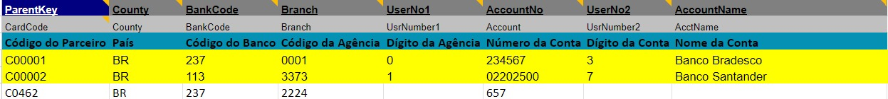

# Documentação do Projeto ERP SAP B1 - Módulo 7 - Inteli

## Grupo Hermes - Solução SAP Business One para G2

### Integrantes do Grupo:

- [Celine Souza](https://www.linkedin.com/in/celine-souza-1a38aa225?trk=blended-typeahead)
- [Eduardo Henrique Oliveira](https://www.linkedin.com/in/eduardo-hos/)
- [Marcelo Sitton](https://www.linkedin.com/in/marcelo-sitton-878248271?trk=blended-typeahead)
- [Paulo Octavio De Paula](https://www.linkedin.com/in/paulooctaviodepaula?trk=blended-typeahead)
- [Pedro Faria](https://www.linkedin.com/in/pedro-faria-santos-10b4061b7/)
- [Pedro Henrique Lima](https://www.linkedin.com/in/pedrohenrique-oliveira-lima/)
- [Thiago Goulart](https://www.linkedin.com/in/thiago-goulart-de-oliveira?trk=blended-typeahead)

# Sumário

- [Controle de Documento](#controle-de-documento)
- [1. Introdução](#1-introdução)
  - [1.1 Parceiro de Negócios](#11-parceiro-de-negócios)
  - [1.2 Definição do Problema](#12-definição-do-problema)

- [2. Objetivos](#2-objetivos)
  - [2.1 Objetivos Gerais](#21-objetivos-gerais)
  - [2.2 Objetivos Específicos](#22-objetivos-específicos)
  - [2.3 Justificativa](#23-justificativa)

- [3. Compreensão do Problema](#3-compreensão-do-problema)
  - [3.1 Canvas Proposta de Valor](#31-canvas-proposta-de-valor)
  - [3.2 Matriz de Risco](#32-matriz-de-risco)
  - [3.3 Análise Financeira](#33-análise-financeira)

- [4. Lean Inception](#4-lean-inception)
  - [4.1 Visão do Produto](#41-visão-do-produto)
  - [4.2 O Produto (É – Não É – Faz – Não Faz)](#42-o-produto-é--não-é--faz--não-faz)
  - [4.3 Objetivos do Produto](#43-objetivos-do-produto)
  - [4.4 Pesquisas](#44-pesquisas)
  - [4.5 Persona](#45-persona)
  - [4.6 User Stories](#46-user-stories)
  - [4.7 Jornada de Multiplos Usuários](#47-jornada-de-multiplos-usuários)


- [5. Análise de Requisitos](#5-análise-de-requisitos)
  - [5.1 Requisitos Funcionais](#51-requisitos-funcionais)
  - [5.2 Requisitos Não Funcionais](#52-requisitos-não-funcionais)

- [6. Desenvolvimento e Configuração](#6-desenvolvimento-e-configuração)
  - [6.1 Configurações Específicas do Módulo de Vendas](#61-configurações-específicas-do-módulo-de-vendas)
  - [6.2 Configurações Gerais do Sistema](#62-configurações-gerais-do-sistema)
  - [6.3 Conclusão Geral](#63-conclusão-geral)

- [7. Desenho da Solução](#7-desenho-da-solução)
  - [7.1 Macroprocessos](#71-macroprocessos)
  - [7.2 Processos](#72-processos)
  - [7.3 Subprocessos](#73-subprocesso)
  - [7.4 Resultados](#74-resultados)

- [8. Procedimentos e Regras de Negócio](#8-procedimentos-e-regras-de-negócio)
  - [8.1 Regras de Negócio](#81-regras-de-negócio)
  - [8.2 Tabelas de Decisão para Configuração SAP](#82-tabelas-de-decisão-para-configuração-sap)
  - [8.3 Diagramas](#83-diagramas)
  - [8.4 Procedimentos](#84-procedimentos)

- [9. Personalizações, Diagramas, Fluxos de Trabalho](#9-personalizações-diagramas-fluxos-de-trabalho)

  - [9.1 Mapeamento de Dados](#91-mapeamento-de-dados)
  - [9.2 Preparação dos Dados](#92-preparação-dos-dados) 
  - [9.3 Execução da Carga](#93-execução-da-carga)
  - [9.4 Validação e Verificação](#94-validação-e-verificação)
  - [9.5 Conclusão](#95-conclusão)

- [10. Testes unitários](#10-testes-unitários)
  - [10.1 Objetivo dos testes](#101-objetivo-dos-testes)
  - [10.2 Escopo dos testes](#102-escopo-dos-testes)
  - [10.3 Caminho feliz](#103-caminho-feliz)
  - [10.4 Resultado dos testes](#104-resultado-dos-testes)
  - [10.5 Diagrama de Fluxo de Vendas no SAP Business One](#105-diagrama-de-fluxo-de-vendas-no-sap-business-one)
  - [10.6 Matriz RACI](#106-matriz-raci)

- [11. Treinamento e Capacitação](#11-treinamento-e-capacitação)
  - [11.1 Plano de Treinamento](#111-plano-de-treinamento)
  - [11.2 Execução do Treinamento](#112-execução-do-treinamento)

- [12. Testes Integrados e Estratégia de Cutover](#12-testes-integrados-e-estratégia-de-cutover)
  - [12.1 Identificação dos Stakeholders](#121-identificação-dos-stakeholders)
  - [12.2 Ajustes do Sistema](#122-ajustes-do-sistema)
  - [12.3 Integridade dos Dados](#123-integridade-dos-dados)
  - [12.4 Verificação de Backup](#124-verificação-de-backup)
  - [12.5 Execução dos Testes Integrados](#125-execução-dos-testes-integrados)
  - [12.6 Cronograma de Atividades de Cutover](#126-cronograma-de-atividades-de-cutover)
  - [12.7 Plano de Comunicação](#127-plano-de-comunicação)
  - [12.8 Matriz RACI dos testes Integrados](#128-matriz-raci-dos-testes-integrados)
  - [12.9 Plano de Contenção](#129-plano-de-contenção)
  - [12.10 Checklist de Ações para Go Live](#1210-checklist-de-ações-para-go-live)
  - [12.11 Suporte Pós Go-Live](#1211-suporte-pós-go-live)

- [14 Conclusão e Recomendações](#14-conclusão-e-recomendações)
  - [14.1 Conclusões](#141-conclusões)
  - [14.2 Recomendações](#142-recomendações)
  - [14.3 Plano de Gerenciamento de Riscos](#143-plano-de-gerenciamento-de-riscos)

- [15. Referências](#15-referências)
- [16. Anexos](#16-anexos)
  - [16.1 Vídeos dos testes integrados](#161-vídeos-dos-testes-integrados)

# Controle de Documento

## Histórico de Revisões

| Data       | Autor           | Versão | Resumo da Atividade                                                                 |
|------------|-----------------|--------|-------------------------------------------------------------------------------------|
| 2024-08-16 | Eduardo Oliveira | v1.0   | Compreende o entendimento do negócio e da experiência do usuário, além de incluir configurações iniciais, análise de dados mestres, e o desenho detalhado da solução com mapeamento de processos. |
| 2024-08-30 | Thiago Goulart | v2.0   | Revisão sobre documentação e tabelas processadas |
| 2024-09-13 | Paulo Octavio | v3.0   | Revisão sobre análise financeira e testes unitários |
| 2024-09-27 | Pedro Henrique | v4.0   | Revisão sobre testes unitários |
| 2024-10-09 | Eduardo Henrique | v5.0   | Revisão final com correções de sprint anteriores. Inclui adesão de seção com jornada de multiplos usuarios. |


# 1. Introdução

## 1.1 Parceiro de Negócios
&emsp;&emsp;A G2 é uma empresa especializada em soluções de software, focada na implementação e otimização de sistemas SAP. Com uma vasta experiência no mercado, a G2 oferece serviços que incluem consultoria, customização, integração e suporte técnico para empresas que utilizam as soluções SAP. A empresa é reconhecida por sua expertise em transformar processos de negócios através da tecnologia, ajudando seus clientes a alcançar eficiência operacional e vantagem competitiva.

## 1.2 Definição do Problema
&emsp;&emsp;Atualmente, a G2 já utiliza um sistema SAP, porém apesar de ser robusto e amplamente reconhecido no mercado, enfrenta limitações devido à sua implementação inicial sem o uso da metodologia Fastpack. Essa abordagem, conhecida por permitir uma configuração mais ágil e eficiente, não foi aplicada, resultando em alguns desafios. O sistema SAP atual apresenta customizações que, ao longo do tempo, tornaram-se complexas e difíceis de gerenciar, comprometendo a flexibilidade e a capacidade de adaptação do sistema às mudanças nos processos de negócios e nas demandas do mercado.

# 2. Objetivos

## 2.1 Objetivos Gerais
&emsp;&emsp;A implantação do projeto em questão, tem como objetivo melhorar os processos operacionais e de tomada de decisões da empresa parceira G2, fazendo uso do sistema de gestão empresarial SAP Business One.

## 2.2 Objetivos Específicos
&emsp;&emsp;Automatização e Eficiência: O SAP Business One automatiza tarefas repetitivas e complexas, reduzindo o tempo gasto em processos manuais e minimizando erros operacionais. Isso permite que as empresas operem de maneira mais eficiente, com fluxos de trabalho otimizados que conectam diferentes departamentos em uma única plataforma.

&emsp;&emsp;Centralização de Dados: Ao consolidar todas as informações da empresa em um único sistema, o SAP Business One facilita o acesso a dados precisos e em tempo real, permitindo uma melhor coordenação entre as equipes e a redução de redundâncias.

&emsp;&emsp;Escalabilidade: O SAP Business One é altamente escalável, permitindo que as organizações cresçam e adaptem suas operações sem a necessidade de substituir o sistema, garantindo que ele continue atendendo às necessidades do negócio ao longo do tempo.

&emsp;&emsp;Conformidade e Segurança: O sistema ajuda as empresas a manterem conformidade com regulamentações e padrões da indústria, além de proporcionar segurança robusta para a proteção de dados sensíveis.

## 2.3 Justificativa
&emsp;&emsp;A implementação do aprimoramento do sistema SAP na empresa é essencial para alcançar maior eficiência operacional e competitividade. Com o SAP Business One, a empresa poderá simplificar processos, eliminando a necessidade de múltiplos sistemas e planilhas, o que reduzirá redundâncias e riscos de erros. Além disso, o sistema oferece adaptabilidade para acompanhar o crescimento da empresa, garantindo que as soluções tecnológicas evoluam junto com as necessidades do negócio.

&emsp;&emsp;A análise de dados avançada permitirá decisões mais assertivas, enquanto a integração de processos entre áreas como compras, vendas, estoque e financeiro promoverá uma operação mais coesa e alinhada. Por fim, o projeto possibilitará uma redução de custos significativa ao otimizar a gestão de recursos, resultando em maior eficiência e economia para a empresa. Esses benefícios justificam claramente a necessidade do aprimoramento do sistema SAP para garantir um futuro mais ágil e competitivo.


# 3. Compreensão do Problema

## 3.1 Canvas Proposta de Valor

&emsp;&emsp;Conforme mencionado por *Adam Fard*, *"O objetivo por trás do framework é garantir que um produto ou serviço seja centrado nas necessidades e valores dos clientes."* ([Brownlee](https://machinelearningmastery.com/much-training-data-required-machine-learning/), 2019), ou seja, o Canvas de Proposta de Valor tem como objetivo garantir que as empresas compreendam profundamente os problemas e desejos dos clientes, permitindo a construção de soluções que realmente agreguem valor às suas vidas. Esta ferramenta é, portanto, dividida em dois segmentos principais: a Proposta de Valor e o Perfil do Cliente, que serão explicados a seguir:

- &emsp;&emsp;O primeiro componente do *Value Proposition Canvas* é o Perfil do Cliente, subdividido em três subgrupos: Dores, Ganhos e Tarefas do Cliente. Neste segmento, a empresa se foca em entender profundamente quem são seus clientes, suas necessidades, desafios e vantagens. Ao construir este bloco, a empresa consegue visualizar melhor as atividades que os clientes estão tentando realizar, os ganhos que esperam obter e as dificuldades que enfrentam nesse processo.

- &emsp;&emsp;O segundo componente é a Proposta de Valor, que também é dividida em três subgrupos: Produtos ou Serviços, Criadores de Ganhos e Aliviadores de Dores. Aqui, a empresa descreve seus produtos e serviços, detalhando como eles contribuem para os ganhos dos clientes e aliviam suas dores.

&emsp; &emsp;No contexto do projeto atualmente em desenvolvimento, foi criado um Canvas de Proposta de Valor, conforme ilustrado na imagem abaixo:

<div align="center">
<p><b>Figura 1</b> - Value Proposition Canvas</p>

<sup>Fonte: Material produzido pelo Grupo Hermes (2024)</sup>
</div>

&emsp;&emsp; Como apresentado na imagem, as subseções abaixo descrevem uma explicação para cada item elencado do Canvas Proposta de Valor.

### 3.1.1 Customer Segment

#### A) Gains

- &emsp;&emsp;**Melhorar a eficiência do processo de vendas e acesso a produtos cadastrados**: A eficiência nas operações de vendas da **G2 Tecnologia** será aprimorada, permitindo que a equipe tenha um acesso mais rápido e preciso aos produtos devidamente cadastrados, agilizando o atendimento ao cliente e a conclusão de vendas.

- &emsp;&emsp;**Usar dashboards com insights acionáveis para a equipe de vendas**: Os *dashboards* fornecem à equipe de vendas da *G2 Tecnologia* informações detalhadas e úteis que permitem identificar tendências e oportunidades, melhorando a capacidade de resposta e a eficácia nas estratégias de vendas.

- &emsp;&emsp;**Obter flexibilidade na gestão de contratos e personalizar soluções**: A proposta permite que a equipe de vendas da *G2 Tecnologia* gerencie contratos com maior flexibilidade, adaptando-os conforme necessário para atender melhor às exigências dos clientes e às mudanças de mercado.

- &emsp;&emsp;**Melhorar a gestão do relacionamento com o cliente**: A implementação do sistema **ERP** promove a potencialização da gestão do relacionamento com o cliente e os *leads* da *G2 Tecnologia*.

#### B) Pains

- &emsp;&emsp;**Sentir falta de dashboards funcionais para métricas de vendas**: A equipe de vendas precisa de *dashboards* eficazes para o monitoramento das vendas na *G2 Tecnologia* e a análise de desempenho, pois, caso não tenha, essa área fica limitada de ajustar suas estratégias em tempo real.

- &emsp;&emsp;**Lidar com precificação desorganizada e desalinhada com a realidade**: A falta de um sistema de precificação eficiente na *G2 Tecnologia* pode levar a inconsistências que não refletem a realidade do mercado, afetando negativamente a competitividade e a lucratividade dos projetos.

- &emsp;&emsp;**Enfrentar dificuldade em gerenciar variações contratuais e personalizações**: As variações contratuais e a necessidade de personalizar soluções para diferentes clientes criam complexidades adicionais para a equipe de vendas da *G2 Tecnologia*, que muitas vezes enfrenta desafios para gerenciar essas variações de maneira eficaz.

#### C) Customer Job(s)

- &emsp;&emsp;**Adaptar-se a variações contratuais e personalizar soluções para diferentes clientes**: A equipe de vendas da *G2 Tecnologia* precisa de uma solução que permita a adaptação rápida às mudanças contratuais, garantindo que as personalizações necessárias para diferentes clientes sejam implementadas sem dificuldades.

- &emsp;&emsp;**Garantir que os produtos estejam cadastrados e acessíveis para vendedores**: É crucial que todos os produtos da *G2 Tecnologia* estejam devidamente cadastrados e facilmente acessíveis para os vendedores, para que possam atender às necessidades dos clientes de maneira rápida e eficiente.

- &emsp;&emsp;**Gerenciar o processo de vendas do lead ao fechamento, principalmente o relacionamento com o cliente**: A equipe de vendas da *G2 Tecnologia* precisa gerenciar todo o ciclo de vendas, desde a qualificação do *lead* até o fechamento do contrato, de maneira organizada e eficiente, garantindo que nenhuma etapa crítica seja negligenciada. Além disso, também é necessário realizar a gestão do relacionamento com o cliente.

### 3.1.2 Value Proposition

#### A) Gains Creators

- &emsp;&emsp;**Gerir de maneira mais eficiente o relacionamento com o cliente**: A solução proposta pelo *Grupo Hermes* permite que a *G2 Tecnologia* gere de maneira mais eficiente e eficaz o relacionamento com seus clientes.

- &emsp;&emsp;**Facilitar o acesso a produtos e informações essenciais para vendedores**: A proposta visa permitir que a equipe de vendas da *G2 Tecnologia* acesse rapidamente os produtos e as informações necessárias, melhorando a eficiência no atendimento ao cliente e na tomada de decisões.

- &emsp;&emsp;**Organizar e otimizar o processo de vendas do lead ao fechamento**: A solução ajuda a *G2 Tecnologia* a estruturar o processo de vendas, garantindo que cada etapa, desde a identificação do *lead* até o fechamento do contrato, seja realizada de forma mais eficiente e organizada.

- &emsp;&emsp;**Adaptar o sistema a diferentes necessidades, garantindo flexibilidade**: A flexibilidade do sistema proposto permite que a *G2 Tecnologia* configure e adapte suas operações para atender a diversas situações e necessidades específicas de negócios, facilitando adaptações rápidas sem comprometer a eficiência.

#### B) Pains Relievers

- &emsp;&emsp;**Simplificar o processo de cadastro, validação e classificação de produtos**: A solução proposta visa reduzir a complexidade dos processos de cadastro e validação na *G2 Tecnologia*, tornando mais fácil para a equipe de vendas gerenciar as informações dos produtos, minimizando erros e aumentando a precisão.

- &emsp;&emsp;**Implementar dashboards claros e úteis para desempenho de vendas**: A implementação de *dashboards* visuais e intuitivos oferece à equipe de vendas da *G2 Tecnologia* uma visão clara das métricas de desempenho, facilitando o monitoramento de resultados e a tomada de decisões baseada em dados.

- &emsp;&emsp;**Gerenciar variações contratuais com flexibilidade**: A proposta inclui ferramentas que permitem à *G2 Tecnologia* uma gestão eficaz e flexível das variações contratuais, garantindo que a equipe de vendas possa personalizar contratos de acordo com as necessidades dos clientes.

#### C) Products & Services

- &emsp;&emsp;**Implementação do módulo de vendas do ERP SAP Business One**: A implementação do módulo de vendas do ERP SAP Business One é o coração da proposta de valor para a *G2 Tecnologia*, oferecendo uma solução integrada que centraliza as operações de vendas e facilita a gestão de processos, produtos e contratos.


## 3.2 Matriz de Risco
&emsp;&emsp;A matriz de risco, uma ferramenta essencial de gestão em projetos, ela serve como um guia para avaliar e priorizar os riscos associados ao desenvolvimento e implementação de soluções tecnológicas. De acordo com o Blog Efera ([Esfera](https://blog.esferaenergia.com.br/gestao-empresarial/matriz-de-risco), 2022), ela é composta por uma espécie de quadro bidimensional que mapeia riscos de acordo com sua probabilidade de ocorrência e impacto nas operações, oferecendo  uma visualização clara e objetiva dos desafios que precisam de atenção imediata e daqueles que podem ser monitorados com menor urgência. Isso, classificando cada risco em seu potencial impacto e probabilidade do risco acontecer. Sendo metade do quadro para riscos considerados ameaças, que são negativos e oportunidades, os considerados positivos.

&emsp;&emsp;Além disso, a matriz de risco é uma ferramenta dinâmica que será atualizada a cada sprint do projeto com a empresa G2. Isso é crucial, pois o grupo Hermes reconhece que os desafios e problemas enfrentados no desenvolvimento e implementação de soluções tecnológicas estão em constante evolução, ainda mais em um projeto que em seu escópo tem alinhado a integração com todos os grupos da turma 10 de Sistemas de informação do curso de Sistemas de Informação na aplicação da solução SAP Business One. Portanto, é necessário que a equipe esteja preparada para adaptar-se e resolver os desafios de acordo com sua relevância e impacto no projeto. E justamente pensando nisso que cada risco identificado é acompanhado de um plano de ação específico, garantindo uma base sólida para aproveitar oportunidades e superar desafios. Veja a seguir a Matriz de Risco.

<div align="center">
  <p><b>Figura 2</b> - Matriz de Risco</p>
  
  <p><b>Fonte:</b> elaborado pela equipe Hermes.</p>
</div>

&emsp;&emsp;A imagem apresenta a Matriz de Riscos que categoriza tanto ameaças quanto oportunidades associadas ao projeto. Cada risco ou oportunidade é avaliado em termos de probabilidade de ocorrência (eixo vertical) e impacto potencial (eixo horizontal). Os itens são distribuídos em uma grade colorida, onde as cores indicam o nível de atenção necessário: os quadrados verdes representam um nível de atenção mínima, os quadrados amarelos indicam uma necessidade de monitoramento contínuo, e os quadrados vermelhos exigem atenção elevada e ações imediatas. Para cada risco ou oportunidade identificado na matriz, são fornecidas explicações detalhadas, os responsáveis pela gestão do risco e as ações planejadas para mitigar as ameaças ou aproveitar as oportunidades. Veja essas informações a a seguir? 


### Ameaças

&emsp;&emsp;**Não cumprimento do Contrato Social do grupo** (Probabilidade: 10%, Impacto: Muito Alto)

   - &emsp;&emsp;**Descrição:** A ausência de aderência ao contrato social do grupo pode gerar conflitos, falta de compromisso e prejudicar o trabalho em equipe, afetando negativamente o andamento do projeto para todos.
   - &emsp;&emsp;**Responsável pelo Risco:** Grupo Hermes com responsabilidade em cima do Eduardo (PO).
   - &emsp;&emsp;**Plano de Ação:** Realizar reuniões periódicas(Daily) de alinhamento para reforçar a importância do contrato social e promover um ambiente de feedback constante, abordando questões de comportamento e expectativas antes que se tornem problemáticas.

&emsp;&emsp;**Falta de alinhamento do grupo com os demais da sala** (Probabilidade: 50%, Impacto: Muito Alto)

   - &emsp;&emsp;**Descrição:** A falta de alinhamento entre o grupo e outros grupos na sala pode levar a inconsistências nas entregas e atrasos.
   - &emsp;&emsp;**Responsável pelo Risco:** Grupo Hermes.
   - &emsp;&emsp;**Plano de Ação:** Participar ativamente das reuniões coletivas da sala, assegurar que as expectativas sejam claramente comunicadas entre os grupos, e ajustar os planos conforme necessário para manter a coesão.

&emsp;&emsp;**Falta de Experiência Técnica** (Probabilidade: 50%, Impacto: Moderado)

   - &emsp;&emsp;**Descrição:** A falta de experiência técnica dos membros do grupo pode dificultar a implementação eficiente das soluções SAP, levando a atrasos e possíveis erros na entrega.
   - &emsp;&emsp;**Responsável pelo Risco:** Grupo Hermes.
   - &emsp;&emsp;**Plano de Ação:** Identificar lacunas de conhecimento e realizar treinamentos específicos para os membros da equipe, além de buscar suporte técnico adicional quando necessário nos dias em que a equipe estiver na instituição Inteli, isto junto do material da G2 de treinamento.

&emsp;&emsp;**Problema de foco na realização de tarefas acordadas** (Probabilidade: 50%, Impacto: Alto)

   - &emsp;&emsp;**Descrição:** A dificuldade em manter o foco nas tarefas acordadas pode resultar em entregas atrasadas e falta de qualidade no trabalho final.
   - &emsp;&emsp;**Responsável pelo Risco:** Grupo Hermes com responsabilidade caindo sobre Eduardo (PO).
   - &emsp;&emsp;**Plano de Ação:** Estabelecer metas claras e prioridades para cada sprint, utilizar ferramentas de gestão de tempo e realizar dailies para acompanhar o progresso das tarefas e identificar desvios de foco.

&emsp;&emsp;**Dependência de terceiros em tarefas que possuem caminho crítico** (Probabilidade: 70%, Impacto: Muito Alto)

   - &emsp;&emsp;**Descrição:** A dependência de terceiros para a conclusão de tarefas críticas pode causar atrasos significativos se os terceiros não entregarem conforme o esperado.
   - &emsp;&emsp;**Responsável pelo Risco:** Eduardo (PO do grupo).
   - &emsp;&emsp;**Plano de Ação:** Mapear as dependências e criar um plano de contingência para cada uma junto da sala como um todo, buscando alternativas ou escalonamento para garantir que as tarefas críticas sejam concluídas a tempo.

&emsp;&emsp;**Sobrecarga de tarefas** (Probabilidade: 30%, Impacto: Alto)

   - &emsp;&emsp;**Descrição:** A sobrecarga de tarefas pode levar ao esgotamento da equipe, reduzindo a qualidade das entregas.
   - &emsp;&emsp;**Responsável pelo Risco:** Grupo Hermes.
   - &emsp;&emsp;**Plano de Ação:** Revisar a distribuição de tarefas periodicamente e ajustar as alocações conforme necessário, além de promover um ambiente onde os membros possam comunicar sobrecargas e buscar apoio.

&emsp;&emsp;**Desalinhamento de Expectativas com o Cliente** (Probabilidade: 30%, Impacto: Muito Alto)

   - &emsp;&emsp;**Descrição:** Um desalinhamento entre as expectativas do cliente (G2) e as entregas do grupo pode resultar em retrabalho e insatisfação, comprometendo a parceria.
   - &emsp;&emsp;**Responsável pelo Risco:** Renato (Product Owner da sala).
   - &emsp;&emsp;**Plano de Ação:** Manter uma comunicação contínua e transparente com a cliente (Eduarda, gerente de projeto da G2), realizando reuniões de feedback para ajustar expectativas ao longo do projeto.

&emsp;&emsp;**Atraso testes integrados** (Probabilidade: 30%, Impacto: Moderado)

   - &emsp;&emsp;**Descrição:** Atraso na realização dos testes integrados em decorrência de erros ou falta de engajamento dos grupos.
   - &emsp;&emsp;**Responsável pelo Risco:** Grupos em geral.
   - &emsp;&emsp;**Plano de Ação:** Manter uma comunicação contínua e transparente entre os grupos, realizando reuniões de feedback para ajustar expectativas ao longo do projeto.

### Oportunidades

&emsp;&emsp;**Aprendizado Técnico com tecnologia da SAP** (Probabilidade: 90%, Impacto: Alto)

   - &emsp;&emsp;**Descrição:** A implementação do SAP Business One oferece uma excelente oportunidade para o grupo desenvolver e aprimorar habilidades técnicas que são altamente valorizadas no mercado.
   - &emsp;&emsp;**Responsável pela Oportunidade:** Grupo Hermes. 
   - &emsp;&emsp;**Plano de Ação:** Envolver-se ativamente nas atividades práticas, buscar certificações SAP e realizar treinamentos complementares para maximizar o aprendizado.

&emsp;&emsp;**Aprendizado em vendas de um ponto de vista de consultoria** (Probabilidade: 10%, Impacto: Muito Alto)

   - &emsp;&emsp;**Descrição:** Trabalhar no projeto de implementação do SAP na área de vendas proporciona uma oportunidade única de adquirir conhecimentos sobre vendas em um contexto de consultoria.
   - &emsp;&emsp;**Responsável pela Oportunidade:** Grupo Hermes.
   - &emsp;&emsp;**Plano de Ação:** Participar de reuniões e negociações com clientes, absorvendo práticas de consultoria, e aplicar os aprendizados diretamente nas atividades do projeto.

&emsp;&emsp;**Fortalecimento de Soft Skills** (Probabilidade: 70%, Impacto: Alto)

   - &emsp;&emsp;**Descrição:** A colaboração em um projeto de grande porte e a interação com múltiplas partes interessadas é uma excelente oportunidade para o desenvolvimento de soft skills, como comunicação, liderança e trabalho em equipe.
   - &emsp;&emsp;**Responsável pela Oportunidade:** Grupo Hermes.
   - &emsp;&emsp;**Plano de Ação:** Fomentar a prática de feedbacks construtivos, promover a liderança rotativa em atividades e utilizar ferramentas de comunicação para melhorar a interação entre os membros.

&emsp;&emsp;**Networking com Profissionais da Área** (Probabilidade: 90%, Impacto: Muito Alto)

   - &emsp;&emsp;**Descrição:** A colaboração com profissionais experientes da G2 e outros stakeholders oferece uma oportunidade valiosa para expandir a rede de contatos e abrir portas para futuras oportunidades profissionais.
   - &emsp;&emsp;**Responsável pela Oportunidade:** Grupo Hermes.
   - &emsp;&emsp;**Plano de Ação:** Participar de reuniões, construir relacionamentos com os profissionais da G2 e manter contato após a conclusão do projeto.

&emsp;&emsp;**Construção de um Case de Sucesso com metodologia nova** (Probabilidade: 70%, Impacto: Moderado)

   - &emsp;&emsp;**Descrição:** A criação de um case de sucesso utilizando uma nova metodologia pode não apenas beneficiar o cliente, mas também servir como referência para futuros projetos.
   - &emsp;&emsp;**Responsável pela Oportunidade:** Renato (Product Owner da sala) junto de toda sala.
   - &emsp;&emsp;**Plano de Ação:** Documentar o processo e os resultados obtidos com a nova metodologia para possivel divulgação.

&emsp;&emsp;**Melhoria da Resiliência e Gestão de Stress** (Probabilidade: 70%, Impacto: Muito Alto)

   - &emsp;&emsp;**Descrição:** O gerenciamento de prazos apertados e a resolução de desafios complexos ao longo do projeto podem fortalecer a resiliência e a capacidade de gestão de stress da equipe.
   - &emsp;&emsp;**Responsável pela Oportunidade:** Grupo Hermes.
   - &emsp;&emsp;**Plano de Ação:** Implementar práticas de bem-estar, como pausas regulares e sessões de descompressão, além de promover um ambiente de apoio mútuo onde os membros possam compartilhar dificuldades e buscar soluções coletivas.


## 3.3 Análise Financeira

&emsp;Esta análise financeira tem como objetivo avaliar a viabilidade econômica do projeto de implementação do *SAP Business One* para a empresa *G2 Tecnologia*, visando otimizar a prestação de seus serviços. A empresa *G2 Tecnologia* oferece consultoria em ERP e gerenciamento de empresas, com foco principal no *SAP Business One*, além de novos serviços como *Be Hero* e *Bodyshopping*. Dessa forma, as informações financeiras e de escopo foram obtidas através de reuniões com *Eduarda Santos* (Gerente de Projetos) e *Bruna Sullivan* (Gerente Comercial) no dias 03 e 04 de setembro de 2024.

&emsp;Os dados utilizados nas subseções seguintes, relacionados à empresa *G2 Tecnologia*, foram obtidos por meio de discussões realizadas entre as equipes envolvidas no projeto. Além disso, algumas informações foram obtidas a partir de informações contidas em um documento fornecido pela empresa, que serviu como base para a construção da análises financeiras e pode ser acessado no seguinte link:

[Documento_análise_financeira](../assets/imagens/D%C3%BAvidas%20Sprint%203%20(1).pdf)

### 3.3.1 Custos de Implementação

#### 3.3.1.1 Média de Custo da G2 durante a Implementação:
&emsp;O custo médio estimado foi informado pelo parceiro de negócios durante as reuniões realizadas no dia 03 e 04 de setembro de 2024, neste custo esta incluso os valores dos consultores:

- **Custo médio**: R$ 7.000,00 a R$ 10.000,00 (para uma média de 16h semanais)
- **Estimativa total**: R$ 8.500,00 x 10 semanas = **R$ 85.000,00**

#### 3.3.1.2 Custo de Licenças:
&emsp;Para a operação do sistema, foi considerado o custo das licenças *SAP Business One Professional*:
- **Valor por usuário/mês**: R$ 740,00
- **Quantidade de licenças**: 5 Licenças *SAP Business One Professional*
- **Tempo de implementação**: 10 semanas, porém pelo custo ser calculado por mês será considerado para o cálculo o tempo de 3 meses.
  
O custo total da implementação para as licenças é:
- **R$ 740,00 x 5 usuários = R$ 3.700,00/mês**
- **R$ 3.700,00 x 3 = R$ 11.100,00**

#### 3.3.1.3 Custo da Nuvem:
A nuvem *SkyOne* foi utilizada para o funcionamento das licenças nos computadores de cada um dos 5 grupos
- **Custo por usuário:** R$ 180,00
- **Número de usuários:** 5
O custo total da nuvem na implemenação é:
**R$ 180,00 x 5 = R$ 900,00**

#### 3.3.1.4 Total de Custos da Implementação:
A soma dos custos da *G2 Tecnologia* com consultores, licenças e a nuvem para a implementação:
- **R$ 85.000,00 + R$ 11.100,00 + R$ 900,00 = R$ 97.000,00**
  
### 3.3.2 Custo de Operação de 1 Ano
&emsp;Para o funcionamento do *SAP Business One durante* um ano, os valores a serem considerados são: o custo da infraestrutura em nuvem para esse período e o custo das licenças utilizadas pela empresa.

&emsp; Nos cálculos a seguir, foi estimado que o parceiro de negócios utilizará 43 licenças, com base na premissa de que 25% dos funcionários da empresa terão acesso a uma licença *SAP Business One Professional*.

#### 3.3.2.1 Custo da Nuvem:
- **Custo por usuário:** R$ 720,00/ano
- **Número de usuários:** 43
O custo total da nuvem durante o período de 1 ano é:
**R$ 720,00 x 43 = R$ 30.960,00**

#### 3.3.2.2 Custo das licenças:
- **Custo por usuário**: R$ 740,00/mês
- **Número de usuários**: 43
- **Duração da licença**: 12 meses 
O custo total das linceças no período de um ano é:
- **R$ 740,00 x 43 usuários = R$ 31.820,00/mês**
- **R$ 31.820,00 x 12 = R$ 381.840,00**

#### 3.3.2.3 Total dos Custos durante 1 ano:
A soma dos custos das licenças e utilização da nuvem:
- **R$ 381.840,0 + R$ 30.960,00 = R$ 412.800,00**

#### 3.3.2.4 Custos Opcionais:
Outros custos, considerados opcionais pelo cliente, não foram incluídos no cálculo, pois são ajustáveis conforme as necessidades:
- **Horas de suporte**: o cliente pode contratar o número de horas desejado mensalmente através de um sistema de tickets.
- **Melhoria contínua**: inclui melhorias na base, relatórios personalizados, entre outros. O custo da hora de suporte é menor do que o de melhorias.

### 3.3.3 Ganhos Estimados

&emsp;&emsp;Após consultas com a empresa, foi informado que os ganhos com a implementação do *SAP Business One* estão relacionados ao faturamento, representando aproximadamente **2% do faturamento anual**.
- **Faturamento em 2023**: R$ 35.000.000,00
- **Ganho estimado**: 2% de R$ 35.000.000,00 = **R$ 700.000,00**

### 3.3.4 Calculo do ROI
&emsp;&emsp;O **ROI (Return on Investment)** é uma métrica financeira usada para medir a eficiência ou lucratividade de um investimento. Ele indica o retorno que um investimento gerou em relação ao seu custo. O ROI é amplamente utilizado para avaliar a performance de investimentos e ajudar na tomada de decisões financeiras, pois fornece uma visão clara sobre quanto retorno foi obtido para cada unidade monetária investida ([Sebrae](https://sebrae.com.br/sites/PortalSebrae/artigos/roi-calcula-o-retorno-de-seus-investimentos,17870ffe48437810VgnVCM1000001b00320aRCRD#:~:text=ROI%20%C3%A9%20a%20sigla%2C%20em,sobre%20investimentos%20feitos%20pela%20empresa.), 2023). A fórmula para calcular o *ROI* é:
```
ROI = ((Ganho do Investimento - Custo do Investimento) / Custo do Investimento) × 100
```
#### 3.3.4.1 Aplicação do ROI no projeto:
&emsp;A seguir, é apresentado o cálculo do *ROI* com base nos números do projeto em questão, conforme detalhado nas subseções anteriores.
- Ganho do investimento: R$ 700.000,00
- Gasto do Investimento: R$ 412.800,00 + R$ 97.000,00 = R$ 509.800,00
```
ROI = ((Ganho do Investimento - Custo do Investimento) / Custo do Investimento) × 100
ROI = ((700.000,00 - 509.800,00) / 509.800,00) × 100
ROI = 37,31%
```
#### 3.3.4.2 Análise do ROI:
&emsp;O *ROI* calculado de 37,31% indica que o projeto de implementação do *SAP Business One* é financeiramente viável e promete um retorno significativo sobre o investimento. Esse percentual sugere que, para cada real investido, a empresa espera obter um retorno de R$ 0,37, o que demonstra um bom equilíbrio entre os custos envolvidos e os benefícios esperados. 

### 3.3.5 Considerações Finais

&emsp;Após uma análise realizada a partir das seções anteriores, o grupo *Hermes* produziu a seguinte tabela sintetizando a análise financeira:

<div align="center">
  <p><b>Quadro 1</b> - Análise Financeira </p>

| Categoria                      | Descrição                                | Valor (R$)        |
|---------------------------------|------------------------------------------|-------------------|
| **Custos de Implementação**      |                                          |                   |
| Custo Médio de Implementação     | Estimativa total para 10 semanas          | **85.000,00**     |
| Custo de Licenças                | 5 Licenças SAP Business One (mensal)      | **11.100,00**     |
| Custo da Nuvem na Implementação  | Custo da nuvem SkyOne (5 usuários)        | **900,00**        |
| **Total de Custos de Implementação** |                                      | **97.000,00**     |
| **Custos de Operação de 1 Ano**  |                                          |                   |
| Custo de Nuvem                  | Custo da nuvem SkyOne para as 43 licenças (anual) | **30.960,00**     |
| Custo de Licenças                | 43 Licenças SAP Business One por 12 meses | **381.840,00**    |
| **Ganhos Estimados**             |                                          |                   |
| Faturamento Anual                |                                          | **35.000.000,00** |
| Ganho Estimado                   | 2% do Faturamento Anual                  | **700.000,00**    |
| **Cálculo do ROI**               |                                          |                   |
| Fórmula ROI                      | ((Ganho do Investimento - Custo do Investimento) / Custo do Investimento) × 100 | **37,31%**        |


  <p><b>Fonte:</b> elaborado pela equipe Hermes.</p>
</div>

&emsp;A tabela acima apresenta um resumo dos custos envolvidos na implementação e operação do projeto, bem como os ganhos estimados. Com base nos valores projetados, o investimento inicial, que inclui custos de implementação, licenciamento e o custo da nuvem, totaliza R$ 97.000,00. O custo de operação anual, que inclui o licenciamento de 43 usuários e o uso da nuvem, soma R$ 412.800,00. Com um faturamento anual previsto de R$ 35.000.000,00 e um ganho estimado de 2% sobre esse valor, ou seja, R$ 700.000,00, o projeto apresenta um retorno financeiro significativo, resultando em um ROI de 37,31%.


# 4. Lean Inception

&emsp;&emsp;Conforme mencionado por Paulo Caroli, "Lean Inception é uma metodologia essencial para alinhar equipes em torno da criação eficaz de produtos, combinando técnicas de Design Thinking e Lean Startup para definir estratégias e o escopo do Produto Mínimo Viável (MVP)" ([Caroli](https://caroli.org/lean-inception-3/), 2022). Essa abordagem é especialmente valiosa em projetos grandes, startups e inovações de negócios, pois permite que as equipes alinhem expectativas e criem um plano claro para o desenvolvimento do produto, focando na entrega de valor incremental aos usuários. A Lean Inception também promove a colaboração e a participação ativa de todos os envolvidos, garantindo que o produto final esteja em sintonia com as necessidades do mercado e dos stakeholders ([Caroli](https://caroli.org/en/livro/lean-inception-how-to-align-people-and-build-the-right-product/), 2024).

## 4.1 Visão do Produto

&emsp;&emsp;A definição dos objetivos do produto é um dos primeiros passos em uma Lean Inception e é fundamental para garantir que a equipe esteja alinhada com as metas e expectativas do projeto. Segundo a Caroli.org, "Estabelecer objetivos claros é crucial para direcionar o desenvolvimento e para que todos na equipe compreendam o propósito e as metas a serem alcançadas" ([Caroli](https://caroli.org/en/livro/lean-inception-how-to-align-people-and-build-the-right-product/), 2024).

<div align="center">
  <p><b>Figura 3</b> - Visão do Produto</p>
  
  <p><b>Fonte:</b> elaborado pela equipe Hermes.</p>
</div>

&emsp;&emsp;Na atividade "Product Vision" do ERP G2 SAP, foram identificados os principais elementos que compõem a visão do produto. O ERP G2 SAP foi definido como uma plataforma integrada de gestão de dados e processos financeiros, com foco na centralização e automação de operações críticas. Além disso, a visão do produto aborda como o ERP G2 SAP se diferencia das soluções concorrentes, destacando sua capacidade de integração completa e monitoramento em tempo real ([Caroli](https://caroli.org/why-did-the-lean-inception-creator-get-involved-with-data-mesh/), 2022).

&emsp;&emsp;A definição clara da visão do produto é fundamental para garantir que todos os membros da equipe estejam alinhados quanto ao propósito do projeto. Conforme destacado por Caroli.org, "Uma visão bem estruturada não só orienta o desenvolvimento, mas também facilita a comunicação com stakeholders e assegura que o produto final esteja alinhado com as expectativas e necessidades do mercado." ([Caroli](https://caroli.org/en/livro/lean-inception-how-to-align-people-and-build-the-right-product/), 2024).


## 4.2 O Produto (É – Não É – Faz – Não Faz)

&emsp;&emsp;A matriz IS/IS NOT - DOES/DOES NOT é uma ferramenta importante na Lean Inception para definir claramente o escopo do produto, evitando ambiguidades e alinhando as expectativas de todos os envolvidos. Segundo Paulo Caroli, "Essa matriz ajuda a equipe a entender o que o produto é e o que ele não é, o que ele faz e o que ele não faz" ([Caroli](https://caroli.org/lean-inception-3/), 2022).

<div align="center">
  <p><b>Figura 4</b> - É – Não É – Faz – Não Faz</p>
  
  <p><b>Fonte:</b> elaborado pela equipe Hermes.</p>
</div>

&emsp;&emsp;Na matriz do ERP G2 SAP, as características do produto foram organizadas nas seções IS/IS NOT e DOES/DOES NOT. Foi definido, por exemplo, que o ERP G2 SAP é uma "Ferramenta de Gestão de Dados e Processos", mas não é um "Sistema de Produção ou Manufatura". Da mesma forma, ele "Monitora e Gerencia Fluxo de Caixa e Inadimplência", mas não "Executa Campanhas de Marketing". Essas definições ajudam a estabelecer limites claros para o escopo do produto, evitando escopo excessivo e garantindo que a equipe se concentre no que é realmente importante ([Caroli](https://caroli.org/why-did-the-lean-inception-creator-get-involved-with-data-mesh/), 2022).

&emsp;&emsp;A utilização da matriz IS/IS NOT - DOES/DOES NOT durante a Lean Inception é essencial para esclarecer o escopo do produto e alinhar as expectativas de todos os stakeholders. Caroli.org enfatiza que, "Essa ferramenta garante que o desenvolvimento do produto permaneça focado e direcionado, evitando desvios que possam comprometer o projeto." ([Caroli](https://caroli.org/en/3-differences-between-design-sprint-and-lean-inception-you-need-to-know/), 2021).

## 4.3 Objetivos do Produto

&emsp;&emsp;A definição dos objetivos do produto é um dos primeiros passos em uma Lean Inception e é fundamental para garantir que a equipe esteja alinhada com as metas e expectativas do projeto. Segundo a Caroli.org, "Estabelecer objetivos claros é crucial para direcionar o desenvolvimento e para que todos na equipe compreendam o propósito e as metas a serem alcançadas." ([Caroli](https://caroli.org/en/livro/lean-inception-how-to-align-people-and-build-the-right-product/), 2024).

<div align="center">
  <p><b>Figura 5</b> - Objetivos do Produto</p>
  
  <p><b>Fonte:</b> elaborado pela equipe Hermes.</p>
</div>

&emsp;&emsp;Na atividade "Product Goals" do ERP G2 SAP, os objetivos foram organizados em três categorias principais: "Centralizar e Automatizar Processos de Gestão", "Melhorar a Eficiência Operacional" e "Aumentar a Rentabilidade e Satisfação do Cliente". Cada uma dessas categorias foi detalhada com metas específicas, como a implementação de uma plataforma integrada para a gestão de dados financeiros e de vendas, e a automatização da qualificação de leads. Esse mapeamento de objetivos não só facilita a priorização das funcionalidades, mas também orienta a equipe no desenvolvimento do produto, assegurando que os esforços sejam concentrados nas áreas de maior impacto para o negócio ([Caroli](https://caroli.org/en/3-differences-between-design-sprint-and-lean-inception-you-need-to-know/), 2021).

&emsp;&emsp;A clareza na definição dos objetivos do produto é essencial para o sucesso do projeto. Essa atividade de mapeamento ajuda a equipe a manter o foco no que realmente importa, permitindo um desenvolvimento direcionado e eficiente, além de alinhar todas as partes interessadas com os objetivos estabelecidos ([Caroli](https://caroli.org/why-did-the-lean-inception-creator-get-involved-with-data-mesh/), 2022).

## 4.4 Pesquisas
### Introdução à Seção 4.4 - Pesquisas

&emsp;&emsp;Esta seção tem como objetivo apresentar as pesquisas realizadas para coletar e analisar dados a fim de promover o entendimento inicial da experiência de usuário. Nesse sentido a seção é composta de uma **Pesquisa Exploratória** (seção 4.4.1) e **Pesquisa Desk** (seção 4.4.2).

&emsp;&emsp;Inicialmente, foi realizada uma **pesquisa exploratória** por meio de um *workshop*/entrevista com a gestora de projetos da *G2 Tecnologia*, *Eduarda Santos*. Essa fase foi importante para entender o fluxo de dados atual, as expectativas da empresa, especialmente no que tange ao processo de vendas, e as regras de negócio que o sistema *ERP* deveria acomodar.

&emsp;&emsp;Na sequência, foi realizada uma **pesquisa desk**, baseada em fontes secundárias, como artigos acadêmicos, estudos de caso e relatórios de mercado. Esse processo complementou as informações obtidas na pesquisa exploratória, fornecendo *insights* sobre as tendências e práticas de mercado para a implementação de sistemas *ERP*.

&emsp;&emsp;Nos tópicos a seguir, serão detalhados os métodos e resultados dessas pesquisas, destacando as principais descobertas e como elas orientaram o desenvolvimento da solução *ERP* para a *G2 Tecnologia*.

### 4.4.1 Pesquisa Exploratória

&emsp;&emsp;No dia 07 de agosto de 2024, foi realizado um *workshop*/entrevista com o parceiro de negócios **G2 Tecnologia** - especificadamente, com a *Eduarda Santos*, gestora de projetos da *G2 Tecnologia** - para coletar informações preliminares e entender as necessidades e expectativas relacionadas ao projeto de implantação de um sistema *ERP*. Esta pesquisa exploratória tem como objetivo fornecer uma base de entendimento para uma pesquisa *desk*.

&emsp;&emsp; Nesse sentido, os principais objetivos desta pesquisa exploratória são:

- &emsp;&emsp;Compreender o fluxo de dados atual da *G2 Tecnologia* e do cliente final, garantindo que o novo sistema *ERP* reflita e otimize esse processo;
- &emsp;&emsp;Identificar as expectativas específicas da *G2 Tecnologia* especialmente, para o grupo *Hermes*, na área de vendas.
- &emsp;&emsp;Mapear o processo de vendas atual, entendendo suas particularidades e necessidades de personalização para que o sistema *ERP* possa acomodá-las.
- &emsp;&emsp;Definir as regras de negócio essenciais que o *ERP* deve suportar, garantindo que todos os requisitos funcionais e não funcionais sejam atendidos.

&emsp;&emsp; Assim, os tópicos a seguir contêm os assuntos que o grupo *Hermes* conversou com o cliente, incluindo anotações de falas da gerente de projetos *Eduarda Santos* e uma reflexão da equipe sobre o tema.

#### Gerenciamento de Dados

&emsp;&emsp; **Pergunta:** "Como a G2 gerencia e utiliza dados para melhorar seus processos e serviços?"

&emsp;&emsp; Durante a discussão, Eduarda Santos relatou que o gerenciamento de dados na *G2 Tecnologia* segue um fluxo específico, onde uma pessoa é responsável por realizar os cadastros por área, e depois isso passa por outra pessoa para validação/classificação. Dessa maneira, esse processo demonstra uma segmentação das etapas de entrada e validação de informações. Nesse sentido, para refletir e potencializar essa estrutura no sistema *ERP*, será necessário garantir que o fluxo de dados seja preservado.

&emsp;&emsp; Este fala demonstra um processo de segmentação das etapas de entrada e validação de informações. Nesse sentido, para refletir e potencializar essa estrutura no sistema *ERP*, será necessário garantir que o fluxo de dados seja preservado.

#### Expectativas da *G2 Tecnologia*

&emsp;&emsp; **Pergunta:** O que a G2 espera receber ao fim do módulo?

&emsp;&emsp; A *G2 Tecnologia* destacou suas expectativas principais para o sistema *ERP*, com foco em vendas. A empresa deseja ter outros produtos bem cadastrados e com fácil acesso aos vendedores. Além disso, já utilizam uma calculadora para precificar os projetos, mas precisam de uma forma correta de precificação que reflita a realidade, que atualmente está um pouco desorganizada. Eles também precisam de dashboards funcionais para avaliar métricas de vendas e um processo de comissionamento adequado. Nesse sentido, essas necessidades apontam para a importância de um *ERP* que vá além da simples automação, oferecendo ferramentas de precificação integradas e precisas, dashboards para visualização de dados críticos e automatização do comissionamento.

#### Processo de Vendas

&emsp;&emsp; **Pergunta:** Como se dá o processo de vendas?

&emsp;&emsp; O processo de vendas da *G2 Tecnologia* é personalizado para cada **lead**. A empresa estabelece tempos e prazos diferentes para cada **lead**, que já são previamente fixados. Assim, isso requer que o sistema *ERP* seja altamente flexível, permitindo que diferentes **leads** sejam gerenciados de acordo com suas especificidades, com prazos e tempos que variam conforme necessário.

&emsp;&emsp;Isso requer que o sistema *ERP* seja altamente flexível, permitindo que diferentes **leads** sejam gerenciados de acordo com suas especificidades, com prazos e tempos que variam conforme necessário.

#### Regras de Negócio
&emsp;&emsp; **Pergunta:** Como serão abordadas e planejadas as regras de negócio?

&emsp;&emsp; As regras de negócio são fundamentais para o funcionamento do *ERP*. Durante a entrevista, foi mencionado que a *G2 Tecnologia* possui um processo de qualificação de **leads**, uma equipe de SDR (Sales Development Representatives) e um orçamento definido para o cliente, com informações específicas. Dessa forma, essas regras definem os requisitos funcionais e não funcionais do sistema, necessitando de uma implementação que suporte a qualificação de **leads**, a integração com os orçamentos dos clientes e a gestão das equipes de SDR.

#### Identificação de Fatores Críticos

&emsp;&emsp; **Pergunta:** Como a *G2* lida com o processo de identificação de fatores críticos?

&emsp;&emsp; Durante a discussão, foi detalhado como a *G2 Tecnologia* enfrenta os desafios mais críticos em seus processos. O foco da empresa está em monitorar atentamente as condições de mercado e desenvolver soluções específicas para setores-chave. Além disso, a integração de tecnologias externas e o gerenciamento de custos de addons são desafios críticos, especialmente devido à crescente dificuldade em encontrar mão de obra qualificada.Desse modo, essa resposta sublinha a importância de uma abordagem estratégica para lidar com fatores críticos, onde o sistema *ERP* deve ser capaz de oferecer suporte para esses aspectos.

#### Expectativas para o Sistema Atual e Futuro

&emsp;&emsp; **Pergunta:** "Como é o sistema que vocês utilizam? O que vocês esperam de diferente?"

&emsp;&emsp; Ao discutir o sistema atual e as expectativas para o novo *ERP*, foi mencionado que o sistema atual não consegue lidar com variações contratuais, o que limita a capacidade da *G2 Tecnologia* de oferecer flexibilidade. A empresa espera que o novo sistema permita gerenciar essas variações de forma eficaz, além de suportar personalizações necessárias para atender a diferentes cenários de negócios. Assim, essa resposta indica a necessidade de um *ERP* mais adaptável, que consiga lidar com variações contratuais.

&emsp;&emsp; Essa resposta indica a necessidade de um *ERP* mais adaptável, que consiga lidar com variações contratuais. 

#### Conclusão

&emsp;&emsp; A pesquisa exploratória realizada com a *G2 Tecnologia* revelou informações importantes sobre as expectativas e necessidades para a implantação do sistema *ERP*. Identificou-se a importância de desenvolver um sistema que seja flexível e capaz de gerenciar variações contratuais, aprimorar o processo de precificação e suportar as regras de negócio apresentadas pelo cliente. Nesse sentido, a pesquisa exploratória se torna fundamental na condução da pesquisa desk, uma vez que permite que o grupo **Hermes** tenha um conhecimento inicial sobre o projeto e as premissas do cliente.

### 4.4.2 Pesquisa Desk

&emsp;&emsp; A **pesquisa desk**, ou pesquisa secundária, é uma investigação baseada na análise de informações já existentes, como artigos acadêmicos, relatórios de mercado, estudos de caso, e documentos de empresas. Essa abordagem é fundamental para adquirir uma compreensão inicial de um tema, sem a necessidade de coletar dados mais específicos. A pesquisa oferece *insights* valiosos que orientam as etapas seguintes de um projeto, permitindo que as decisões ao longo dele sejam tomadas de maneira informada e certeira. ([Medium](https://medium.com/aela/desk-research-o-que-%C3%A9-e-como-efetuar-uma-pesquisa-secund%C3%A1ria-784ee064c10b), 2020)

&emsp;&emsp; Essa pesquisa desk, em específico, foi realizada com o objetivo de adquirir uma compreensão inicial abrangente sobre sistemas ERP, mais especificamente no contexto de empresas de prestação de serviços. O propósito era identificar as principais tendências, desafios e oportunidades no uso desses sistemas, além de avaliar como o ERP pode ser aplicado para otimizar as operações, melhorar a eficiência e aumentar a competitividade dessas empresas. Justifica-se a realização dessa pesquisa pela necessidade de fundamentar as decisões do grupo Hermes com dados relevantes, garantindo que as soluções propostas ao longo do projeto estejam alinhadas com as melhores práticas de mercado e as demandas específicas da G2 Tecnologia. Assim, o grupo está preparado para adotar uma abordagem estratégica na implementação do SAP Business One, assegurando que os objetivos de inovação sejam alcançados.


#### O que é um ERP?

&emsp;&emsp; Um **ERP** (Enterprise Resource Planning) é um sistema de software que integra e automatiza diversos processos de uma empresa em um único sistema centralizado. Ele abrange diferentes áreas de uma empresa, como finanças, estoque, compras, vendas, contabilidade, e outras. O sistema viabiliza a todos os departamentos o acesso e compartilhamento de dados em tempo real. A centralização dessas informações melhora a transparência e comunicação entre as áreas, resultando em uma gestão mais integrada e eficiente. ([Senior](https://www.senior.com.br/sistema-erp-o-que-e-e-como-funciona), 2024)

&emsp;&emsp; A importância do **ERP** para as empresas consiste na sua capacidade de organizar os dados, melhorar a eficiência operacional, reduzir erros, e facilitar a tomada de decisões. Além disso, os sistemas **ERP** padronizam os processos, trazendo consistência e transparência em todas as operações da empresa. Ao oferecer uma visão unificada dos negócios, o **ERP** também melhora a capacidade de planejamento estratégico, assim, facilitando as empresas a responder de forma mais rápida e eficiente às mudanças do mercado.

#### Por que um ERP é Interessante para Empresas de Prestação de Serviços?

&emsp;&emsp; Os sistemas **ERP** oferecem diversos benefícios para empresas de prestação de serviços, que buscam eficiência e excelência no atendimento ao cliente ([Cigam](https://www.cigam.com.br/blog/306/o-que-e-erp), 2024). A seguir, são detalhados os principais benefícios que um **ERP** pode proporcionar:

#### Melhoria na Gestão de Projetos 

&emsp;&emsp; Um **ERP** oferece ferramentas avançadas para planejamento, acompanhamento e execução de projetos. Ele integra informações de diversas áreas, permitindo que as empresas controlem prazos, orçamentos e a alocação de recursos da maneira mais eficiente possível. Isso garante que os projetos sejam concluídos dentro do prazo e do orçamento previsto ([Cigam](https://www.cigam.com.br/blog/306/o-que-e-erp), 2024).

#### Otimização de Recursos
&emsp;&emsp; Com um **ERP**, a alocação de recursos se torna mais eficaz. O sistema ajuda a garantir que equipes, materiais e outros recursos sejam utilizados de maneira produtiva, evitando gastos extras e otimizando a utilização dos ativos da empresa.

#### Aumento da Eficiência
&emsp;&emsp; Ao automatizar tarefas manuais e repetitivas, um **ERP** reduz o tempo gasto em processos. ([Cigam](https://www.cigam.com.br/blog/306/o-que-e-erp), 2024) Isso não só acelera as operações, mas também minimiza a ocorrência de erros, resultando em maior precisão e produtividade.

#### Melhor Atendimento ao Cliente
&emsp;&emsp; Um **ERP** centraliza as informações dos clientes, incluindo histórico de compras, preferências e interações anteriores ([Teraware](https://teraware.com.br/blog/o-que-e-crm-em-um-erp-e-como-utilizalo-eficazmente), 2024). Com acesso rápido a esses dados, as empresas podem oferecer um atendimento mais eficaz e personalizado, aumentando a satisfação do cliente, o que leva a uma relação mais duradoura. Isso é essencial para empresas de prestação de serviços, uma vez que a fidelidade do cliente é crucial para o sucesso contínuo.


#### Principais Dados Obtidos na Pesquisa Desk
&emsp;&emsp; A pesquisa forneceu uma visão abrangente sobre o mercado de **ERP** e seu impacto nas empresas de prestação de serviços. A seguir, são destacados os principais dados e insights relevantes para o projeto:

#### Adoção do ERP entre Empresas de Serviços

&emsp;&emsp; Na pesquisa, foi estudado que sistemas **ERP** como o **SAP S/4HANA** estão se tornando cada vez mais populares entre empresas de grande porte no setor de serviços, devido à sua capacidade de integrar processos complexos e fornecer análises em tempo real. Em média, empresas que implementaram o **SAP S/4HANA** relataram uma melhoria de 25% na eficiência operacional ([Meta](https://meta.com.br/go-live-ocp-fertilizantes/), 2024).

#### Crescimento do Mercado de ERP em Nuvem

&emsp;&emsp; O mercado de **ERP** em nuvem está previsto para crescer a uma taxa composta anual de 13,6% entre 2022 e 2029, alcançando um valor superior a USD 59,77 bilhões em 2029, comparado a USD 18,97 bilhões em 2020 ([Exactitude Consultancy](https://exactitudeconsultancy.com/pt/reports/15712/cloud-erp-market/), 2022). O **Cloud ERP**, que permite às empresas acessar e gerenciar seus recursos empresariais pela Internet, está se tornando uma escolha popular devido à sua flexibilidade, escalabilidade e menores custos iniciais.

#### Desafios de Implementação

&emsp;&emsp; Embora os benefícios sejam claros, o levantamento apontou que a implementação de **ERP** ainda enfrenta desafios, como a resistência à mudança entre os funcionários e o custo inicial elevado. No entanto, empresas que investiram em programas de treinamento e gestão de mudanças relataram uma adoção mais rápida e um retorno sobre o investimento em menos de dois anos ([Vorecol](https://psico-smart.com/pt/blogs/blog-quais-sao-os-principais-desafios-enfrentados-pelas-empresas-ao-implementar-ferramentas-de-gestao-de-mudanca-organizacional-94260), 2024).


#### Comparação SAP/Oracle

 &emsp;&emsp; No mercado de ERP, SAP e Oracle são dois dos principais competidores, cada um oferecendo soluções robustas e amplamente utilizadas. A SAP se destaca por sua abordagem personalizada, com produtos específicos como o SAP Business One para pequenas empresas e o SAP S/4HANA para médias e grandes corporações. Essa segmentação permite uma adaptação mais precisa às necessidades de cada cliente, especialmente para empresas que buscam integração completa entre seus departamentos e atividades de negócio. Por outro lado, o Oracle ERP Cloud adota uma abordagem mais universal, atendendo desde pequenas até grandes empresas com um único sistema em nuvem. O Oracle é reconhecido por sua capacidade de gerenciar grandes volumes de dados e por sua segurança, mas pode ser menos flexível em termos de personalização, o que pode limitar sua adaptação a certas necessidades específicas. Em pesquisas, a SAP é frequentemente elogiada por sua alta capacidade de customização, embora essa flexibilidade possa resultar em um custo total de propriedade (TCO) mais elevado. Em termos de adaptabilidade, o Oracle facilita mudanças rápidas, enquanto a SAP, apesar de altamente ajustável, pode exigir suporte técnico especializado para customizações, o que pode ser caro e menos ágil ([Elbahri et al. ](https://ieeexplore.ieee.org/abstract/document/8695976), 2019).

&emsp;&emsp; Com isso, pode-se notar que ambos os sistemas têm seus pontos fortes. No entanto, o SAP tende a se sobressair em cenários onde a integração entre setores e a capacidade de personalização são importantes, o que acontece em empresas de serviços, já que normalmente necessitam de uma resposta rápida e ajustada às suas operações. Para este projeto, o SAP foi escolhido por essas razões, uma vez que atende melhor às exigências de flexibilidade e eficiência operacional ([Simple Vision](https://simplevisionit.com/diferenca-entre-sap-e-oracle/#:~:text=Enquanto%20a%20Oracle%20tem%20o,para%20m%C3%A9dias%20e%20grandes%20empresas), 2022).


#### Métodos de Coleta e Análise de Dados e Reflexão

&emsp;&emsp; O processo de coleta envolveu a seleção criteriosa de fontes e análise dos dados utilizando técnicas de análise de conteúdo. Foram comparados diferentes estudos de caso para identificar padrões e insights relevantes para a aplicação do **SAP Business One** em empresas de prestação de serviços apresentados nesta seção. Além disso, o *kickoff* com o cliente permitiu um entendimento mais profundo das necessidades específicas da empresa, ajustando a pesquisa para fornecer soluções que realmente atendam às suas expectativas.

&emsp;&emsp; Os dados da pesquisa revelam que a adoção de sistemas ERP, oferece vantagens estratégicas significativas para empresas de prestação de serviços, melhorando a eficiência operacional e o planejamento estratégico. Também notou-se certo crescimento do mercado de ERP em nuvem, impulsionado por sua flexibilidade e escalabilidade, reforçando a relevância dessas soluções. No entanto, a resistência à mudança e os custos iniciais elevados são desafios que exigem uma abordagem cuidadosa. Mesmo assim, benefícios, como a melhoria na eficiência operacional, demonstram que uma implementação bem planejada costuma proporcionar um retorno significativo em curto prazo, tornando o ERP essencial para a competitividade no mercado moderno.

#### Conclusão
&emsp;&emsp; A pesquisa exploratória realizada inicialmente forneceu uma compreensão aprofundada das necessidades específicas da G2 Tecnologia e do cliente final. Isso permitiu que o grupo ajustasse sua abordagem para garantir que a solução proposta estivesse alinhada com os objetivos estratégicos da empresa. A pesquisa desk complementou essa análise, trazendo suporte informacional sobre o mercado de ERP e destacando a crescente demanda por soluções integradas. A escolha do SAP Business One como solução ERP mostrou-se correta, devido à sua flexibilidade e capacidade de personalização, que são cruciais.A comparação com o Oracle ERP Cloud reforçou a decisão, evidenciando as vantagens do SAP Business One em termos de integração entre setores e capacidade de suportar o crescimento da empresa sem comprometer a eficiência.

&emsp;&emsp; Portanto, ao final da pesquisa pode-se notar que, apesar dos desafios da implementação de um ERP, os benefícios como a otimização de processos e a melhoria na gestão de recursos, justificam o investimento. Com isso, através de uma base sólida de dados e uma solução bem escolhida, o grupo *Hermes* está preparado para implementar o SAP Business One, garantindo que a empresa alcance seus objetivos.

## 4.5 Persona

&emsp;&emsp;O grupo Hermes desenvolveu uma solução em parceria com a empresa G2, voltada para otimizar os processos de vendas, compras, estoque, contábil e financeiro através do SAP Business One. Neste contexto, a criação de personas é para assegurar que a solução atenda às necessidades reais dos usuários finais. Segundo Megquier e Barlow ([Megquier e Barlow](https://projects.iq.harvard.edu/harvarduxgroup/presentations/using-personas-create-awesome-experiences), 2017), personas são representações precisas de tipos de clientes, baseadas em pesquisas que incorporam objetivos, papéis, necessidades e interesses dos usuários. Essas ferramentas são fundamentais para responder à pergunta: "Para quem estamos projetando?" e alinhar a estratégia e os objetivos aos grupos específicos de usu  ários. Ao compreender quem são os usuários, o que estão tentando alcançar e por que, além de suas expectativas, comportamentos e suposições, as personas permitem criar experiências mais alinhadas às necessidades do público-alvo.

&emsp;&emsp;Nesse sentido, para garantir a qualidade do desenvolvimento do projeto, foi desenvolvida uma persona para compreender os usuários que entrarão em contato com a solução. Lucinda Silva, aos 35 anos, ocupa o cargo de Gerente de Vendas na G2 Tecnologia e possui uma experiência de 10 anos na área. Ela está constantemente em busca de estratégias para otimizar os processos de vendas e alcançar as metas da empresa. Apesar de ser uma profissional dedicada, Lucinda enfrenta o desafio de equilibrar seu tempo entre o trabalho e sua vida pessoal, buscando sempre manter um alto desempenho em ambas as áreas. Veja mais detalhes da persona a seguir:

<div align="center">
  <p><b>Quadro 2</b> - Persona 1</p>


| **Seção**                    | **Detalhes**                                                                                                                                                       |
|------------------------------|--------------------------------------------------------------------------------------------------------------------------------------------------------------------|
| **Imagem da persona**         |                                                                                    |
| **Nome**                      | Lucinda Silva                                                                                                                                                      |
| **Localização:**              | São Paulo, SP                                                                                                                                                      |
| **Título**                    | Gerente de Vendas                                                                                                                                                  |
| **Compania**                  | G2 Tecnologia                                                                                                                                                      |
| **Média salarial:**           | R$ 12.000,00                                                                                                                                                       |
| **Indústria**                 | Tecnologia da Informação                                                                                                                                           |
| **Marcas Favoritas**          | Apple, SAP e HBO Max                                                                                                                                               |
| **Descrição**                 | Lucinda, como Gerente de vendas SAP tem a responsabilidade de gerenciar todo o setor de vendas da empresa. Logo, ela é responsável por revisar e monitorar todos os sub-processos que envolvem a área, para que tudo ocorra da forma correta. |
| **Personalidade**             | Lucinda é muito comunicativa e gosta de trabalhar em equipe. Além disso, tem uma forte aptidão para liderar.                                                       |
| **KPIs**                      | - Taxa de Conversão de Vendas<br>- Tempo Médio de Ciclo de Vendas<br>- Valor Médio por Pedido<br>- Custo de Aquisição de Cliente (CAC) <br>- Tempo Médio de Resposta a E-mails Importantes                              |
| **Desejos e Necessidades**    | - Precisa de ferramentas que ajudem a automatizar o processo de vendas<br>- Forneçam insights de performance<br>- Permitam a personalização do atendimento ao cliente |
| **Objetivos**                 | - Ferramenta de automatização para o processo de vendas<br>- Otimizar o tempo gasto para concluir o processo<br>- Maior produtividade<br>- Redução de custos       |
| **Dores**                     | - Necessidade de resultados<br>- Falta de equilíbrio entre vida pessoal e profissional<br>- Preocupação constante com a concorrência<br>- Tomadas de decisões complexas |
| **Citações**                  | “Com o SAP Business One, tenho uma visão 360 graus das operações, permitindo decisões mais rápidas e embasadas.”<br>“Podemos automatizar ainda mais os fluxos de trabalho dentro do SAP Business One, reduzindo a necessidade de intervenção manual e aumentando a eficiência operacional.” |


  <p><b>Fonte:</b> elaborado pela equipe Hermes.</p>
</div>

&emsp;&emsp;Para desenvolver está persona, foram realizadas entrevistas com funcionários da empresa G2 durante os dias 16/08 e 21/08, para assim ter uma melhor visão sobre como seria essa pessoa do setor de vendas na perspectiva de profissionais que sabem sobre os processos dentro do SAP Business One. Além disso foi pesquisado no LinkeIn pessoas da área de vendas em SAP, ara se ter uma inspiração, um desses exemplos foi a Fernanda Campolim ([Fernanda](https://www.linkedin.com/in/fernanda-campolim-02994a35/), 20224). Vale ressaltar que a imagem da persona é de uma pessoa que não existe, vinda do site "This Person Does Not Exist" ([This Person](https://this-person-does-not-exist.com/en), 2024), que cria feições com Inteligência Artificial.

**Background:**

&emsp;&emsp;Lucinda Silva, Gerente de Vendas na G2 Tecnologia, possui experiência na área de vendas, com destaque no setor de Tecnologia da Informação. Como responsável por liderar o setor de vendas da empresa, Lucinda coordena a equipe com competência, dedicando-se a revisar e monitorar todos os sub-processos que envolvem a área. Essa atenção aos detalhes e foco na eficiência garantem que as operações de vendas ocorram de forma correta e sem falhas, permitindo que a empresa atinja suas metas estratégicas.

&emsp;&emsp;No âmbito pessoal, Lucinda é uma pessoa comunicativa, que valoriza o trabalho em equipe e possui uma forte aptidão para liderança. No entanto, ela enfrenta o desafio de equilibrar as pressões do trabalho com sua vida pessoal, buscando formas de otimizar o tempo e reduzir o estresse associado às altas demandas de sua posição.

**Necessidades e Motivações:**

- **Eficiência e Produtividade:** Lucinda necessita de ferramentas que possam automatizar os processos de vendas, fornecendo insights de performance que a ajudem a tomar decisões mais rápidas e embasadas. A automação é crucial para permitir que Lucinda e sua equipe mantenham a alta produtividade, sem sacrificar a qualidade do atendimento ao cliente.

- **Equilíbrio entre vida pessoal e profissional:** Com uma agenda lotada e a constante pressão por resultados, Lucinda busca soluções que possam lhe proporcionar equilíbrio entre vida profissional e pessoal. A possibilidade de reduzir o tempo dedicado a tarefas repetitivas e automatizar fluxos de trabalho é essencial para aliviar esse fardo.

- **Atualização e Competitividade:** No competitivo setor de Tecnologia da Informação, Lucinda está sempre em busca de novas tecnologias que possam diferenciar a G2 Tecnologia de seus concorrentes. A necessidade de estar à frente da concorrência é uma motivação constante, impulsionando-a a adotar ferramentas que possam proporcionar uma vantagem competitiva.

**Conclusão:**

&emsp;&emsp;A implementação do SAP Business One na G2 Tecnologia oferece uma solução ideal para os desafios enfrentados por Lucinda Silva como Gerente de Vendas. Com essa plataforma, Lucinda pode obter uma visão 360 graus das operações de vendas, o que facilita a tomada de decisões mais rápidas e bem fundamentadas. Além disso, a automação dos fluxos de trabalho dentro do SAP Business One não apenas reduz a necessidade de intervenção manual, mas também aumenta a eficiência operacional, permitindo que Lucinda e sua equipe foquem em atividades mais estratégicas e menos operacionais.

&emsp;&emsp;Essa solução tecnológica não apenas melhora a produtividade da equipe de vendas, mas também alivia a pressão sobre Lucinda, contribuindo para um melhor equilíbrio entre sua vida pessoal e profissional. Com o SAP Business One, a G2 Tecnologia fortalece sua posição exemplar no mercado, permitindo que Lucinda continue a liderar, ao mesmo tempo em que melhora sua qualidade de vida e satisfação no trabalho.

## 4.6 User Stories

&emsp;&emsp;As user stories são ferramentas indispensáveis no contexto do desenvolvimento ágil, pois permitem que os requisitos do usuário sejam capturados de forma clara e concisa. Elas facilitam a comunicação entre a equipe de desenvolvimento e os stakeholders, garantindo que todos estejam alinhados quanto aos objetivos do projeto. Conforme mencionado por *Cohn (2004)*, *"User stories são essenciais para manter o foco no usuário e assegurar que o desenvolvimento seja orientado a resultados que realmente agreguem valor."*. No projeto de implementação do SAP Business One (SAPB1) para a G2 Tecnologia, as user stories foram cuidadosamente elaboradas para refletir as necessidades e desafios enfrentados pela Gerente de Vendas, Lucinda Silva, e sua equipe. Essas histórias visam otimizar processos críticos de vendas e compras, garantindo maior eficiência operacional e satisfação do cliente.

### **User Story 1**

<div align="center">
  <p><b>Quadro 3</b> -User Story 1</p>

| **Número**  | 01 |
|-------------|----|
| **Título**  | Adicionar Pedido de Venda |
| **Persona** | Lucinda Silva, Gerente de Vendas |
| **História**| Eu, como gerente de vendas, desejo adicionar um pedido de venda no SAP Business One para formalizar as vendas aos clientes de maneira eficiente. |
| **Critérios de Aceitação** | 1. O pedido de venda é adicionado com sucesso no SAP Business One.<br>2. O sistema valida automaticamente os dados obrigatórios antes da confirmação do pedido.<br>3. O status do pedido é atualizado no sistema para "Pendente" após a criação. |
| **Testes de Aceitação** | 1. Verificar a adição de um pedido de venda com todos os campos preenchidos corretamente.<br>2. Confirmar a validação de dados obrigatórios e erros, se existirem.<br>3. Testar a criação e atualização do status do pedido para "Pendente" após a inclusão no sistema. |

   <p><b>Fonte:</b> elaborado pela equipe Hermes.</p>
</div>

<div align="center">
  <p><b>Quadro 4</b> -User Story 2</p>

### **User Story 2**

| **Número**  | 02 |
|-------------|----|
| **Título**  | Adicionar Nota Fiscal de Saída |
| **Persona** | Lucinda Silva, Gerente de Vendas |
| **História**| Eu, como gerente de vendas, desejo adicionar uma nota fiscal de saída no SAP Business One sem referência a nenhum documento, para registrar as saídas fiscais da empresa. |
| **Critérios de Aceitação** | 1. A nota fiscal de saída é adicionada com sucesso no sistema sem referência a nenhum documento.<br>2. O sistema permite a seleção de clientes e itens apropriados para a nota fiscal.<br>3. A nota fiscal reflete transações de criptomoedas na tabela de usuário, conforme necessário. |
| **Testes de Aceitação** | 1. Testar a criação da nota fiscal de saída sem vinculação a documentos prévios.<br>2. Verificar se a seleção de clientes e itens é feita corretamente.<br>3. Confirmar que as transações de criptomoedas são registradas corretamente na tabela de usuário. |

   <p><b>Fonte:</b> elaborado pela equipe Hermes.</p>
</div>

<div align="center">
  <p><b>Quadro 5</b> -User Story 3</p>

### **User Story 3**

| **Número**  | 03 |
|-------------|----|
| **Título**  | Adicionar Devolução de Nota Fiscal de Saída |
| **Persona** | Lucinda Silva, Gerente de Vendas |
| **História**| Eu, como gerente de vendas, desejo adicionar uma devolução de nota fiscal de saída no SAP Business One com base em uma nota fiscal já existente, para registrar corretamente devoluções de produtos. |
| **Critérios de Aceitação** | 1. A devolução é criada com sucesso no sistema com base em uma nota fiscal de saída existente.<br>2. O sistema permite o uso da função "Copiar para" diretamente de documentos base.<br>3. A devolução reflete adequadamente os itens e valores da nota fiscal de saída original. |
| **Testes de Aceitação** | 1. Verificar a criação da devolução com base em uma nota fiscal existente.<br>2. Testar a funcionalidade "Copiar para" para facilitar o processo de devolução.<br>3. Confirmar que os itens e valores da devolução são os mesmos da nota original. |

   <p><b>Fonte:</b> elaborado pela equipe Hermes.</p>
</div>

<div align="center">
  <p><b>Quadro 6</b> -User Story 4</p>

### **User Story 4**

| **Número**  | 04 |
|-------------|----|
| **Título**  | Cancelar Nota Fiscal de Saída |
| **Persona** | Lucinda Silva, Gerente de Vendas |
| **História**| Eu, como gerente de vendas, desejo cancelar uma nota fiscal de saída no SAP Business One e gerar automaticamente a nota de cancelamento, para corrigir eventuais erros no processo de faturamento. |
| **Critérios de Aceitação** | 1. O cancelamento da nota fiscal de saída é realizado com sucesso.<br>2. A nota de cancelamento correspondente é gerada automaticamente após o cancelamento.<br>3. O sistema bloqueia novas transações vinculadas à nota fiscal cancelada. |
| **Testes de Aceitação** | 1. Verificar o cancelamento de uma nota fiscal de saída.<br>2. Testar a geração automática da nota de cancelamento.<br>3. Confirmar que o sistema impede novas transações com a nota cancelada. |

   <p><b>Fonte:</b> elaborado pela equipe Hermes.</p>
</div>

### **User Story 5**

<div align="center">
  <p><b>Quadro 7</b> -User Story 5</p>

| **Número**  | 05 |
|-------------|----|
| **Título**  | Relatório de Vendas e Vencimento de Contas a Receber |
| **Persona** | Lucinda Silva, Gerente de Vendas |
| **História**| Eu, como gerente de vendas, desejo executar relatórios de análise de vendas e vencimento de contas a receber no SAP Business One, para monitorar a saúde financeira da empresa. |
| **Critérios de Aceitação** | 1. O relatório de vendas é gerado com sucesso, exibindo clientes, compradores ou itens.<br>2. O sistema exibe corretamente as transações de vendas em aberto com as datas de vencimento e montantes corretos.<br>3. O relatório permite a análise detalhada por cliente ou item. |
| **Testes de Aceitação** | 1. Testar a geração de relatórios de vendas com clientes e itens específicos.<br>2. Verificar se as transações de vendas em aberto estão listadas com as datas de vencimento e valores corretos.<br>3. Confirmar a navegação e detalhamento por cliente ou item. |

   <p><b>Fonte:</b> elaborado pela equipe Hermes.</p>
</div>

### **User Story 6**

<div align="center">
  <p><b>Quadro 8</b> -User Story 6</p>

| **Número**  | 06 |
|-------------|----|
| **Título**  | Adicionar Adiantamento de Cliente |
| **Persona** | Lucinda Silva, Gerente de Vendas |
| **História**| Eu, como gerente de vendas, desejo adicionar um adiantamento de cliente no SAP Business One, para garantir que o cliente pague parte do valor antecipadamente antes da emissão da nota fiscal. |
| **Critérios de Aceitação** | 1. O adiantamento do cliente é adicionado com sucesso e reflete no saldo disponível no SAP Business One.<br>2. O adiantamento é calculado com base em uma porcentagem do valor total da nota fiscal.<br>3. O sistema bloqueia novos pedidos do cliente até que o adiantamento seja compensado. |
| **Testes de Aceitação** | 1. Verificar o registro do adiantamento do cliente e seu reflexo no saldo disponível.<br>2. Testar o cálculo do adiantamento com base na porcentagem configurada.<br>3. Confirmar que novos pedidos são bloqueados até que o adiantamento seja compensado. |

   <p><b>Fonte:</b> elaborado pela equipe Hermes.</p>
</div>

&emsp;&emsp;As user stories apresentadas para o projeto SAP Business One na G2 Tecnologia foram criadas com o intuito de otimizar processos críticos de vendas e compras, alinhando-se diretamente com as necessidades da Gerente de Vendas, Lucinda Silva. Ao aplicar o método INVEST, essas histórias foram estruturadas para garantir a entrega de funcionalidades que realmente agreguem valor ao usuário final. Conforme discutido por *[Cohn](https://athena.ecs.csus.edu/~buckley/CSc191/User-Stories-Applied-Mike-Cohn.pdf) (2004)*, *"User stories bem elaboradas são fundamentais para o sucesso de qualquer iniciativa ágil, pois garantem que todos os envolvidos no projeto estejam alinhados e focados em resultados concretos."*. A implementação dessas user stories promete melhorar significativamente a eficiência operacional da G2 Tecnologia, assegurando que os processos automatizados no SAP Business One atendam plenamente às expectativas dos usuários.


## 4.7 Jornada de Multiplos Usuários

&emsp;&emsp;A **Jornada de Múltiplos Usuários** foi desenvolvida para mapear as interações e os desafios enfrentados por diferentes perfis de usuários no contexto da implementação do *SAP Business One* na *G2 Tecnologia*. Nesse sentido, este mapeamento detalha as etapas essenciais de processos críticos, como vendas, compras, gestão de estoque, contabilidade e processamento financeiro. Conforme discutido por [Uxpressia](https://uxpressia.com/blog/multiple-personas-on-one-customer-journey-map), 2021 - *"mapear múltiplos perfis de usuários em um único mapa de jornada ajuda a identificar as diferenças e semelhanças nas necessidades, comportamentos e dificuldades enfrentadas por cada perfil durante a interação com um processo ou sistema."*.

&emsp;&emsp;No caso deste projeto, os perfis operacionais chave incluem o gerente de vendas, gerente de compras, gerente financeiro, e gestor de estoque. Cada um desses perfis desempenha um papel diferentes momentos da jornada. O mapeamento também destaca os **pontos de dor** (problemas enfrentados durante o uso do sistema), as **oportunidades de otimização** (possibilidades de melhoria no processo) e os **sentimentos** atribuídos pelos usuários a cada etapa, classificados em uma escala de -2 a 2. Esses sentimentos foram capturados para avaliar a experiência geral dos usuários e identificar áreas com maior necessidade de intervenção ou ajuste.

&emsp;&emsp;Este mapeamento é uma ferramenta importante para a *G2 Tecnologia*, uma vez que permite uma visão integrada e detalhada das interações entre os diferentes departamentos da empresa e o sistema *SAP Business One*. A partir desse levantamento, é possível implementar melhorias que otimizem a performance do sistema, minimizem os gargalos e melhorem a satisfação dos usuários em relação à eficiência operacional. O objetivo final é garantir que o sistema *ERP* esteja alinhado com as necessidades de todos os perfis de usuários que utilizam esta, promovendo uma gestão mais eficaz e colaborativa.

&emsp;&emsp; A imagem abaixo (figura 5) ilustra a Jornada de Múltiplos Usuários produzida pelo Grupo *Hermes*:

<div align="center">
  <p><b>Figura 5</b> - Jornada de Múltiplos Usuários</p>
  
  <p><b>Fonte:</b> elaborado pela equipe Hermes.</p>
</div>

*Para melhor visualização acessar [link do canvas](https://www.canva.com/design/DAGRIl1J7R4/j__rWPZodmcxxvhrCP0JWQ/edit?utm_content=DAGRIl1J7R4&utm_campaign=designshare&utm_medium=link2&utm_source=sharebutton)*

&emsp;&emsp;Como apresentado na imagem acima, a Jornada de Múltiplos Usuários desenvolvida no contexto do *SAP Business One* na *G2 Tecnologia* foi organizada de forma eficiente, mapeando as interações dos principais perfis de usuários nos processos de vendas, compras, gestão de estoque, contabilidade e finanças. Essa estrutura permite uma análise detalhada das atividades de cada perfil, destacando pontos de dor e oportunidades de melhoria em cada fase do processo.

- **Clareza e Organização das Fases**

&emsp;&emsp;A jornada foi estruturada em fases como Cotação e Venda, Verificação e Planejamento de Estoque, Processamento de Compras, Configuração Contábil, e Processamento Financeiro. Cada fase apresenta passos bem definidos, facilitando a compreensão do fluxo de trabalho e a identificação de problemas e oportunidades. A escolha das fases reflete uma lógica clara do processo operacional, permitindo que os usuários entendam como cada etapa se conecta com as outras.

- **Perfis de Usuários e Sentimentos**

&emsp;&emsp;A jornada inclui múltiplos perfis, como Gerente de Vendas, Gerente de Compras, Gerente de Estoque, e Gerente Financeiro. A atribuição de sentimentos aos usuários em cada fase, numa escala de -2 a 2, oferece uma visão precisa da experiência de uso do sistema. Esses sentimentos ajudam a identificar de maneira eficaz as etapas mais problemáticas e aquelas que proporcionam uma experiência positiva, fornecendo insights importantes para priorizar melhorias.

- **Pontos de Dor e Oportunidades**

&emsp;&emsp;A jornada detalha pontos de dor, como a sincronização do depósito, relatórios desatualizados, e falhas na apuração de impostos, que afetam diretamente o desempenho dos processos. As oportunidades de melhoria, como a implementação de relatórios dinâmicos em tempo real e a padronização de ofertas de compra, são sugeridas para otimizar a eficiência das operações e reduzir os erros. A estruturação dessas oportunidades demonstra um claro foco na melhoria contínua do sistema e na integração das áreas.

- **Integração entre Áreas**

&emsp;&emsp;A jornada destaca a interconexão entre diferentes áreas, mostrando como problemas em uma fase podem afetar as fases subsequentes. Por exemplo, falhas na Verificação de Estoque impactam diretamente a Cotação e Venda. Essa visão integrada garante que as interações entre vendas, compras e finanças sejam analisadas de maneira global, permitindo uma melhor coordenação e integração dos processos.

- **Escala de Sentimentos**

&emsp;&emsp;A jornada utiliza a escala de sentimentos para medir a experiência dos usuários de forma objetiva. As pontuações negativas, como -1 e -2, indicam pontos de dor críticos, enquanto os sentimentos neutros, como 0, apontam para processos funcionais, mas sem destaque. Sentimentos positivos, como 1 e 2, indicam onde o sistema está funcionando de forma eficaz, permitindo que boas práticas sejam identificadas e replicadas em outros processos.


&emsp;&emsp;Portanto, a jornada mapeada para o SAP *Business One* na *G2 Tecnologia* oferece uma visão abrangente e bem estruturada das interações dos usuários com o sistema. A divisão em fases claras, a identificação de pontos de dor e as sugestões de oportunidades de melhoria proporcionam uma ferramenta valiosa para guiar o aprimoramento contínuo das operações. Com a implementação das oportunidades destacadas, espera-se um aumento significativo na eficiência e na satisfação dos usuários.

# 5. Análise de Requisitos

A análise de requisitos é uma etapa fundamental para garantir que o sistema ERP SAP Business One seja implementado de forma eficiente e atenda às necessidades específicas da empresa. Esta seção descreve os requisitos funcionais e não funcionais que nortearão o desenvolvimento e implantação do sistema, visando assegurar que todas as funcionalidades essenciais sejam contempladas e que o sistema opere de maneira eficaz, segura e adaptável ao crescimento futuro da organização.

## 5.1 Requisitos Funcionais

1. **Gestão de Finanças**: O sistema deve permitir o controle financeiro da empresa, integrando contas a pagar, contas a receber, fluxo de caixa, e emissão de relatórios financeiros.
2. **Controle de Compras e Vendas**: Integração dos processos de compras e vendas, permitindo o acompanhamento desde o pedido de compra até a entrega e faturamento.
3. **Gestão de Estoque**: O sistema deve proporcionar a gestão eficiente do estoque, permitindo o controle de entradas e saídas de produtos e materiais.
4. **Produção**: Integração do processo produtivo, desde a entrada de matéria-prima até a finalização do produto, incluindo controle de ordens de produção.
5. **Relatórios Gerenciais**: Geração de relatórios gerenciais para análise de desempenho e apoio à tomada de decisões.
6. **Adaptação às Necessidades do Cliente**: O sistema deve ser adaptável às necessidades específicas da G2 Tecnologia, permitindo futuras customizações.
7. **Automatização de Processos**: Utilização de funcionalidades que permitem a automação de tarefas repetitivas, como emissão de notas fiscais, geração de relatórios e atualizações em estoque.

## 5.2 Requisitos Não Funcionais

1. **Desempenho**: O sistema deve ser capaz de processar grandes volumes de dados de forma eficiente e sem impactar o desempenho operacional.
2. **Escalabilidade**: A solução deve ser escalável, permitindo a expansão conforme o crescimento da empresa.
3. **Segurança**: O SAP Business One deve garantir a segurança dos dados, com controle de acesso por meio de perfis de usuário e criptografia de informações sensíveis.
4. **Usabilidade**: A interface do sistema deve ser intuitiva e de fácil uso para todos os colaboradores da empresa, com treinamento adequado fornecido pela G2 Tecnologia.
5. **Conformidade Legal**: O sistema deve estar em conformidade com as legislações fiscais e trabalhistas vigentes no Brasil.


A definição clara dos requisitos funcionais e não funcionais é essencial para o sucesso da implementação do sistema ERP SAP Business One. Ao seguir esses parâmetros, garante-se que o sistema atenda às expectativas do cliente e seja escalável, seguro e adaptável às mudanças futuras. Além disso, o atendimento às exigências legais e a usabilidade intuitiva são fatores críticos que contribuirão para o sucesso da adoção do sistema pela empresa. 


# 6. Desenvolvimento e Configuração

&emsp;Esta seção contém capturas de tela que ilustram as configurações iniciais do Business Blueprint fornecido pela empresa G2. Para um melhor entendimento desta seção, consulte o [Manual de Primeiro Acesso](../document/manual_de_primeiro_acesso.pdf) e o [Handover](https://docs.google.com/spreadsheets/d/1clJpMaB2bDiKr22gr6-vOg74IkNNJ4Pc/edit?gid=1051847183#gid=1051847183), que detalha as configurações e ajuda a compreender melhor este tópico. Cada imagem está alinhada com a seção correspondente do BBP. Veja as imagens a seguir:


## 6.1 Configurações Específicas do Módulo de Vendas

&emsp;Nesta subseção, o grupo *Hermes* abordou as configurações detalhadas realizadas no módulo de vendas, seguindo as diretrizes estabelecidas no *Business Blueprint* (BBP) da *G2 Tecnologia*. As configurações foram ajustadas para atender às particularidades do cliente, garantindo uma gestão eficiente das operações de vendas e o cumprimento das exigências contábeis e fiscais. A seguir, apresenta-se as principais configurações implementadas, acompanhadas de descrições e capturas de tela que ilustram o processo.

#### 6.1.1 Determinação de Conta Contábil - Vendas

&emsp;As contas contábeis foram configuradas de acordo com o *BBP (Business Blueprint)* fornecido pela empresa. O mapeamento de contas abrange categorias como contas a receber, adiantamentos, variações cambiais e juros, garantindo que todas as operações de vendas sejam devidamente registradas e controladas conforme os requisitos contábeis e fiscais estabelecidos para o ano de 2024.

<div align="center">
  <p><b>Figura 6</b> - Determinação de Conta Contábil - Vendas</p>
<a href="https://res.cloudinary.com/dmornatkl/image/upload/v1724375512/Determina%C3%A7%C3%A3o_de_Conta_Cont%C3%A1bil_-_Vendas_xzccry.png"></a>

<sup><b>Fonte:</b> Material produzido pelo Grupo Hermes (2024)</sup>
</div>

**Configurações Principais:**

- *Seleção do Período:* 2024
  - Assegura que as transações de vendas deste ano sejam devidamente contabilizadas.
- *Contas a Receber:* Conta contábil padrão para operações de recebimento de clientes.
- *Cliente padrão para nota fiscal de saída e pagamento:* Não configurado.
- *Permitir modificação das contas controle:* Ativado.


#### 6.1.2 Determinação de Conta Contábil - Geral

&emsp;As contas contábeis foram configuradas para atender às necessidades gerais da empresa, assegurando que as transações comuns, como ajustes de estoque, variações de preço e compensações, estejam devidamente categorizadas. O mapeamento de contas inclui alocações para compensações de mercadorias, ajustes de inventário e outras operações essenciais para o controle financeiro.

<div align="center">
<p><b>Figura 7 </b> - Determinação de Conta Contábil - Geral</p>
<a href="https://res.cloudinary.com/dmornatkl/image/upload/v1724375512/Determina%C3%A7%C3%A3o_de_Conta_Cont%C3%A1bil_-_geral_fxzohu.png"></a>

<sup><b>Fonte:</b> Material produzido pelo Grupo Hermes (2024)</sup>
</div>

**Configurações Principais:**

- *Seleção do Período:* 2024
- *Conta de Estoque:* Mercadorias para Revenda
- *Conta de Custo de Produtos Vendidos:* Custo das Mercadorias Revendidas
- *Conta de Alocação:* Variação do Custo Médio
- *Conta de Ajuste de Estoque Negativo:* Ajuste de Inventário
- *Conta de Material em Processo:* Importação em Andamento


#### 6.1.3 Exemplo de Configuração de Grupo de Itens

&emsp;Esta configuração define grupos de itens e seus respectivos métodos de planejamento, fornecimento e avaliação. A categorização dos itens é essencial para o controle adequado de estoque e para o cálculo correto dos custos de produção.

<div align="center">
<p><b>Figura 8</b> - Exemplo de Configuração de Grupo de Itens</p>
<a href="https://res.cloudinary.com/dmornatkl/image/upload/v1724376581/config-grupo-itens_qc94tg.png"></a>

<sup><b>Fonte:</b> Material produzido pelo Grupo Hermes (2024)</sup>
</div>

**Configurações Principais:**

- *Nome do Grupo de Itens:* Itens
- *Método de Planejamento:* Nenhum
- *Método de Suprimento:* Comprar
- *Método de Avaliação Padrão:* Preço médio móvel
- *Classificação de Itens p/ Impostos:* Material
- *Tipo de Material:* Matéria-Prima
- *Fonte do Produto:* Nacional, exceto as indicadas nos códigos 3 a 5


#### 6.1.4 Condição de Pagamento

&emsp;As condições de pagamento foram definidas para garantir flexibilidade e segurança nas transações comerciais, com prazos de pagamento bem estabelecidos e métodos de pagamento alinhados às práticas da empresa.

<div align="center">
<p><b>Figura 9</b>- Condição de Pagamento</p>
<a href="https://res.cloudinary.com/dmornatkl/image/upload/v1724376862/exemplo-confi%C3%A7%C3%A3o-de-pagamento_yvzmrg.png"></a>

<sup><b>Fonte:</b> Material produzido pelo Grupo Hermes (2024)</sup>
</div>

**Configurações Principais:**

- *Código da Condição de Pagamento:* 217
- *Data de Vencimento Baseada em:* Data do documento
- *Dias de Tolerância:* 256
- *Número de Prestações:* 1
- *Contas a Receber em Aberto:* Transferência bancária


#### 6.1.5 Cartão de Crédito

O&emsp;s cartões de crédito foram configurados com contas específicas para controle e registro das despesas associadas, permitindo uma gestão financeira mais eficaz.]

<div align="center">
<p><b>Figura 10</b> - Cartão de Crédito</p>
<a href="https://res.cloudinary.com/dmornatkl/image/upload/v1724377363/definicao-cartao-credito_nxjpdb.png"></a>

<sup><b>Fonte:</b> Material produzido pelo Grupo Hermes (2024)</sup>
</div>

**Configurações Principais:**

- *Nome do Cartão de Crédito:* Itaú - Mastercard (G2-Beto)
- *Conta do Razão:* 1.01.01.02.04
- *Identificação da Empresa:* G2 Informática Ltda


#### 6.1.6 Definição de Territórios

&emsp;Os territórios foram configurados para refletir a organização geográfica da empresa, facilitando a gestão das operações de vendas e a alocação de recursos de acordo com as regiões.

<div align="center">
<p><b>Figura 11</b> - Definição de Territórios</p>
<a href="https://res.cloudinary.com/dmornatkl/image/upload/v1724377682/territorios_f3yvs8.png"></a>

<sup><b>Fonte:</b> Material produzido pelo Grupo Hermes (2024)</sup>
</div>

**Configurações Principais:**

- *Nome do Território:* Pernambuco
- *Território Superior:* Nordeste
- *Ordem do Local:* Último


#### 6.1.7 Definição de Vendedores/Compradores

&emsp;A configuração dos vendedores e compradores foi realizada para permitir um controle eficiente das comissões e das atividades comerciais, assegurando que cada colaborador esteja devidamente registrado e com suas informações atualizadas.

<div align="center">
<p><b>Figura 12</b> - Definição de Vendedores/Compradores</p>
<a href="https://res.cloudinary.com/dmornatkl/image/upload/v1724377774/vendedores-compradores_iwg524.png"></a>

<sup><b>Fonte:</b> Material produzido pelo Grupo Hermes (2024)</sup>
</div>

**Configurações Principais:**

- *Nome do Vendedor/Comprador:* Diversos
- *Grupo de Comissões:* Network
- *% da Comissão:* 25%


#### 6.1.8 Níveis de Venda

&emsp;Os níveis de venda foram definidos para estruturar o processo de vendas, com etapas claras e porcentagens de conclusão associadas, ajudando na previsão e acompanhamento das oportunidades de negócio.

<div align="center">
<p><b>Figura 13</b> - Níveis de venda</p>
<a href="https://res.cloudinary.com/dmornatkl/image/upload/v1724378031/niveis-de-venda_e33gdd.png"></a>

<sup><b>Fonte:</b> Material produzido pelo Grupo Hermes (2024)</sup>
</div>

**Configurações Principais:**

- *Nome do Nível:* Telefomema
- *Número da Etapa:* 1
- *Porcentagem Final:* 5%

## 6.2 Configurações Gerais do Sistema

&emsp;Nesta subseção, são apresentadas as configurações gerais do sistema feitas pelo grupo *Hermes*, a fim de garantir que o ambiente ERP esteja alinhado com as necessidades operacionais e regulamentares da empresa.

#### 6.2.1 Contas Bancárias da Empresa

&emsp;As contas bancárias da empresa foram configuradas para garantir que todas as transações financeiras sejam registradas de forma precisa, com contas específicas para cada banco e controle de cheques. Esta configuração é essencial para a reconciliação bancária, permitindo um controle eficaz do fluxo de caixa e garantindo a precisão dos registros contábeis.

<div align="center">
<p><b>Figura 14</b> - Contas Bancárias da Empresa</p>
<a href="https://res.cloudinary.com/dmornatkl/image/upload/v1724375029/ContasBancariasDaEmpresa_u0yq0e.png"></a>

<sup><b>Fonte:</b> Material produzido pelo Grupo Hermes (2024)</sup>
</div>

**Configurações Principais:**

- *Nome da Conta Bancária:* Diversos (Banco do Brasil, Santander, Bradesco, Itaú)
  - As contas bancárias foram configuradas para incluir várias instituições financeiras, cada uma com suas especificações.
- *Código do Banco:* Diversos
  - O código do banco foi inserido para cada conta, facilitando a identificação e a integração com o sistema bancário.
- *Número da Conta:* Variado conforme o banco
  - Os números de conta foram devidamente registrados para garantir a exatidão das transações financeiras.
- *Conta do Razão:* 1.01.01.02.04 (para contas da G2 Análise)
  - A conta do razão para essas contas bancárias foi configurada para centralizar as transações, assegurando clareza nos relatórios financeiros.


#### 6.2.2 Detalhes da Empresa - Inicialização Básica

&emsp;As configurações básicas da empresa foram estabelecidas para definir os parâmetros iniciais do sistema, incluindo a moeda padrão, modelo de plano de contas, e outros detalhes cruciais para o funcionamento do ERP. Essas configurações asseguram que o sistema esteja alinhado com as necessidades operacionais e regulamentares da empresa, permitindo uma operação eficiente e conforme as normas locais.

<div align="center">
<p><b>Figura 15</b> - Detalhes da empresa Inicialização Básica</p>
<a href="https://res.cloudinary.com/dmornatkl/image/upload/v1724346913/DetalhesDaEmpresaBasico_ues5s3.jpg"></a>

<sup><b>Fonte:</b> Material produzido pelo Grupo Hermes (2024)</sup>
</div>

**Configurações Principais:**

- *Modelo do Plano de Contas:* BR_CoA
  - O plano de contas foi configurado de acordo com os padrões contábeis brasileiros, essencial para a conformidade com as normas fiscais.
- *Moeda do Sistema:* Real
  - O Real foi definido como a moeda padrão para todas as transações, garantindo consistência e facilidade de cálculo.
- *Suporte Multilíngue:* Ativado
  - A funcionalidade multilíngue foi ativada para suportar operações internacionais e atender a uma base de usuários diversificada.
- *Utilizar Estoque Permanente:* Ativado
  - A opção de estoque permanente foi habilitada para garantir um controle contínuo e preciso dos níveis de estoque, utilizando o método de avaliação do preço médio móvel.


#### 6.2.3 Configurações do Documento Geral

&emsp;As configurações do documento geral foram estabelecidas para definir como os documentos de venda, compra e outros documentos operacionais serão geridos no sistema. Estas configurações asseguram que os processos sigam os padrões estabelecidos pela empresa, facilitando a administração de transações e garantindo a conformidade com as práticas internas.

<div align="center">
<p><b>Figura 16</b> - Configurações do Documento Geral</p>
<a href="https://res.cloudinary.com/dmornatkl/image/upload/v1724346912/Configura%C3%A7%C3%B5eDocumentoGeral_jvtvwh.jpg"></a>

<sup><b>Fonte:</b> Material produzido pelo Grupo Hermes (2024)</sup>
</div>

**Configurações Principais:**

- *Calcular Lucro Bruto:* Ativado
  - Esta configuração permite que o sistema calcule automaticamente o lucro bruto das transações, facilitando a análise financeira.
- *Origem do Preço Base:* Último preço de compra
  - O preço base utilizado para cálculos é o último preço de compra registrado, assegurando que o custo mais recente seja considerado nas transações.
- *Método de Arredondamento:* Por moeda
  - As transações são arredondadas de acordo com a moeda utilizada, garantindo consistência e precisão nos registros financeiros.


#### 6.2.4 Moedas

&emsp;A configuração das moedas foi realizada para definir as principais moedas utilizadas pela empresa nas suas transações. Isso garante que todas as operações financeiras possam ser realizadas de forma precisa e conforme as taxas de câmbio aplicáveis, permitindo a conversão e o registro correto das transações internacionais.

<div align="center">
<p><b>Figura 17</b> - Moedas</p>
<a href="https://res.cloudinary.com/dmornatkl/image/upload/v1724346912/Moedas_suvf2g.jpg"></a>

<sup><b>Fonte:</b> Material produzido pelo Grupo Hermes (2024)</sup>
</div>

**Configurações Principais:**

- *Código da Moeda:* Diversos (CAN, EUR, R$, USD)
  - As principais moedas foram configuradas no sistema, abrangendo Dólar Canadense, Euro, Real e Dólar Norte-Americano.
- *Descrição Internacional:* Nome das moedas conforme padrão internacional (Dólar Canadense, Euro, Real, Dólar Norte Americano)
  - Cada moeda foi registrada com sua descrição internacional para garantir clareza nas transações.
- *Centésimo Nome:* Centavo
  - A nomenclatura para os centavos foi estabelecida, assegurando precisão nos cálculos e na apresentação dos valores.


#### 6.2.5 Configurações Gerais PN

&emsp;As configurações gerais do PN (Planejamento de Necessidades) foram estabelecidas para assegurar que todos os parâmetros para cálculos de necessidades e reabastecimento de materiais estejam configurados de acordo com as práticas operacionais da empresa. Isso é fundamental para manter o fluxo contínuo de materiais e evitar rupturas no estoque.

<div align="center">
<p><b>Figura 18</b> - Configurações Gerais PN</p>
<a href="https://res.cloudinary.com/dmornatkl/image/upload/v1724346913/Configura%C3%A7%C3%B5esGeraisPN_phb6ie.png"></a>

<sup><b>Fonte:</b> Material produzido pelo Grupo Hermes (2024)</sup>
</div>

**Configurações Principais:**

- *Método de Administração:* Em todas as transações
  - O sistema aplica o método de administração de estoque em todas as transações, garantindo um controle abrangente e eficaz.
- *Depósito Padrão:* Depósito geral
  - Foi definido um depósito padrão onde os itens serão armazenados, facilitando o gerenciamento de inventário.
- *Importe Retido na Fonte:* Ativado
  - Configura a retenção de impostos na fonte, assegurando conformidade fiscal e simplificação dos processos de contabilidade.


#### 6.2.6 Configurações Gerais Estoque

&emsp;As configurações gerais de estoque foram configuradas para definir como os itens de inventário serão geridos, incluindo métodos de avaliação, unidade de medida padrão e outras especificações importantes para o controle de estoque. Estas configurações são essenciais para manter a precisão dos registros de inventário e otimizar o fluxo de materiais.

<div align="center">
<p><b>Figura 19</b> - Configurações Gerais Estoque</p>
<a href="https://res.cloudinary.com/dmornatkl/image/upload/v1724346912/Configura%C3%A7%C3%B5esGeraisEstoque_kbt9f5.png"></a>

<sup><b>Fonte:</b> Material produzido pelo Grupo Hermes (2024)</sup>
</div>

**Configurações Principais:**

- *Método de Avaliação:* Preço médio móvel
  - O preço médio móvel foi escolhido como método de avaliação para suavizar as flutuações de custo ao longo do tempo.
- *Unidade de Medida de Estoque:* Unidade de medida específica para controle de estoque.
  - Define a unidade de medida padrão a ser utilizada no controle de estoque, assegurando uniformidade nos registros.
- *Definir Método de Estoque por:* Depósito
  - O controle de estoque é gerido por depósito, permitindo uma visão detalhada e precisa da localização dos itens.


#### 6.2.7 Configurações Gerais Exibir

&emsp;As configurações de exibição determinam como os dados serão apresentados aos usuários no sistema, permitindo uma interface de usuário que seja eficiente e fácil de utilizar. Estas configurações são vitais para garantir que os usuários tenham acesso às informações necessárias de forma clara e organizada.

<div align="center">
<p><b>Figura 20</b> - Configurações Gerais Exibir</p>
<a href="https://res.cloudinary.com/dmornatkl/image/upload/v1724346912/Configura%C3%A7%C3%B5esGeraisExibir_oldauu.png"></a>

<sup><b>Fonte:</b> Material produzido pelo Grupo Hermes (2024)</sup>
</div>

**Configurações Principais:**

- *Exibir Itens Inativos:* Configurado para mostrar itens inativos no documento, garantindo que todas as opções estejam visíveis para o usuário, mesmo que inativas.
  - Esta configuração permite que os itens inativos ainda sejam visualizados no sistema, assegurando que todas as informações relevantes estejam acessíveis.


#### 6.2.8 Configuração de Centro de Custos

&emsp;A configuração dos centros de custos foi realizada para permitir o controle detalhado das despesas e receitas da empresa, dividindo-as em diferentes centros de custo. Isso facilita a análise financeira e a tomada de decisões estratégicas.

<div align="center">
<p><b>Figura 21</b> - Configuração de centro de custos</p>
<a href="https://res.cloudinary.com/dmornatkl/image/upload/v1724375887/centro-de-custos_iqxhtf.png"></a>

<sup><b>Fonte:</b> Material produzido pelo Grupo Hermes (2024)</sup>
</div>

**Configurações Principais:**

- *Dimensão:* Departamento
  - Os centros de custos foram configurados por departamento, permitindo a atribuição precisa de custos e receitas.
- *Efetivo Desde:* 19/08/2024
  - As configurações estão em vigor desde 19 de agosto de 2024, assegurando que todos os lançamentos subsequentes sigam essas regras.
- *Regra de Distribuição:* Definida para cada centro de custo individualmente, permitindo a alocação precisa dos recursos.


#### 6.2.9 Determinação de Conta Contábil - Compras

&emsp;A determinação das contas contábeis para compras foi configurada para garantir que todas as transações de compras sejam registradas corretamente, assegurando a conformidade com os requisitos fiscais e contábeis.

<div align="center">
<p><b>Figura 22</b> - Determinação de Conta Contábil - Compras</p>
<a href="https://res.cloudinary.com/dmornatkl/image/upload/v1724375512/Determina%C3%A7%C3%A3o_de_Conta_Cont%C3%A1bil_-_Compras_gsgiej.png"></a>

<sup><b>Fonte:</b> Material produzido pelo Grupo Hermes (2024)</sup>
</div>

**Configurações Principais:**

- *Conta de Arredondamento:* 4.01.02.01.06 - Arredondamento por Diferenças de Moeda
  - Conta utilizada para ajustes de arredondamento em transações de compras, assegurando precisão nos registros financeiros.
- *Conta de Encerramento do Período:* 6.02.02.01.01 - Resultado Final de Exercício
  - Esta conta é utilizada para fechar o período contábil, garantindo que todas as despesas e receitas sejam devidamente consolidadas.
- *Ganhos por Diferença de Câmbio:* 3.01.02.01.01 - Variações Cambiais Ativas
  - Conta destinada ao registro de ganhos provenientes de variações cambiais em transações internacionais.


#### 6.2.10 Determinação de Conta Contábil - Estoque

&emsp;A configuração das contas contábeis para estoque assegura que todas as movimentações de estoque sejam registradas de forma adequada, facilitando a gestão de inventário e a precisão nos relatórios financeiros.

<div align="center">
<p><b>Figura 23</b> - Determinação de Conta Contábil - Estoque</p>
<a href="https://res.cloudinary.com/dmornatkl/image/upload/v1724375512/Determina%C3%A7%C3%A3o_de_Conta_Cont%C3%A1bil_-_Estoque_uwe1j0.png"></a>

<sup><b>Fonte:</b> Material produzido pelo Grupo Hermes (2024)</sup>
</div>

**Configurações Principais:**

- *Conta de Estoque:* 1.01.01.01.01 - Mercadorias para Revenda
  - Conta responsável pelo registro do valor das mercadorias em estoque, essencial para o controle de inventário.
- *Conta de Ajuste de Estoque Negativo:* 5.03.01.01.03 - Ajuste de Inventário
  - Utilizada para ajustes de inventário, especialmente em situações onde o estoque está negativo, garantindo a precisão dos registros.
- *Conta de Variação de Preço:* 5.03.01.01.01 - Variação do Custo Médio
  - Conta destinada a registrar as variações no custo médio dos itens em estoque, assegurando que as flutuações de custo sejam contabilizadas corretamente.


#### 6.2.11 Configuração de IRF

&emsp;A configuração do IRF (Imposto Retido na Fonte) foi estabelecida para garantir que os impostos sejam devidamente retidos e registrados, em conformidade com as exigências fiscais.

<div align="center">
<p><b>Figura 24</b> - Configuração de IRF</p>
<a href="https://res.cloudinary.com/dmornatkl/image/upload/v1724376701/imposto-retino-fonte_yd2bpd.png"></a>

<sup><b>Fonte:</b> Material produzido pelo Grupo Hermes (2024)</sup>
</div>

**Configurações Principais:**

- *Categoria:* Entrada - Nota Fiscal
  - A categoria foi definida para entradas com base em notas fiscais, assegurando que os impostos sejam corretamente aplicados nas compras.
- *Taxa:* Variável conforme o tipo de imposto, como PIS, COFINS, IRRF, CSLL
  - As alíquotas foram configuradas de acordo com a legislação vigente, para diferentes tipos de impostos retidos.
- *Conta Contábil:* Diversas contas atribuídas para cada tipo de imposto, como PIS, COFINS, IRRF, CSLL
  - As contas contábeis específicas foram definidas para cada tipo de imposto, garantindo que os valores sejam corretamente alocados.


#### 6.2.12 Cadastro de Usuário

&emsp;O cadastro de usuários no sistema foi configurado para permitir o controle de acesso e atribuições de funções específicas, assegurando que cada colaborador tenha acesso somente às funcionalidades pertinentes ao seu papel.

<div align="center">
<p><b>Figura 25</b> - Cadastro de Usuário</p>
<a href="https://res.cloudinary.com/dmornatkl/image/upload/v1724377475/exemplo-cadastro-usuario_pajvhg.png"></a>

<sup><b>Fonte:</b> Material produzido pelo Grupo Hermes (2024)</sup>
</div>

**Configurações Principais:**

- *Código do Usuário:* g2014
  - Identifica o usuário pelo código g2014, facilitando o controle de acesso.
- *Nome do Usuário:* Bruna Oliveira
  - Nome da colaboradora associada ao código de usuário, garantindo que as transações sejam rastreáveis.
- *E-mail:* bruna_oliv_sant@icloud.com.br
  - O e-mail de contato foi registrado para comunicação e notificações internas.
- *Departamento:* Geral
  - O usuário foi atribuído ao departamento Geral, permitindo acesso às funcionalidades relevantes.


#### 6.2.13 Níveis de Compra

&emsp;Os níveis de compra foram configurados para definir etapas específicas no processo de compras, permitindo um acompanhamento mais detalhado e preciso das transações, desde a solicitação até o fechamento.

<div align="center">
<p><b>Figura 26</b> - Níveis de Compra</p>
<a href="https://res.cloudinary.com/dmornatkl/image/upload/v1724377877/niveis-de-compra_ckz38y.png"></a>

<sup><b>Fonte:</b> Material produzido pelo Grupo Hermes (2024)</sup>
</div>

**Configurações Principais:**

- *Nome do Nível:* Telefomema
  - Primeira etapa do processo de compras, onde o contato inicial com o fornecedor é realizado.
- *Número da Etapa:* 1
  - Definida como a primeira etapa no processo de compra.
- *Porcentagem Final:* 5%
  - A etapa de telefonema representa 5% do progresso total no processo de compras.


#### 6.2.14 Tipos de Envio

&emsp;A configuração dos tipos de envio foi realizada para categorizar os diferentes métodos de envio utilizados pela empresa, assegurando que os processos logísticos sejam geridos de maneira eficiente.

<div align="center">
<p><b>Figura 27</b> - Tipos de Envio</p>
<a href="https://res.cloudinary.com/dmornatkl/image/upload/v1724378171/tipos-de-envio_tvxtvz.png"></a>

<sup><b>Fonte:</b> Material produzido pelo Grupo Hermes (2024)</sup>
</div>

**Configurações Principais:**

- *Nome do Tipo de Envio:* CLOUD, LU ADDON, LU SAP, etc.
  - Vários tipos de envio foram configurados para cobrir diferentes parceiros e serviços, como CLOUD, LU ADDON, e LU SAP.
- *Web site:* Vários (Parceiros, SAP, Outros)
  - Cada tipo de envio foi associado a um website específico para facilitar a gestão de logística.
- *Ativo:* Ativado para todos os tipos de envio
  - Todos os tipos de envio configurados estão ativos, garantindo que possam ser selecionados para operações.


#### 6.2.15 Configuração do Documento

&emsp;As configurações de documentos foram definidas para garantir que todos os documentos gerados pelo sistema estejam em conformidade com as políticas internas da empresa, assegurando a precisão e a consistência nas transações.

<div align="center">
<p><b>Figura 28</b> - Configuração do Documento</p>
<a href="https://res.cloudinary.com/dmornatkl/image/upload/v1724378266/Configura%C3%A7%C3%A3o_de_Documento_vmppl5.png"></a>

<sup><b>Fonte:</b> Material produzido pelo Grupo Hermes (2024)</sup>
</div>

**Configurações Principais:**

- *Calcular Lucro Bruto:* Ativado
  - Configuração para calcular automaticamente o lucro bruto nas transações de venda.
- *Origem do Preço Base:* Último preço de compra
  - Define o último preço de compra como referência para cálculos de custo.
- *Observações dos Documentos:* Incluem observações manuais
  - As observações nos documentos incluem notas manuais para maior detalhamento.

## 6.3 Conclusão Geral

&emsp;Nessa seção, foi apresentada de forma objetiva as principais configurações do Business Blueprint (BBP) para a empresa. O documento abrange uma ampla gama de temas para a implementação do sistema, organizados em tópicos detalhados:

1. **Informações Básicas da Empresa**: Configurações que incluem nome, endereço, dados de contato, informações contábeis e as preferências de moedas e métodos de avaliação de estoque.

2. **Configurações Gerais da Empresa**: Incluindo opções de alerta, condições de pagamento, formatos de data e hora, casas decimais, e métodos para números de série e lotes.

3. **Plano de Contas**: Especificações para o plano de contas, fornecido em formato Excel, que será usado para a contabilidade da empresa.

4. **Informações Bancárias**: Detalhamento das contas bancárias utilizadas pela empresa.

5. **Determinação da Conta Contábil**: Diretrizes para o lançamento de transações, divididas em vendas, compras, lançamentos gerais e estoque.

6. **Centros de Custo**: Definição e configuração das dimensões e centros de custo da empresa.

7. **Despesas**: Incluindo despesas de importação e adicionais.

8. **Depósitos**: Configuração dos depósitos que a empresa utilizará.

9. **Grupos de Itens**: Definição dos grupos de itens para o controle de estoque.

10. **Impostos**: Configuração detalhada de impostos, incluindo Imposto Retido na Fonte (IRF) e códigos de imposto.

11. **Condições de Pagamento**: Lista e configuração das condições de pagamento utilizadas.

12. **Cartões**: Informações e configurações detalhadas para o uso de cartões de crédito.

13. **Usuários e Senhas**: Definição dos usuários e suas credenciais.

14. **Territórios, Grupos de Comissão, Vendedores e Níveis de Vendas**: Configuração de territórios, grupos de comissão, vendedores e estágios de vendas.

15. **Grupos de Clientes e Fornecedores**: Definição dos grupos de clientes e fornecedores.

16. **Tipos de Expedição**: Configuração dos tipos de expedição utilizados pela empresa.

17. **Configurações Iniciais de Documento**: Parâmetros para as configurações iniciais de documentos em todo o sistema.

&emsp; Assim, essas configurações são para assegurar que o sistema SAP Business One esteja adaptado às necessidades específicas da empresa, garantindo uma base para a sua operação. 


# 7. Desenho da Solução

&emsp;&emsp;Esta seção detalha a configuração e os fluxos de trabalho que serão implementados no SAP Business One para otimizar os principais processos de negócio da *G2 Tecnologia*. Essa seção foca nos macroprocessos de compras, vendas, estoque, financeiro e contabilidade, assegurando que a solução ERP atenda às necessidades operacionais da empresa, proporcionando maior eficiência, integração e suporte à tomada de decisões. Apesar de ser uma pesquisa que engloba vários setores da empresa, o grupo Hermes é focado apenas no Setor de Vendas.

## 7.1 Macroprocessos
&emsp;&emsp;Os macroprocessos principais que serão implementados no SAP Business One, em conformidade com as necessidades do cliente, incluem:

### 7.1.1 Compras:
&emsp;&emsp;Gestão de todo o ciclo de compras, desde a seleção de fornecedores até a aquisição de bens e serviços necessários para as operações da empresa.

### 7.1.2 Vendas: 
&emsp;&emsp;Acompanhamento de todo o funil de vendas, desde a prospecção de clientes até o fechamento de vendas e emissão de notas fiscais.

### 7.1.3 Estoque:
&emsp;&emsp;Controle de inventário, garantindo a gestão eficiente dos produtos disponíveis, com rastreamento de entradas e saídas e alinhamento com a contabilidade.

### 7.1.4 Financeiro:
&emsp;&emsp;Gerenciamento das finanças da empresa, incluindo fluxo de caixa, contas a pagar e a receber, e planejamento financeiro.

### 7.1.5 Contabilidade:
&emsp;&emsp;Cumprimento das obrigações fiscais e tributárias, com integração direta com os processos de compras, vendas e financeiro.


## 7.2 Processos
&emsp;&emsp;Dentro de cada macroprocesso, identificamos processos específicos que serão automatizados e otimizados pelo SAP Business One:

### 7.2.1 Vendas

&emsp;&emsp;Os processos de vendas na G2 estão divididos em duas grandes áreas: a venda do software desenvolvido pela própria G2 e a venda de licenças e certificados SAP. Cada um desses processos tem etapas específicas que garantem o atendimento completo das necessidades dos clientes e a formalização correta das transações.

**Seção 1: Vendas de Software SAP**

&emsp;&emsp;**Processo 1: Prospecção de Clientes:** Este processo envolve a identificação e atração de potenciais clientes. Através de técnicas de marketing e pesquisa de mercado, a empresa busca leads que possam ser convertidos em clientes reais, qualificando-os para futuras negociações.

&emsp;&emsp;**Processo 2: Negociação e Fechamento de Vendas:** Este processo é focado na interação direta com os clientes para definir termos de venda, como preço, prazo e condições. Inclui a criação de propostas e a formalização de contratos para oficializar a venda.

&emsp;&emsp;**Processo 3: Execução do Pedido e Entrega:** Após o fechamento da venda, este processo garante que o pedido seja corretamente registrado e entregue ao cliente. Envolve a coordenação logística e a confirmação de que a entrega foi realizada conforme o combinado.

&emsp;&emsp;**Processo 4: Entrega e Onboarding do Cliente:** Este processo envolve a entrega do software ao cliente e o suporte inicial para garantir que o cliente consiga utilizar o produto de forma eficiente e sem problemas.

&emsp;&emsp;**Processo 5: Pós-Venda e Suporte ao Cliente:** Este processo mantém o relacionamento com o cliente após a venda, garantindo sua satisfação. Inclui follow-up, suporte técnico e estratégias de fidelização para promover futuras vendas.

**Seção 2: Vendas de Licenças e Certificados SAP**

&emsp;**Processo 1: Recebimento e Validação do Pedido de Compra:** Nesta etapa, a G2 valida os pedidos de compra de licenças e certificados SAP recebidos, garantindo que todas as informações estejam corretas e completas antes de prosseguir.

&emsp;&emsp;**Processo 2: Solicitação ao Fornecedor:** Após a validação do pedido, a G2 solicita as licenças e certificados ao fornecedor SAP, assegurando a conformidade com as especificações e requisitos do cliente.

### 7.2.2 Compras

&emsp;&emsp;**Processo 1: Identificação de Necessidades:** Este processo envolve a análise interna para determinar quais itens ou serviços são necessários. O planejamento detalhado de compras é feito para atender a essas demandas de forma eficiente e dentro do orçamento.

&emsp;&emsp;**Processo 2: Seleção de Fornecedores:** Aqui, a empresa identifica e avalia fornecedores que podem atender às suas necessidades. O processo inclui solicitar propostas, comparar ofertas e escolher o fornecedor mais adequado com base em critérios como preço, qualidade e prazo.

&emsp;&emsp;**Processo 3: Negociação e Compra:** Neste processo, a empresa negocia os termos de compra com os fornecedores escolhidos, emitindo os pedidos de compra formais e monitorando o cumprimento dos prazos e condições acordados.

&emsp;&emsp;**Processo 4: Recebimento e Avaliação de Produtos:** Este processo garante que os produtos ou serviços comprados sejam recebidos conforme solicitado. Inclui a verificação de qualidade, o registro no sistema e a gestão de qualquer discrepância ou problema identificado.

### 7.2.3 Estoque

&emsp;&emsp;**Processo 1: Controle de Entradas e Saídas:** Este processo gerencia as movimentações de estoque, assegurando que todas as entradas e saídas de produtos sejam registradas com precisão para manter o controle adequado do inventário.

&emsp;&emsp;**Processo 2: Planejamento de Estoque:** Focado em manter níveis ótimos de estoque, este processo envolve o monitoramento constante e a reposição de itens para evitar falta de produtos ou excesso de estoque, que pode gerar custos adicionais.

&emsp;&emsp;**Processo 3: Armazenamento e Organização:** Este processo assegura que os produtos sejam armazenados de maneira eficiente e organizada, facilitando o acesso e a movimentação no armazém. A localização precisa dos itens é registrada para otimizar o tempo e os recursos.

&emsp;&emsp;**Processo 4: Inventário e Controle de Perdas:** Este processo envolve a realização de inventários regulares para conferir o estoque físico com os registros e a análise de discrepâncias para minimizar perdas e garantir a integridade do estoque.

### 7.2.4 Financeiro

&emsp;&emsp;**Processo 1: Controle de Contas a Pagar:** Este processo lida com a gestão das obrigações financeiras da empresa, garantindo que todas as faturas sejam verificadas, programadas e pagas dentro dos prazos estabelecidos para manter boas relações com os fornecedores.

&emsp;&emsp;**Processo 2: Controle de Contas a Receber:** Neste processo, a empresa administra os recebíveis, assegurando que as faturas emitidas sejam pagas pelos clientes dentro dos prazos e que ações de cobrança sejam tomadas em casos de inadimplência.

&emsp;&emsp;**Processo 3: Conciliação Bancária:** Este processo garante que todas as movimentações bancárias estejam corretamente registradas e conciliadas com os registros financeiros da empresa, evitando erros e garantindo a precisão das contas.

&emsp;&emsp;**Processo 4: Planejamento e Controle Orçamentário:** Este processo envolve a criação e o monitoramento do orçamento anual da empresa, permitindo ajustes conforme necessário para garantir que as operações financeiras estejam alinhadas com os objetivos estratégicos.

### 7.2.5 Contabilidade

&emsp;&emsp;**Processo 1: Lançamentos Contábeis:** Neste processo, todas as transações financeiras são registradas e classificadas no sistema contábil, garantindo a precisão e a conformidade das informações para a apuração de resultados.

&emsp;&emsp;**Processo 2: Apuração de Impostos:** Este processo é responsável por calcular os impostos devidos pela empresa com base nas transações realizadas, assegurando que todos os tributos sejam pagos corretamente e dentro dos prazos legais.

&emsp;&emsp;**Processo 3: Demonstrações Contábeis:** Este processo envolve a preparação de relatórios financeiros, como o Balanço Patrimonial e a Demonstração de Resultados, que fornecem uma visão detalhada da saúde financeira da empresa.

&emsp;&emsp;**Processo 4: Auditoria e Conformidade:** Este processo garante que as práticas contábeis da empresa estejam em conformidade com as normas e regulamentos vigentes, preparando-a para auditorias e assegurando a transparência nas operações financeiras.

## 7.3 Subprocesso

### 7.3.1 Vendas
&emsp;&emsp;Assim como processos, os subprocessos de vendas na G2 estão divididos em: venda do software desenvolvido pela própria G2 e a venda de licenças e certificados SAP.

**Seção 1: Vendas de Software SAP**

Processo 1: Prospecção de Clientes
- Subprocesso 1.1: Pesquisa de Mercado
- Subprocesso 1.2: Geração de Leads

Processo 2: Negociação e Fechamento de Vendas
- Subprocesso 2.1: Criação de Propostas
- Subprocesso 2.2: Formalização de Contratos

Processo 3: Execução do Pedido e Entrega
- Subprocesso 3.1: Registro do Pedido
- Subprocesso 3.2: Coordenação Logística

Processo 4: Entrega e Onboarding do Cliente
- Subprocesso 4.1: Implementação e Entrega
- Subprocesso 4.2: Onboarding e Treinamento

Processo 5: Pós-Venda e Suporte ao Cliente
- Subprocesso 5.1: Follow-up de Satisfação
- Subprocesso 5.2: Suporte Técnico

**Seção 2: Vendas de Licenças e Certificados SAP**

Processo 1: Recebimento e Validação do Pedido de Compra
- Subprocesso 1.1: Análise do Pedido de Compra
- Subprocesso 1.2: Confirmação do Pedido com o Cliente

Processo 2: Solicitação ao Fornecedor
- Subprocesso 2.1: Solicitação de Licenças e Certificados
- Subprocesso 2.2: Aprovação do Fornecedor

### 7.3.2 Compras

Processo 1: Identificação de Necessidades
- Subprocesso 1.1: Análise de Demanda
- Subprocesso 1.2: Planejamento de Compras

Processo 2: Seleção de Fornecedores
- Subprocesso 2.1: Solicitação de Propostas
- Subprocesso 2.2: Avaliação de Ofertas

Processo 3: Negociação e Compra
- Subprocesso 3.1: Negociação de Termos
- Subprocesso 3.2: Emissão de Pedidos

Processo 4: Recebimento e Avaliação de Produtos
- Subprocesso 4.1: Verificação de Qualidade
- Subprocesso 4.2: Registro no Sistema

### 7.3.3 Estoque

Processo 1: Controle de Entradas e Saídas
- Subprocesso 1.1: Registro de Entradas
- Subprocesso 1.2: Registro de Saídas

Processo 2: Planejamento de Estoque
- Subprocesso 2.1: Monitoramento de Níveis de Estoque
- Subprocesso 2.2: Reposição de Produtos

Processo 3: Armazenamento e Organização
- Subprocesso 3.1: Localização de Itens
- Subprocesso 3.2: Organização do Armazém

Processo 4: Inventário e Controle de Perdas
- Subprocesso 4.1: Realização de Inventários
- Subprocesso 4.2: Análise de Discrepâncias

### 7.3.4 Financeiro

Processo 1: Controle de Contas a Pagar
- Subprocesso 1.1: Verificação de Faturas
- Subprocesso 1.2: Pagamento de Obrigações

Processo 2: Controle de Contas a Receber
- Subprocesso 2.1: Emissão de Faturas
- Subprocesso 2.2: Cobrança de Inadimplentes

Processo 3: Conciliação Bancária
- Subprocesso 3.1: Registro de Movimentações
- Subprocesso 3.2: Conferência de Saldos

Processo 4: Planejamento e Controle Orçamentário
- Subprocesso 4.1: Elaboração do Orçamento
- Subprocesso 4.2: Monitoramento Orçamentário

### 7.3.5 Contabilidade

Processo 1: Lançamentos Contábeis
- Subprocesso 1.1: Registro de Transações
- Subprocesso 1.2: Classificação Contábil

Processo 2: Apuração de Impostos
- Subprocesso 2.1: Cálculo de Impostos
- Subprocesso 2.2: Pagamento de Tributos

Processo 3: Demonstrações Contábeis
- Subprocesso 3.1: Preparação do Balanço Patrimonial
- Subprocesso 3.2: Elaboração da Demonstração de Resultados

Processo 4: Auditoria e Conformidade
- Subprocesso 4.1: Revisão das Práticas Contábeis
- Subprocesso 4.2: Preparação para Auditorias

## 7.4 Resultados:
&emsp;&emsp;Dado a esses subprocessos, foi desenvolvido um  BPMN (Business Process Model and Notation) para uma descrição detalhada dos subprocessos e atividades do Setor de Vendas. Um focado em: venda do software desenvolvido pela própria G2 e a venda de licenças SAP.

<div align="center">
  <p><b>Figura 29</b> - Venda do Software SAP</p>

  <p><b>Fonte:</b> Elaborado pela equipe Hermes.</p>
</div>
&emsp;&emsp;O diagrama mostra o processo de venda de software SAP, começando com a prospecção de clientes e a criação do pedido de venda. Após a aprovação do crédito e validação fiscal, a fatura é emitida. O pagamento é confirmado e, se tudo estiver em ordem, o software é implementado e entregue ao cliente. Se o pedido for cancelado, a nota fiscal é devolvida e cancelada. O processo finaliza com um relatório de vendas.

<div align="center">
  <p><b>Figura 30</b> - Venda de licenças SAP</p>

  <p><b>Fonte:</b> Elaborado pela equipe Hermes.</p>
</div>
&emsp;&emsp;O diagrama BPMN de venda de licença SAP mostra o processo desde o pedido até a conclusão. Ele começa com a adição do pedido de venda, seguido pela análise do pedido e uma verificação com o fornecedor. Se aprovado, o pedido é confirmado, preparado e entregue. Na área financeira, o contrato é elaborado, a fatura é enviada e o pagamento é confirmado. Se houver problemas, o pedido pode ser cancelado, gerando devoluções. O processo finaliza com o relatório de vendas.

### Conclusão

&emsp;&emsp;A identificação desses processos só foi possível por meio de entrevistas com os funcionários da G2, especificamente Lucas Batista e Walquíria, sobre como certos fluxos funcionam na empresa. Como notado, o processo de vendas na *G2 Tecnologia* é complexo e integrado, envolvendo vários departamentos para garantir a eficiência e a conformidade em cada etapa. Desde a prospecção de clientes até a entrega final do produto, o departamento de vendas desempenha um papel central, guiando o fluxo de trabalho e interagindo diretamente com os departamentos financeiro, contábil e outros módulos existentes no SAP Business One. O processo de vendas não apenas envolve a identificação e captura de oportunidades de mercado, mas também requer uma coordenação eficaz para formalizar contratos, aprovar créditos e garantir que todas as exigências fiscais sejam cumpridas. A integração entre os departamentos assegura que as vendas sejam bem-sucedidas, do fechamento da venda até a entrega e registro de receita, garantindo a satisfação do cliente e a saúde financeira da empresa.

# 8. Procedimentos e Regras de Negócio

O sucesso de qualquer sistema automatizado depende da forma como as regras de negócio são estabelecidas, modeladas e aplicadas. Definir essas regras de maneira clara e eficaz é crucial para garantir que os processos ocorram de forma consistente e estejam alinhados com os objetivos estratégicos da organização. No contexto do sistema SAP implementado pela G2 Tecnologia, a formalização dessas regras é vital para assegurar que as operações sejam conduzidas em conformidade com as políticas internas e os requisitos regulatórios.

Nesta seção, são apresentadas tabelas de decisão modeladas seguindo o padrão **Decision Model and Notation (DMN)**, que facilitam a automatização e simulação das decisões no sistema SAP. Os diagramas DMN complementam essas tabelas ao oferecer uma visualização clara das inter-relações entre as decisões e seus critérios de avaliação, garantindo que as operações sejam realizadas de forma eficiente e em total alinhamento com os objetivos da G2 Tecnologia.

Além disso, são detalhados os **Procedimentos** operacionais necessários para a execução dessas regras de negócio. Esses procedimentos garantem que cada etapa do processo, desde a qualificação de leads até a entrega final ao cliente, seja conduzida de maneira estruturada e eficiente. A documentação cuidadosa desses procedimentos é fundamental para assegurar a conformidade com as políticas da empresa e minimizar riscos operacionais, contribuindo para o sucesso contínuo da G2 Tecnologia.

## 8.1 Regras de Negócio

As regras de negócio foram desenvolvidas a partir de reuniões realizadas com representantes da empresa G2 Tecnologia. Durante essas reuniões, foram esclarecidos dois tipos principais de vendas realizadas pela empresa: a **venda de Software SAP**, que é o principal produto da G2, e a **venda de Licenças SAP**, na qual a G2 atua como intermediária. No caso das vendas de Licenças SAP, o cliente faz o pedido à G2, que, após o fechamento da venda e a confirmação do pagamento, encaminha o pedido ao fornecedor. Esse processo justifica a divisão das regras de negócio em **Venda de Software** e **Venda de Licença**.

Conforme as melhores práticas de análise e projeto de sistemas descritas por Ledur (2018) no livro *"Análise e projeto de sistemas"*, as regras de negócio são essenciais para garantir que os processos automatizados estejam em conformidade com as políticas e objetivos estratégicos da organização. Esta seção apresenta as principais regras de negócio que orientarão os processos automatizados no sistema SAP para a G2 Tecnologia. Essas regras foram definidas para assegurar a consistência nas decisões e a conformidade com as políticas internas da empresa.

Além disso, as Regras de negócio de todos os módulos/grupos estão descritas na seguinte planilha: [Regras de Negócio de todos os módulos/grupos](https://docs.google.com/spreadsheets/d/1ZStPpVIFbWy5etIdOPqlezVS84bLlSn7_A9MMm9ueOo/edit?gid=1075676442#gid=1075676442)

### 8.1.1 Regras de Negócio - Venda de Software


<div align="center">
  <p><b>Quadro 9</b> - Regras de Negócio sobre Venda de Software</p>

| Identificador | Nome                              | Descrição                                                                 | Módulo       | Data de Criação | Data da Última Alteração |
|---------------|-----------------------------------|---------------------------------------------------------------------------|-------------|-----------------|--------------------------|
| VE001         | Aprovação de Crédito              | Avalia se o crédito do cliente pode ser aprovado com base nas condições.  | Financeiro   | 20/08/2024      | 08/10/2024               |
| VE002         | Verificação de Conformidade Fiscal | Verifica se os dados fiscais do cliente e da transação estão corretos.    | Contabilidade | 20/08/2024      | 08/10/2024               |
| VE003         | Adiantamento de Cliente           | Verifica se o pagamento foi feito de forma antecipada.                    | Financeiro   | 20/08/2024      | 08/10/2024               |
| VE004         | Confirmação de Pagamento          | Confirma se o pagamento foi realizado corretamente e corresponde à fatura.| Financeiro   | 20/08/2024      | 08/10/2024               |
| VE005         | Cancelamento de Pedido            | Verifica se o pedido de venda foi cancelado.                              | Vendas       | 20/08/2024      | 08/10/2024               |
| VE006         | Bloqueio de Processos             | Bloqueia os processos se o pagamento não foi efetuado no prazo.           | Financeiro   | 20/08/2024      | 08/10/2024               |
| VE007         | Adicionar Pedido de Venda         | Adiciona um novo pedido de venda se todas as condições forem atendidas.   | Vendas       | 20/08/2024      | 08/10/2024               |
| VE008         | Adicionar NF de Saída             | Gera a nota fiscal de saída após a confirmação do pagamento.              | Contabilidade | 20/08/2024      | 08/10/2024               |
| VE009         | Adicionar Devolução de NF de Saída| Gera a devolução da nota fiscal de saída quando o pedido é cancelado.     | Financeiro   | 20/08/2024      | 08/10/2024               |
| VE010         | Gerar Relatório de Vendas         | Gera o relatório de vendas a partir dos pedidos e faturas confirmados.    | Vendas       | 20/08/2024      | 08/10/2024               |

  <p><b>Fonte:</b> elaborado pela equipe Hermes.</p>
</div>


### 8.1.2 Regras de Negócio - Venda de Licença

<div align="center">
  <p><b>Quadro 10</b> - Regras de Negócio sobre Venda de Licença</p>

| **Identificador** | **Nome**                                | **Descrição**                                                                                                                                   | **Módulo** | **Data de Criação** | **Data da Última Alteração** |
|-------------------|-----------------------------------------|-------------------------------------------------------------------------------------------------------------------------------------------------|------------|---------------------|------------------------------|
| VE011             | Emissão de Fatura                       | Emitir a fatura com todas as informações fiscais e valores acordados, enviando-a ao cliente dentro do prazo de pagamento, desde que o crédito tenha sido aprovado e os dados do cliente validados. | Financeiro | 20/08/2024          | 08/10/2024                   |
| VE012             | Verificação de Pagamento da Fatura      | Verificar se o pagamento foi realizado até a data de vencimento. Se não, emitir aviso de atraso e bloquear novas compras até a regularização.    | Financeiro | 20/08/2024          | 08/10/2024                   |
| VE013             | Conformidade Fiscal                     | Verificar a conformidade fiscal da operação, emitir as notas fiscais corretas e, em caso de inconsistências, interromper o processo e solicitar ajustes. | Financeiro | 20/08/2024          | 08/10/2024                   |
| VE014             | Decisão sobre Confirmar Pedido          | Se o pedido de compra for confirmado, proceder com a solicitação ao fornecedor. Se não for confirmado, encerrar o processo ou revisar o pedido para correções. | Vendas    | 20/08/2024          | 08/10/2024                   |
| VE015             | Solicitação da Licença/Certificado      | Solicitar a licença/certificado ao fornecedor, caso esteja disponível e o pedido esteja confirmado. Se indisponível, notificar o cliente e sugerir alternativas ou prorrogar o prazo de entrega. | Compras    | 20/08/2024          | 08/10/2024                   |
| VE016             | Verificação de Aprovação do Fornecedor  | Se o fornecedor aprovar a solicitação, seguir para a preparação da entrega. Se não aprovar, revisar a solicitação, renegociar termos ou buscar outro fornecedor. | Compras    | 20/08/2024          | 08/10/2024                   |
| VE017             | Recebimento e preparação da Licença/Certificado | Verificar a conformidade da licença/certificado recebido com o pedido. Se conforme, atualizar o status para "Pronto para Entrega"; se não, solicitar retificação ao fornecedor. | Vendas    | 20/08/2024          | 08/10/2024                   |
| VE018             | Entrega para o Cliente                  | Preparar e agendar a entrega ao cliente conforme a disponibilidade logística e a data acordada, finalizando com a confirmação da entrega e atualização do status do pedido para "Concluído". | Vendas  | 20/08/2024          | 08/10/2024                   |
| VE019             | Adicionar Pedido de Venda               | Adicionar um novo pedido de venda ao sistema, verificando a disponibilidade de estoque e confirmando as condições comerciais antes de concluir o registro. | Vendas    | 20/08/2024          | 08/10/2024                   |
| VE020             | Adicionar NF de Saída                   | Emitir automaticamente a nota fiscal de saída após a confirmação do pagamento e envio do pedido, conforme as regras fiscais vigentes.            | Contabilidade | 20/08/2024          | 08/10/2024                   |
| VE021             | Adicionar Devolução de NF de Saída      | Gera a devolução da nota fiscal de saída quando o pedido é cancelado, garantindo o registro correto e o ajuste fiscal.                          | Financeiro | 20/08/2024          | 08/10/2024                   |
| VE022             | Gerar Relatório de Vendas               | Consolidar automaticamente as vendas realizadas e gerar relatórios periódicos de desempenho, enviando para as equipes responsáveis.            | Vendas     | 20/08/2024          | 08/10/2024                   |
| VE023             | Adiantamento de Cliente                 | Registrar e aplicar o pagamento antecipado feito pelo cliente às faturas futuras, garantindo o controle correto do saldo do cliente.            | Financeiro | 20/08/2024          | 08/10/2024                   |
| VE024             | Cancelamento de Pedido                  | Verificar as condições do pedido para autorizar o cancelamento, emitir nota de crédito e realizar estorno do pagamento, quando aplicável.       | Vendas     | 20/08/2024          | 08/10/2024                   |


  <p><b>Fonte:</b> elaborado pela equipe Hermes.</p>
</div>

## 8.2 Tabelas de Decisão para Configuração SAP

Esta seção apresenta um conjunto de tabelas de decisão desenvolvidas segundo o padrão **Decision Model and Notation (DMN)**, utilizadas para orientar a configuração de processos no sistema SAP. As tabelas de decisão representam as regras de negócio fundamentais, descrevendo as condições que precisam ser verificadas para que decisões sejam tomadas em diferentes etapas do processo empresarial.

Cada tabela de decisão é composta por uma série de condições, o resultado esperado dessas condições e a regra de negócio que orienta a decisão final. Essas tabelas são cruciais para garantir que as decisões no SAP sejam tomadas de forma consistente e automatizada, de acordo com as políticas e procedimentos estabelecidos pela empresa.

### 8.2.1 Tabelas de Decisão - Venda do Software SAP

#### 8.2.1.1 Tabela de Decisão: Aprovação de Crédito

**Regra de Negócio:** Se o histórico de pagamentos é positivo, o risco é baixo e o limite de crédito é adequado, aprovar o crédito.

<div align="center">
  <p> <b>Figura 31: </b> Tabela de Decisão 1</p>

  <p><b>Fonte:</b> Elaborado pela equipe Hermes.</p>
</div>

#### 8.2.1.2 Tabela de Decisão: Emissão de Fatura

**Regra de Negócio:** Se o crédito foi aprovado e as condições de pagamento estão de acordo, emitir a fatura.

<div align="center">
  <p> <b>Figura 32: </b> Tabela de Decisão 2</p>

  <p><b>Fonte:</b> Elaborado pela equipe Hermes.</p>
</div>

#### 8.2.1.3 Tabela de Decisão: Conformidade Fiscal

**Regra de Negócio:** Se as regras fiscais estão de acordo com o contrato, validar a conformidade.

<div align="center">
  <p> <b>Figura 33: </b> Tabela de Decisão 3</p>

  <p><b>Fonte:</b> Elaborado pela equipe Hermes.</p>
</div>

#### 8.2.1.4 Tabela de Decisão: Confirmação de Pagamento

**Regra de Negócio:** Confirmar que o pagamento foi realizado corretamente antes de prosseguir com a emissão da nota fiscal.

<div align="center">
  <p> <b>Figura 34: </b> Tabela de Decisão 4</p>

  <p><b>Fonte:</b> Elaborado pela equipe Hermes.</p>
</div>

#### 8.2.1.5 Tabela de Decisão: Adicionar NF de Saída

**Regra de Negócio:** Gerar a nota fiscal de saída após a confirmação de pagamento e envio do pedido, de acordo com as regras fiscais vigentes.

<div align="center">
  <p> <b>Figura 35: </b> Tabela de Decisão 5</p>

  <p><b>Fonte:</b> Elaborado pela equipe Hermes.</p>
</div>

#### 8.2.1.6 Tabela de Decisão: Geração de Relatório de Vendas

**Regra de Negócio:** Gerar relatórios periódicos sobre as vendas e faturas emitidas, consolidando os pedidos concluídos.

<div align="center">
  <p> <b>Figura 36: </b> Tabela de Decisão 6</p>

  <p><b>Fonte:</b> Elaborado pela equipe Hermes.</p>
</div

##

### 8.2.2 Tabelas de Decisão - Venda de Licença

#### 8.2.2.1 Tabela de Decisão: Cadastrar Cliente

**Regra de negócio:** Se o CPF/CNPJ não estiver registrado no sistema, cadastrar o cliente; caso contrário, verificar e atualizar as informações se necessário.	

<div align="center">
  <p> <b>Figura 37: </b> Tabela de Decisão 1</p>

  <p><b>Fonte:</b> Elaborado pela equipe Hermes.</p>
</div>

#### 8.2.2.2 Tabela de Decisão: Aprovação de Crédito

**Regra de negócio:** Se o histórico de pagamentos for positivo e o limite de crédito for adequado, aprovar o crédito. Se o valor do pedido exceder o limite de crédito, requerer aprovação superior.	

<div align="center">
  <p> <b>Figura 38: </b> Tabela de Decisão 2</p>

  <p><b>Fonte:</b> Elaborado pela equipe Hermes.</p>
</div>

#### 8.2.2.3 Tabela de Decisão: Emissão de Fatura

**Regra de negócio:** Emitir a fatura com todas as informações fiscais e valores acordados, enviando-a ao cliente dentro do prazo de pagamento, desde que o crédito tenha sido aprovado e os dados do cliente validados.	

<div align="center">
  <p> <b>Figura 39: </b> Tabela de Decisão 3</p>

  <p><b>Fonte:</b> Elaborado pela equipe Hermes.</p>
</div>

#### 8.2.2.4 Tabela de Decisão: Verificação de Pagamento da Fatura

**Regra de negócio:** Verificar se o pagamento foi realizado até a data de vencimento. Se não, emitir aviso de atraso e bloquear novas compras até a regularização.	

<div align="center">
  <p> <b>Figura 40: </b> Tabela de Decisão 4</p>

  <p><b>Fonte:</b> Elaborado pela equipe Hermes.</p>
</div>

#### 8.2.2.5 Tabela de Decisão: Conformidade Fiscal

**Regra de negócio:** Verificar a conformidade fiscal da operação, emitir as notas fiscais corretas e, em caso de inconsistências, interromper o processo e solicitar ajustes.	

<div align="center">
  <p> <b>Figura 41: </b> Tabela de Decisão 5</p>

  <p><b>Fonte:</b> Elaborado pela equipe Hermes.</p>
</div>

#### 8.2.2.6 Tabela de Decisão: Decisão sobre Confirmar Pedido

**Regra de negócio:** Se o pedido de compra for confirmado, proceder com a solicitação ao fornecedor. Se não for confirmado, encerrar o processo ou revisar o pedido para correções.	

<div align="center">
  <p> <b>Figura 42: </b> Tabela de Decisão 6</p>

  <p><b>Fonte:</b> Elaborado pela equipe Hermes.</p>
</div>

#### 8.2.2.7 Tabela de Decisão: Solicitação da Licença/Certificado

**Regra de negócio:** Solicitar a licença/certificado ao fornecedor, caso esteja disponível e o pedido esteja confirmado. Se indisponível, notificar o cliente e sugerir alternativas ou prorrogar o prazo de entrega.	

<div align="center">
  <p> <b>Figura 43: </b> Tabela de Decisão 7</p>

  <p><b>Fonte:</b> Elaborado pela equipe Hermes.</p>
</div>

#### 8.2.2.8 Tabela de Decisão: Verificação de Aprovação do Fornecedor

**Regra de negócio:** Se o fornecedor aprovar a solicitação, seguir para a preparação da entrega. Se não aprovar, revisar a solicitação, renegociar termos ou buscar outro fornecedor.	

<div align="center">
  <p> <b>Figura 44: </b> Tabela de Decisão 8</p>

  <p><b>Fonte:</b> Elaborado pela equipe Hermes.</p>
</div>

#### 8.2.2.9 Tabela de Decisão: Recebimento e Verificação da Licença/Certificado

**Regra de negócio:** Verificar a conformidade da licença/certificado recebido com o pedido. Se conforme, atualizar o status para "Pronto para Entrega"; se não, solicitar retificação ao fornecedor.	

<div align="center">
  <p> <b>Figura 45: </b> Tabela de Decisão 9</p>

  <p><b>Fonte:</b> Elaborado pela equipe Hermes.</p>
</div>

#### 8.2.2.10 Tabela de Decisão: Entrega para o Cliente

**Regra de negócio:** Preparar e agendar a entrega ao cliente conforme a disponibilidade logística e a data acordada, finalizando com a confirmação da entrega e atualização do status do pedido para "Concluído".	

<div align="center">
  <p> <b>Figura 46: </b> Tabela de Decisão 10</p>

  <p><b>Fonte:</b> Elaborado pela equipe Hermes.</p>
</div>


Essas tabelas de decisão, desenvolvidas segundo o padrão DMN, serão implementadas para automatizar as decisões dentro do sistema SAP. Elas oferecem uma maneira clara e estruturada de representar regras de negócio, garantindo que todas as condições sejam avaliadas de forma consistente.

## 8.3 Diagramas

Nesta seção, são apresentados os diagramas DMN (Decision Model and Notation) que simbolizam visualmente as tabelas de decisão descritas anteriormente. Esses diagramas são essenciais para entender como as decisões são estruturadas e aplicadas em diferentes etapas dos processos empresariais, especialmente no contexto da configuração e operação do sistema SAP da G2 Tecnologia.

Desenvolvidos com base nas melhores práticas de modelagem de decisões, conforme descrito no artigo *"Decision Model and Notation: Create and Simulate Detailed Models of Enterprise Decisions"* da Enterprise Architect, os diagramas DMN oferecem uma representação clara e organizada dos fluxos de decisão, facilitando tanto a compreensão quanto a implementação das regras de negócio no sistema. Eles asseguram que as operações sejam conduzidas de forma consistente, precisa e em total alinhamento com os objetivos estratégicos da organização.

### 8.3.1 Diagrama Venda de Software SAP

<div align="center">
  <p> <b>Figura 47: </b> Diagrama Venda de Software SAP</p>

  <p><b>Fonte:</b> Elaborado pela equipe Hermes.</p>
</div>

### 8.3.2 Diagrama Venda de Licenças SAP

<div align="center">
  <p> <b>Figura 48: </b> Diagrama Venda de Licenças SAP</p>

  <p><b>Fonte:</b> Elaborado pela equipe Hermes.</p>
</div>

Os diagramas DMN apresentados nesta seção complementam as tabelas de decisão ao traduzir decisões complexas em fluxos visuais facilmente compreensíveis. Eles permitem que os processos sejam executados de maneira mais eficiente e confiável, garantindo a conformidade com as políticas internas da G2 Tecnologia. A implementação desses diagramas no sistema SAP otimiza a tomada de decisões, contribui para a mitigação de riscos e aumenta a produtividade. Ao alinhar as operações com as metas estratégicas da empresa por meio de uma modelagem clara e precisa, os diagramas DMN desempenham um papel essencial na sustentação do crescimento e da competitividade da G2 Tecnologia.

## 8.4 Procedimentos

Os procedimentos são passos operacionais necessários para garantir que as regras de negócio sejam implementadas e executadas corretamente dentro do sistema SAP da G2 Tecnologia. Eles fornecem uma sequência clara de ações a serem seguidas pelos usuários e administradores do sistema para assegurar que todas as decisões sejam tomadas conforme as regras estabelecidas e que os processos sejam conduzidos de forma eficiente e em conformidade com as políticas da empresa.

### 8.4.1 Procedimento para Venda de Software

1. **Cadastro do Cliente**:
    - Verificar se o CPF/CNPJ do cliente já está registrado no sistema.
    - Se não estiver, cadastrar o cliente; se já estiver, atualizar as informações, se necessário.

2. **Aprovação de Crédito**:
    - **Procedimento**: O sistema SAP deve permitir a verificação das condições de crédito do cliente antes de aprovar a venda. 

3. **Verificação de Conformidade Fiscal**:
    - **Procedimento**: O sistema SAP deve permitir a verificação da conformidade fiscal do cliente e da transação.

4. **Adiantamento de Cliente**:
    - **Procedimento**: O sistema SAP deve permitir a verificação de adiantamentos de pagamento feitos pelo cliente.

5. **Confirmação de Pagamento**:
    - **Procedimento**: O sistema SAP deve permitir a confirmação de que o pagamento foi realizado corretamente antes de continuar com o processo de venda.

6. **Cancelamento de Pedido**:
    - **Procedimento**: O sistema SAP deve permitir a verificação das condições de cancelamento do pedido.

7. **Bloqueio de Processos**:
    - **Procedimento**: O sistema SAP deve permitir o bloqueio de processos se o pagamento não for realizado dentro do prazo estipulado.


8. **Adicionar Pedido de Venda**:
    - **Procedimento**: O sistema SAP deve permitir a adição de novos pedidos de venda após a verificação de disponibilidade de estoque e aprovação de crédito.


9. **Adicionar Nota Fiscal de Saída**:
    - **Procedimento**: O sistema SAP deve permitir a geração automática da nota fiscal de saída após a confirmação do pagamento.


10. **Adicionar Devolução de Nota Fiscal de Saída**:
    - **Procedimento**: O sistema SAP deve permitir a geração de uma devolução de nota fiscal de saída quando o pedido for cancelado.


11. **Gerar Relatório de Vendas**:
    - **Procedimento**: O sistema SAP deve permitir a consolidação dos dados de vendas e a geração de relatórios periódicos de desempenho.


### 8.4.2 Procedimento para Venda de Licença

1. **Cadastro do Cliente:**
   - Verificar se o CPF/CNPJ do cliente já está registrado no sistema.
   - Se não estiver, cadastrar o cliente; se já estiver, atualizar as informações, se necessário.

2. **Aprovação de Crédito:**
   - Avaliar o histórico de pagamentos do cliente.
   - Verificar o limite de crédito disponível.
   - Se o pedido exceder o limite de crédito, buscar aprovação superior.

3. **Emissão de Fatura**:
   - Processo Operacional no SAP: Ao confirmar o pedido e aprovar o crédito, o sistema SAP deve permitir a emissão automática da fatura.
   - A fatura deve conter todas as informações fiscais exigidas por lei e seguir os prazos acordados com o cliente.
   - A equipe financeira deve revisar os dados da fatura antes do envio.

4. **Verificação de Pagamento da Fatura:**
   - Processo Operacional no SAP: O SAP deve permitir o monitoramento automático dos pagamentos e alertar a equipe quando uma fatura estiver prestes a vencer.
   - Caso o pagamento não seja realizado até a data de vencimento, o sistema deve permitir a geração de um aviso de atraso e o bloqueio de novos pedidos até a regularização.

5. **Conformidade Fiscal:**
   - Processo Operacional no SAP: O sistema deve permitir a verificação dos dados fiscais de cada transação e a emissão de notas fiscais de acordo com a legislação vigente.
   - Caso ocorra alguma inconsistência fiscal, o processo deve ser interrompido até que os ajustes sejam realizados.

6. **Decisão sobre Confirmar Pedido:**
   - Processo Operacional no SAP: O SAP deve permitir a verificação automática se todos os requisitos do pedido estão atendidos antes de confirmar a compra.
   - Caso o pedido não possa ser confirmado, o sistema deve permitir correções e reenvio do pedido.

7. **Solicitação da Licença/Certificado:**
   - Processo Operacional no SAP: Ao confirmar o pedido, o sistema SAP deve permitir a solicitação de licença ou certificado ao fornecedor. 
   - Caso o produto esteja indisponível, o sistema deve permitir a notificação ao cliente e sugerir alternativas.

8. **Verificação de Aprovação do Fornecedor:**
   - Processo Operacional no SAP: O SAP deve permitir o registro da aprovação ou reprovação do fornecedor e possibilitar ajustes conforme necessário. 
   - Caso o fornecedor não aprove a solicitação, o sistema deve permitir renegociações ou a busca por outro fornecedor.

9. **Recebimento e Preparação da Licença:**
   - Processo Operacional no SAP: Ao receber a licença ou certificado, o sistema deve permitir a verificação automática se o conteúdo corresponde ao pedido.
   - Caso haja discrepâncias, o fornecedor deve ser notificado para correção.

10. **Entrega para o Cliente:**
    - Processo Operacional no SAP: O SAP deve permitir a coordenação da logística e o agendamento da entrega conforme a disponibilidade do cliente e dos recursos logísticos.
    - Após a entrega, o status do pedido deve ser atualizado para "Concluído".

11. **Adicionar Pedido de Venda:**
    - Processo Operacional no SAP: O sistema deve permitir o cadastro de novos pedidos de venda, validando a disponibilidade de estoque e condições comerciais antes da aprovação.

12. **Adicionar NF de Saída:**
    - Processo Operacional no SAP: A nota fiscal de saída deve ser gerada automaticamente após a confirmação do pagamento e envio do pedido, conforme as regras fiscais vigentes.

13. **Adicionar Devolução de NF de Saída:**
    - Processo Operacional no SAP: Ao cancelar um pedido, o SAP deve permitir a geração automática da devolução da nota fiscal de saída, garantindo que os ajustes fiscais sejam refletidos corretamente.

14. **Gerar Relatório de Vendas:**
    - Processo Operacional no SAP: O SAP deve permitir a consolidação automática dos dados de vendas e a geração de relatórios periódicos para análise de desempenho.

15. **Adiantamento de Cliente:**
    - Processo Operacional no SAP: O pagamento adiantado deve ser registrado no sistema e aplicado automaticamente às faturas futuras, garantindo o controle correto do saldo do cliente.

16. **Cancelamento de Pedido:**
    - Processo Operacional no SAP: O sistema SAP deve permitir a verificação das condições do pedido e, se aplicável, gerar automaticamente uma nota de crédito e realizar o estorno do pagamento.


### 8.4.3 Procedimento para Conformidade Fiscal

1. **Verificação de Regras Fiscais**:
   - Verificar se as regras fiscais da operação estão de acordo com o contrato e as regulamentações vigentes.
   - Validar a conformidade antes de prosseguir com a emissão de notas fiscais.

2. **Emissão de Notas Fiscais**:
   - Emitir as notas fiscais conforme as regras fiscais validadas.
   - Em caso de inconsistências, interromper o processo e solicitar ajustes.

3. **Registro Contábil**:
   - Registrar despesas e receitas conforme as categorias contábeis definidas.
   - Assegurar que todos os registros estejam em conformidade com as regras fiscais e contábeis.

### 8.4.4 Procedimento de Revisão e Atualização

1. **Monitoramento Contínuo**:
   - Realizar revisões periódicas das regras de negócio e procedimentos para garantir a conformidade com as políticas da empresa e mudanças no ambiente regulatório.

2. **Atualização de Procedimentos**:
   - Quando necessário, atualizar os procedimentos para refletir novas regras, políticas ou alterações nos processos de negócio.

3. **Treinamento de Usuários**:
   - Treinar os usuários no uso dos procedimentos atualizados para assegurar a correta aplicação das regras de negócio.

### 8.4.5 Procedimento de Simulação com DMN

1. **Modelagem de Decisões**:
   - Utilizar a ferramenta de DMN para modelar as decisões de negócio.
   - Definir as entradas, saídas e regras de decisão com base nos requisitos do processo.

2. **Execução de Simulações**:
   - Executar simulações utilizando dados de exemplo para validar as decisões modeladas.
   - Analisar os resultados das simulações e ajustar as regras de decisão conforme necessário.

3. **Implementação e Automação**:
   - Após a validação, proceder com a implementação das regras de decisão no sistema SAP.
   - Automatizar as decisões utilizando os modelos DMN para assegurar consistência e precisão nas operações.

Os procedimentos descritos nesta seção fornecem uma estrutura clara para a aplicação das regras de negócio e garantem que as operações da G2 Tecnologia sejam conduzidas de maneira eficiente e em conformidade com as políticas internas e regulamentações externas.


# 9. Personalizações

&emsp;&emsp;Esta seção abrange todas as opções e funcionalidades de personalização disponíveis para cada módulo do SAP B1, permitindo que cada módulo adapte os fluxos de trabalho às suas necessidades específicas. Inclui instruções detalhadas para a criação e modificação das bases de dados, além do processo de preparação e limpeza dos dados recebidos. O objetivo é fornecer as ferramentas e conhecimentos necessários para moldar o sistema conforme suas exigências operacionais, maximizando a eficácia das soluções implementadas.

## 9.1 Mapeamento de Dados

&emsp;&emsp;O mapeamento de dados é uma etapa na configuração do SAP Business One, onde são organizadas as informações dos parceiros de negócio para garantir a eficiência operacional e a integridade dos dados. A seguir, são detalhadas as funções e importâncias das tabelas envolvidas nesse processo:

### 9.1.1 OCRD (Open Customer Record Database)
- **Função**: A aba OCRD é responsável por armazenar os dados dos parceiros de negócio, incluindo clientes e fornecedores. Ela contém informações importantes, como o código do parceiro de negócio, nome, endereço principal, número de identificação fiscal (CNPJ/CPF), e outras informações cadastrais essenciais.
- **Importância**: Esta tabela é fundamental para o funcionamento do SAP Business One, pois centraliza todos os dados necessários para a realização de transações comerciais e operacionais.

### 9.1.2 CRD1 (Customer Record Detail 1)
- **Função**: A aba CRD1 armazena os endereços adicionais dos parceiros de negócio registrados na OCRD. Nela são incluídos endereços de cobrança, entrega, correspondência, e outros tipos específicos de endereço que um parceiro de negócio possa ter.
- **Importância**: A capacidade de gerenciar múltiplos endereços para um único parceiro de negócio é essencial, especialmente para empresas como a G2, que operam em escala nacional e prestam serviços a empresas em todo o Brasil. Essa abrangência exige uma solução robusta para garantir que produtos e documentos sejam entregues corretamente, independentemente da localização das filiais ou centros de distribuição dos clientes. A CRD1 complementa a OCRD ao permitir uma visão mais abrangente e detalhada dos parceiros de negócio, proporcionando a flexibilidade necessária para atender às demandas operacionais da G2.

### 9.1.3 CRD7 (Customer Record Detail 7)
- **Função**: A aba CRD7 é dedicada ao armazenamento das informações de contato associadas aos parceiros de negócio. Isso inclui dados como nomes de contatos, cargos, números de telefone, endereços de e-mail, entre outros.
- **Importância**: Manter as informações de contato atualizadas é de extrema importância para a comunicação com clientes e fornecedores. Esta aba permite que vários contatos sejam associados a um único parceiro, facilitando o atendimento personalizado e a rápida resolução de problemas.

### 9.1.4 OCRB (Open Customer Record Bank)
- **Função**: A aba OCRB contém os dados bancários dos parceiros de negócio, como números de conta, agências, nomes de bancos, e outras informações necessárias para a realização de transações financeiras.
- **Importância**: Esta aba é crucial para a gestão financeira da empresa, já que permite a execução de pagamentos e recebimentos com segurança e precisão. A OCRB está diretamente vinculada à OCRD, garantindo que cada transação financeira seja associada ao parceiro de negócio correto.

### 9.1.5 Cadastro de Itens

- **Função**: A aba **Cadastro de Itens** é responsável por registrar as informações detalhadas de cada item no sistema, como código do item, nome, grupo de itens, tipo de item, e status de gerenciamento de estoque. Ela permite organizar e configurar todos os itens que a empresa utiliza, vende ou produz.

- **Importância**: Essa tabela é importante para a gestão de estoques, compras, vendas e produção dentro do SAP Business One. Um cadastro de itens bem estruturado garante que todas as operações relacionadas aos produtos sejam realizadas de forma precisa e eficiente.

&emsp;&emsp;O mapeamento das tabelas OCRD, CRD1, CRD7, OCRB, e Cadastro de Itens é crucial para a implementação do SAP Business One. Essas tabelas formam a base dos dados mestres que, quando bem estruturados, facilitam a configuração e integração do sistema, garantindo que todos os processos, desde o cadastro de parceiros de negócio até a gestão de itens e estoques, sejam executados de maneira fluida e sem contratempos.

## 9.2 Preparação dos Dados
&emsp;&emsp;A preparação dos dados é um processo na implementação de um ERP. Esse processo tem como objetivo garantir a precisão dos dados, essencial para o sucesso das operações empresariais. Com uma base de dados limpa e bem estruturada, o sistema pode ser utilizado de forma eficaz, minimizando erros e inconsistências que possam impactar os processos de negócios.

Abaixo, você pode ver duas imagens que mostram como era a planilha antes e depois da limpeza de dados:

<div align="center">
  <p> <b>Figura 49 </b>Planilha com dados sem ser alterados</p>

  <p><b>Fonte:</b> Elaborado pela equipe Hermes.</p>
</div>

<div align="center">
  <p> <b>Figura 50 </b> Planilha com dados limpos</p>

  <p><b>Fonte:</b> Elaborado pela equipe Hermes.</p>
</div>
Como é possível ver nas imagens acima, foram realizadas importantes alterações na base de dados para garantir a consistência e a precisão das informações armazenadas. A seguir, detalho as principais mudanças implementadas:

- **Remoção de Linhas de Exemplos**: Três linhas que continham dados fictícios foram eliminadas da base. Essas linhas serviam apenas como exemplos e não deveriam estar presentes no conjunto final de dados.
- **Atualização dos Nomes dos Bancos**: Uma das mudanças mais significativas foi a inclusão dos nomes dos bancos na coluna `AccountName`. Utilizamos a coluna `BankCode`, que contém os códigos dos bancos, para identificar e preencher automaticamente os respectivos nomes. Por exemplo, o código 237 foi corretamente associado ao banco "BANCO BRADESCO S.A.".
- **Adição da Coluna LineNum**: Foi adicionada a coluna `LineNum` para identificar e diferenciar múltiplas contas associadas ao mesmo `ParentKey`. Quando há mais de uma conta para um `ParentKey`, a primeira é numerada como 0 e a segunda como 1. Se existir apenas uma conta, o valor na coluna `LineNum` é 0.

Além dessa planilha, outras quatro planilhas também foram tratadas e passaram por um processo de limpeza semelhante. Todas as modificações seguiram a mesma lógica, garantindo que os dados estejam consistentes, corretos e prontos para uso em análises futuras.


## 9.3 Execução da Carga

&emsp;Para a realização das cargas dos dados, que nada mais é do que a importação dos dados para a nuvem do SAP B1, foram necessários realizar os seguintes passos:

- Passo 1: O primeiro passo é entrar no DTW, local por onde é feito a importação dos dados

<div align="center">
  <p><b>Figura 51</b> - Tela Inicial DTW</p>
  
  <p><b>Fonte:</b> Elaborado pela equipe Hermes.</p>
</div>

- Passo 2: Então, clicamos na opção de importação, localizada no canto superior esquerdo da tela, e logo após na opção "Next>"

<div align="center">
  <p><b>Figura 52</b> - Tela de Importação</p>
  
  <p><b>Fonte:</b> Elaborado pela equipe Hermes.</p>
</div>

- Passo 3: Com isso, agora na tela seguinte, iremos selecionar o tipo de dado que será importado para a base, no caso deve ser a opção "Master Data"

<div align="center">
  <p><b>Figura 53</b> - Tela de seleção do tipo de dado</p>
  
  <p><b>Fonte:</b> Elaborado pela equipe Hermes.</p>
</div>

- Passo 4: Selecionado o tipo de dados, escolhemos qual operação será feita, se será a adição de novos dados, atualização de um dado já existente, ou ambos. Como essa foi a primeira carga de dados realizada, selecionamos a opção "Add New Data"

<div align="center">
  <p><b>Figura 54</b> - Tela de seleção do tipo de operação</p>
  
  <p><b>Fonte:</b> Elaborado pela equipe Hermes.</p>
</div>

- Passo 5: Agora, selecionamos a qual seção do sistema esses dados serão atribuídos. Como nesse exemplo estávamos fazendo a inserção dos parceiros de negócios, selecionamos a opção "Business Partner"

<div align="center">
  <p><b>Figura 55</b> - Tela de seleção da seção de negócios que será preenchida</p>
  
  <p><b>Fonte:</b> Elaborado pela equipe Hermes.</p>
</div>

- Passo 6: Dentro da seção do sistema escolhido (Business Partner), é necessário selecionar qual base de dados será preenchida dentre as opções possíveis para aquela seção

<div align="center">
  <p><b>Figura 56</b> - Tela de seleção da base de dados</p>
  
  <p><b>Fonte:</b> Elaborado pela equipe Hermes.</p>
</div>

- Passo 7: Ao escolher a base de dados onde será alocado os dados, agora selecionamos o arquivo que contém os dados a serem importados

<div align="center">
  <p><b>Figura 57</b> - Tela de seleção do arquivo</p>
  
  <p><b>Fonte:</b> Elaborado pela equipe Hermes.</p>
</div>

- Passo 8: Escolhendo o arquivo, o seu respectivo caminho aparecerá ao lado da base escolhida, e então é possível prosseguir

<div align="center">
  <p><b>Figura 58</b> - Tela de atribuição do arquivo</p>
  
  <p><b>Fonte:</b> Elaborado pela equipe Hermes.</p>
</div>

- Passo 9: Nesta etapa, é necessário conferir se as atribuições das colunas foram feitas corretamente pelo sistema, na coluna da esquerda temos a coluna que será preenchida no SAP, enquanto na direita a coluna presente no seu arquivo da qual será importado os dados, por esse motivo as atribuições devem estar corretas, caso contrário os dados serão importados para colunas na qual não deveriam estar.

<div align="center">
  <p><b>Figura 59</b> - Tela de verificação de conformidade</p>
  
  <p><b>Fonte:</b> Elaborado pela equipe Hermes.</p>
</div>

- Passo 9: Antes de partimos para a parte de validação e verificação, é preciso selecionar o limite de erros que será aceito sem que o processo de importação seja interrompido

<div align="center">
  <p><b>Figura 60</b> - Tela de seleção da quantidade de erros</p>
  
  <p><b>Fonte:</b> Elaborado pela equipe Hermes.</p>
</div>

## 9.4 Validação e Verificação

- Passo 10: Agora para validar e verificar a conformidade dos dados, nós iniciamos uma simulação que irá apontar os possíveis erros da base que está no processo de importação

<div align="center">
  <p><b>Figura 61</b> - Tela de simulação</p>
  
  <p><b>Fonte:</b> Elaborado pela equipe Hermes.</p>
</div>

- Passo 11: Caso haja algum erro ou inconforidade, a sua importação será negada, logo é preciso clicar no botão "Close" e os erros apontados pelo sistema serão apresentados da seguinte forma:

<div align="center">
  <p><b>Figura 62</b> - Tela de erros</p>
  
  <p><b>Fonte:</b> Elaborado pela equipe Hermes.</p>
</div>

- Passo 12: Caso não haja nenhum erro ou inconforidade, é possível iniciar a importação clicando no botão "Next>", dessa forma ele irá carregar a base de dados, e realizar a importação.

<div align="center">
  <p><b>Figura 63</b> - Tela de importação</p>
  
  <p><b>Fonte:</b> Elaborado pela equipe Hermes.</p>
</div>

## 9.5 Conclusão

&emsp; Realizando todos os passos descritos acima, a realização da carga de dados estará completa. Assim, é possível prosseguir com as configurações, caso necessário, ou iniciar a integração entre os módulos ERP. Se por ventura, for necessário realizar alguma atualização dos dados ou fazer a importação de uma nova base, basta repetir o processo descrito.

# 10. Testes unitários

&emsp;Os testes unitários são um tipo de teste de software que verifica individualmente pequenas partes de um sistema, no contexto desse projeto verifica individualmente cada módulo do ERP, para garantir que funcionem corretamente. Dessa forma, é possível prever possíveis falhas na integração entre os módulos, e assim, adiantar a resolução desses conflitos dentro do sistema.

## 10.1 Objetivo dos testes

&emsp;O objetivo principal do teste unitário é identificar erros ou falhas logo no início do desenvolvimento, garantindo que cada componente funcione como esperado de forma isolada. Isso facilita a correção de problemas e melhora a qualidade e a confiabilidade do sistema, facilitando também o processo o processo de integração.

## 10.2 Escopo dos testes

&emsp; Abaixo se encontra o quadro de escopo do teste, que detalha os casos de teste executados, incluindo suas respectivas pré-condições, entradas e as saídas esperadas para cada cenário.

<div align="center">

<p><b>Quadro 11</b> - Escopo dos testes</p>


| ID do Teste | Descrição | Pré-condições | Entradas | Saídas Esperadas | 
|-------------|-----------|---------------|----------|------------------| 
| T001 | Adicionar pedido de venda | Carga dos dados mestres | Dados referente a venda | Adicionar pedido de venda | 
| T002 | Adicionar NF de saída | Pedido de venda/Contas a receber fechada | Dados para a criação da NF | Adicionar NF de saída | 
| T003 | Adicionar devolução de NF de saída | NF de saída emitida | Número da NF | Documento de devolução de NF | 
| T004 | Cancelamento de NF de saída | NF de saída emitida | Dados referente a NF | Cancelamento da NF de saída | 
| T005 | Relatório de vendas | Documentos em aberto e fechados | Pedidos de venda/NF emitidas | Transações em aberto e concluídas listadas | 
| T006 | Adiantamento de cliente | Pedido de venda | Dados referente a venda | Documento de adiantamento de cliente |

<sup><b>Fonte:</b> Material produzido pelo Grupo Hermes (2024)</sup>
</div>

## 10.3 Caminho feliz

&emsp;&emsp;Ainda no contexto de testes de software, o caminho feliz (ou happy path) é o cenário onde o sistema ou funcionalidade é testado com as condições ideais, seguindo o fluxo mais comum ou esperado de uso, sem a ocorrência de erros, exceções ou entradas inválidas. Em outras palavras, é o teste que verifica se o sistema funciona corretamente quando tudo ocorre conforme o planejado. Serve para garantir que, nas condições normais de uso, o sistema atenda aos requisitos e forneça a experiência esperada ao usuário. A seguir temos o caminho feliz para cada um dos testes listados acima.

<div align="center">
<p><b>Figura 64</b> - Caminho feliz T001</p>
<a href="<a href="https://res.cloudinary.com/dmornatkl/image/upload/v1726104603/Diagrama_de_macro-processo_de_vendas_1_gxwwpp.png"></a>
<sup><b>Fonte:</b> Material produzido pelo Grupo Hermes (2024)</sup>
</div>

<div align="center">
<p><b>Figura 65</b> - Caminho feliz T002</p>
<a href="<a href="https://res.cloudinary.com/dmornatkl/image/upload/v1726104603/Diagrama_de_macro-processo_de_vendas_1_gxwwpp.png"></a>
<sup><b>Fonte:</b> Material produzido pelo Grupo Hermes (2024)</sup>
</div>

<div align="center">
<p><b>Figura 66</b> - Caminho feliz T003</p>
<a href="<a href="https://res.cloudinary.com/dmornatkl/image/upload/v1726104603/Diagrama_de_macro-processo_de_vendas_1_gxwwpp.png"></a>
<sup><b>Fonte:</b> Material produzido pelo Grupo Hermes (2024)</sup>
</div>

<div align="center">
<p><b>Figura 67</b> - Caminho feliz T004</p>
<a href="<a href="https://res.cloudinary.com/dmornatkl/image/upload/v1726104603/Diagrama_de_macro-processo_de_vendas_1_gxwwpp.png"></a>
<sup><b>Fonte:</b> Material produzido pelo Grupo Hermes (2024)</sup>
</div>

<div align="center">
<p><b>Figura 68</b> - Caminho feliz T005</p>
<a href="<a href="https://res.cloudinary.com/dmornatkl/image/upload/v1726104603/Diagrama_de_macro-processo_de_vendas_1_gxwwpp.png"></a>
<sup><b>Fonte:</b> Material produzido pelo Grupo Hermes (2024)</sup>
</div>

<div align="center">
<p><b>Figura 69</b> - Caminho feliz T005</p>
<a href="<a href="https://res.cloudinary.com/dmornatkl/image/upload/v1726104603/Diagrama_de_macro-processo_de_vendas_1_gxwwpp.png"></a>
<sup><b>Fonte:</b> Material produzido pelo Grupo Hermes (2024)</sup>
</div>

&emsp;&emsp;Em resumo, o caminho feliz representa o fluxo ideal de uso do sistema, onde todas as interações ocorrem conforme o esperado, sem erros ou imprevistos. Validar este cenário garante que as funcionalidades principais operem corretamente nas condições mais comuns, assegurando uma experiência positiva para o usuário final e a conformidade com os requisitos de negócios.

## 10.4 Resultado dos testes

&emsp;&emsp; A seguir, são apresentados os resultados dos testes realizados, comparando os resultados esperados com os obtidos para cada cenário, juntamente com o status final de aprovação:

<div align="center">

<p><b>Quadro 12</b> - Resultado dos testes</p>


| ID do Teste | Resultado Esperado | Resultado Obtido | Status |
|-------------|--------------------|------------------|--------|
| T001        | Adicionar pedido de venda | Pedido de venda gerado | Aprovado |
| T002        | Adicionar NF de saída | NF de saída emitida | Aprovado |
| T003        | Documento de devolução de NF | Devolução de NF gerada | Aprovado |
| T004        | Cancelamento da NF de saída | NF de saída cancelada | Aprovado |
| T005        | Transações em aberto e concluídas listadas | Relatórios listados | Aprovado |
| T006        | Documento de adiantamento de cliente | Adiantamento de cliente emitido | Aprovado |


<p><b>Fonte:</b> Material produzido pelo Grupo Hermes (2024).</p>

</div>

- Evidências de teste: [link](https://docs.google.com/document/d/1E2i7IQoR-K4NTpZWfr5RrPQG-3Y3S3jy/edit)

## 10.5 Diagrama de Fluxo de Vendas no SAP Business One

&emsp;&emsp;Esta documentação tem como objetivo descrever os testes realizados para validar os processos principais de vendas no módulo **Vendas - C/R** do **SAP Business One**. Os testes abrangem desde a criação de pedidos de venda, emissão e cancelamento de notas fiscais, até a geração de relatórios e devoluções, garantindo a integridade e eficiência das operações comerciais.

&emsp;&emsp;Os testes foram conduzidos por **Pedro Henrique**, do grupo *Hermés*, em um ambiente controlado, com cancelamento de ruído. O time de teste contou com a participação das usuárias **Celine Souza**, desenvolvedora responsável pelo projeto, e **Valquiria**, especialista em SAP B1 da **G2 Tecnologia**. No total, seis cenários de teste foram executados, detalhando o comportamento do sistema SAP B1 em relação às necessidades de negócio e regras descritas na Seção 8.1 (Regras de Negócio) e Seção 4.7 (User Stories).

&emsp;&emsp;Os testes foram projetados para cobrir situações-chave, como a adição de pedidos de venda, emissão e devolução de notas fiscais, cancelamento de transações e análise de relatórios. Cada teste foi fundamentado em regras de negócio específicas e alinhado com os cenários reais de operação das empresas usuárias do SAP B1. A seguir, se encontra um diagrama que mapeia o fluxo dessas operações no sistema, facilitando a compreensão de como o SAP B1 lida com o processo de vendas e os pré-requisitos de cada etapa.

<div align="center">
<p><b>Figura 70</b> - Diagrama de macro-processos de vendas</p>
<a href="<a href="https://res.cloudinary.com/dmornatkl/image/upload/v1726104603/Diagrama_de_macro-processo_de_vendas_1_gxwwpp.png"></a>

<sup><b>Fonte:</b> Material produzido pelo Grupo Hermes (2024)</sup>
</div>

&emsp;&emsp; A imagem acima apresenta o **Diagrama de Macro-processos de Vendas** no **SAP Business One**, detalhando os principais fluxos que compõem o processo de vendas. A seguir, entenda as etapas associadas a cada parte do fluxo:

- **Início**
   O processo de vendas inicia-se com o acesso do usuário ao sistema SAP Business One, onde todas as operações subsequentes são registradas.

- **Pedido de Venda**
   <br>O usuário cria um **Pedido de Venda**, que contém as informações do cliente, filial e itens, constituindo a base para as etapas seguintes.</br>
   **Resultado do teste:** Testado e aprovado nas operações de rotina.

- **Nota Fiscal de Saída**
   <br>Após a criação do pedido, é emitida a **Nota Fiscal de Saída**, garantindo o registro correto da transação financeira.</br>
   **Resultado do teste:** A integridade fiscal foi confirmada.

- **Devolução de Nota Fiscal de Saída**
   <br>Quando necessário, é possível emitir uma **Devolução de Nota Fiscal de Saída**, que ajusta os estoques e a contabilidade.</br>
   **Resultado do teste:** Validado como procedimento adequado para devoluções de produtos.

- **Cancelamento de Nota Fiscal de Saída**
   <br>O sistema permite o **Cancelamento** de uma Nota Fiscal de Saída, gerando automaticamente um documento de cancelamento que assegura a rastreabilidade dos dados.</br>
   **Resultado do teste:** Testado para garantir a consistência e a não exclusão dos dados.

- **Fatura de Adiantamento**
   <br>Em cenários de pagamento antecipado, o sistema gera uma **Fatura de Adiantamento**, vinculada ao pedido de venda original.</br>
   **Resultado do teste:** Validado para assegurar o desconto correto do valor.

- **Relatórios de Vendas**
   <br>O **Relatório de Vendas** permite visualizar pedidos e notas fiscais em aberto, fornecendo uma análise precisa das transações.</br>
   **Resultado do teste:** Verificado o correto acompanhamento dos pedidos em andamento.

- **Mapa de Relações**
   <br>Este mapa oferece uma visualização gráfica das conexões entre documentos no sistema, facilitando a análise completa dos processos de vendas.</br>
   **Resultado do teste:** Testado para garantir a rastreabilidade entre os documentos.

#### Conclusão
&emsp;&emsp;A execução dos testes dentro do sistema SAP Business One, no que diz respeito à gestão do ciclo de vendas, é a discutida acima, desde a criação de um pedido até a análise de relatórios e emissão de documentos fiscais. Todos os testes foram conduzidos com base em cenários reais e sobre uma base de dados única e centralizada, que já estava devidamente cortada e unificada entre todos os módulos do projeto. Isso significa que as ações executadas nos diferentes módulos foram realizadas de maneira integrada, garantindo que todas as operações estivessem conectadas e consistentes. No entanto, é válido ressaltar que, nesse momento, os testes foram feitos unicamente e individualizados para cada módulo. As etapas foram devidamente testadas e validadas, assegurando a confiabilidade do fluxo de vendas e a integridade dos dados em cada uma das fases.

## 10.6 Matriz RACI

&emsp;&emsp;A Matriz RACI é uma ferramenta essencial para atribuição clara de responsabilidades em projetos, especialmente em ambientes complexos como a implantação de um sistema ERP, no caso o SAP Business One. Ela define quem é responsável por realizar as atividades, quem é aprovador das decisões finais, quem deve ser consultado e quem precisa ser informado sobre o progresso. Conforme mencionado por RACI Solutions, "A matriz RACI ajuda a identificar papéis e responsabilidades, fornecendo uma visão clara sobre o envolvimento de cada parte no projeto.". Abaixo está a matriz RACI desenvolvida para o projeto, que assegura o correto gerenciamento das atividades e comunicação entre os envolvidos.

#### Legenda:
- <span style="background-color: red; border-radius: 10px; padding: 0px 5px 0 5px;">R</span>: Responsável (quem executa a tarefa)
- <span style="background-color: green; border-radius: 10px; padding: 0px 5px 0 5px;">A</span>: Aprovador (quem aprova o trabalho e assume a responsabilidade final)
- <span style="background-color: blue; border-radius: 10px; padding: 0px 5px 0 5px;">C</span>: Consultado (quem é consultado antes da execução ou decisão)
- <span style="background-color: orange; border-radius: 10px; padding: 0px 7px 0 7px;">I</span>: Informado (quem é informado sobre as decisões ou resultados)

<div align="center">
  <p><b>Quadro 13</b> - Matriz RACI</p>

| Atividade                  | P.O | Scrum Master | Eduardo Henrique Oliveira Santos | Pedro Henrique Oliveira Lima | Thiago Goulart | Marcelo Sitton | Pedro Faria Santos |
|----------------------------|:------------------:|:-------------:|:--------:|:--------:|:-------:|:-------:|:-------:|
| Realizar testes | <span style="background-color: orange; border-radius: 10px; padding: 0px 7px 0 7px;">I</span> | <span style="background-color: red; border-radius: 10px; padding: 0px 5px 0 5px;">R</span> | <span style="background-color: blue; border-radius: 10px; padding: 0px 5px 0 5px;">C</span> | <span style="background-color: green; border-radius: 10px; padding: 0px 5px 0 5px;">A</span> | <span style="background-color: orange; border-radius: 10px; padding: 0px 7px 0 7px;">I</span> | <span style="background-color: orange; border-radius: 10px; padding: 0px 7px 0 7px;">I</span> | <span style="background-color: orange; border-radius: 10px; padding: 0px 7px 0 7px;">I</span> |
| Guiar treinamento | <span style="background-color: orange; border-radius: 10px; padding: 0px 7px 0 7px;">I</span> | <span style="background-color: orange; border-radius: 10px; padding: 0px 7px 0 7px;">I</span> | <span style="background-color: orange; border-radius: 10px; padding: 0px 7px 0 7px;">I</span> | <span style="background-color: blue; border-radius: 10px; padding: 0px 5px 0 5px;">C</span> | <span style="background-color: green; border-radius: 10px; padding: 0px 5px 0 5px;">A</span> | <span style="background-color: red; border-radius: 10px; padding: 0px 5px 0 5px;">R</span> | <span style="background-color: orange; border-radius: 10px; padding: 0px 7px 0 7px;">I</span> |
| Criar guia | <span style="background-color: green; border-radius: 10px; padding: 0px 5px 0 5px;">A</span> | <span style="background-color: green; border-radius: 10px; padding: 0px 5px 0 5px;">A</span> | <span style="background-color: blue; border-radius: 10px; padding: 0px 5px 0 5px;">C</span> | <span style="background-color: blue; border-radius: 10px; padding: 0px 5px 0 5px;">C</span> | <span style="background-color: red; border-radius: 10px; padding: 0px 5px 0 5px;">R</span> | <span style="background-color: orange; border-radius: 10px; padding: 0px 7px 0 7px;">I</span> | <span style="background-color: orange; border-radius: 10px; padding: 0px 7px 0 7px;">I</span> |
| Criar manual | <span style="background-color: orange; border-radius: 10px; padding: 0px 7px 0 7px;">I</span> | <span style="background-color: orange; border-radius: 10px; padding: 0px 7px 0 7px;">I</span> | <span style="background-color: green; border-radius: 10px; padding: 0px 5px 0 5px;">A</span> | <span style="background-color: orange; border-radius: 10px; padding: 0px 7px 0 7px;">I</span> | <span style="background-color: blue; border-radius: 10px; padding: 0px 5px 0 5px;">C</span> | <span style="background-color: red; border-radius: 10px; padding: 0px 5px 0 5px;">R</span> | <span style="background-color: orange; border-radius: 10px; padding: 0px 7px 0 7px;">I</span> |
| Criar fluxo feliz | <span style="background-color: orange; border-radius: 10px; padding: 0px 7px 0 7px;">I</span> | <span style="background-color: orange; border-radius: 10px; padding: 0px 7px 0 7px;">I</span> | <span style="background-color: orange; border-radius: 10px; padding: 0px 7px 0 7px;">I</span> | <span style="background-color: red; border-radius: 10px; padding: 0px 5px 0 5px;">R</span> | <span style="background-color: green; border-radius: 10px; padding: 0px 5px 0 5px;">A</span> | <span style="background-color: blue; border-radius: 10px; padding: 0px 5px 0 5px;">C</span> | <span style="background-color: orange; border-radius: 10px; padding: 0px 7px 0 7px;">I</span> |


<p><b>Fonte:</b> Material produzido pelo Grupo Hermes (2024).</p>

</div>

&emsp;&emsp;A matriz RACI é uma parte fundamental do planejamento de projetos, pois permite identificar claramente quem está envolvido em cada etapa do processo e como eles devem interagir. Ao seguir essa estrutura, evitamos problemas de comunicação e garantimos que todas as partes estejam cientes de suas responsabilidades e das expectativas que precisam ser atendidas. Segundo Brownlee (2024), "Gerir as responsabilidades de maneira eficiente é crucial para o sucesso de projetos complexos, especialmente em ambientes empresariais como o SAP Business One.". Assim, a utilização da matriz RACI otimiza a colaboração e a entrega de resultados dentro do escopo e do prazo previstos.

# 11. Treinamento e Capacitação

## 11.1 Plano de Treinamento
&emsp;Este plano de treinamento visa capacitar os usuários finais para utilização eficiente e correta do módulo de vendas do **SAP Business One**, garantindo que todas as etapas dos processos de vendas sejam seguidas corretamente. O treinamento é dividido em várias etapas que cobrem o ciclo completo de vendas, desde a criação de pedidos até a emissão e cancelamento de notas fiscais.

&emsp;Nesse sentido, o plano de treinamento contem como objetivos principais:

- **Compreensão do Módulo de Vendas**: Capacitar os usuários a navegar e utilizar as funcionalidades principais do módulo de vendas do **SAP Business One** de acordo com as Regras de Negócio.
- **Gerenciamento de Documentos**: Ensinar a criar, modificar, cancelar e analisar documentos como pedidos de venda, notas fiscais de saída e devoluções.
- **Geração de Relatórios**: Instruir sobre a geração e análise de relatórios de vendas para acompanhar o status de itens em aberto e transações finalizadas.
- **Processos de Cancelamento e Devolução**: Capacitar o usuário a realizar cancelamentos e devoluções de notas fiscais de forma correta e eficiente.
- **Faturamento de Adiantamento**: Explicar o processo de criação de faturas de adiantamento de cliente.

&emsp; Assim, para contemplar todos os objetivos de modo eficiente, o treinamento será feito através de aulas teóricas com demonstrações práticas com os usuários finais. Desse modo, o grupo **Hermes** passará todo o treinamento em um horário de desenvolvimento.

&emsp; As subseções a seguir demonstram o passo a passo do treinamento dado para a equipe de vendas da **G2 Tecnologia**:

#### 11.1.1. Pedido de Venda

&emsp;O usuário terá que realizar este procedimento toda vez que for necessário adicionar um novo pedido de venda no sistema, garantindo que o pedido esteja devidamente registrado e que as informações do cliente, filial, e itens sejam corretamente preenchidas para o processamento adequado da venda.

##### A) Acessar módulo de vendas:
1. No menu superior, clique em **Módulos**.
2. Selecione **Vendas - C/R**.
3. Clique em **Pedido de Venda**.
4. **Maximize** a tela para melhor visualização.

Para melhor visualização, segue imagem:
<div align="center">
  <p><b>Figura 71</b> - Criar pedido de venda</p>
  
  <p><b>Fonte:</b> Elaborado pela equipe Hermes.</p>
</div>

##### B) Formatação da tabela
1. No menu superior, clique em **Configurações do Formulário**.
2. Selecione a aba **Formato da tabela**
3. Personalize a tabela da maneira que desejar (Um item que é importante de preencher é a descrição do item)

Para melhor visualização, segue imagem:
<div align="center">
  <p><b>Figura 72</b>- Formato da Tabela</p>
  
  <p><b>Fonte:</b> Elaborado pela equipe Hermes.</p>
</div>

##### C) Preencher informações obrigatórias:
1. **Canto superior esquerdo**:
   - No campo **Cliente**, clique no **dropdown** e selecione o cliente desejado.
   - Defina a **Filial** como **G2 Tecnologia**.

   
2. **Canto superior direito**:
   - Preencha a **Data de lançamento**.
   - Defina a **Data de entrega**.
   - Preencha a **Data do documento do pedido**.

   Para melhor visualização, segue imagem:
<div align="center">
  <p><b>Figura 73</b> - Informações obrigatórias</p>
  
  Deve se preencher todos os campos circulados de vermelho
  <p><b>Fonte:</b> Elaborado pela equipe Hermes.</p>
</div>

##### D) Preencher informações do item e finalizar pedido de venda:
1. **Centro da tela**:
   - Clique no **dropdown** do campo **Número do item** e selecione o item apropriado.
   - Visualize os detalhes do item clicando no número do item.
   - Defina o **Preço unitário** do item.
   - Preencha o campo **Utilização**
2. **Finalizar pedido de venda**
 - No canto inferior esquerdo, clique em **Adicionar**.
 - Confirme a operação.

Para melhor visualização, segue imagem:
<div align="center">
 <p><b>Figura 74</b> - Informações do item e finalizção de pedido de venda</p>
  
  Deve se preencher todos os campos circulados de vermelho
  <p><b>Fonte:</b> Elaborado pela equipe Hermes.</p>
</div>


#### 11.1.2. Nota Fiscal de Saída

&emsp;O usuário deverá seguir este processo sempre que precisar emitir uma nota fiscal de saída após a criação de um pedido de venda. Isso garante que os dados fiscais estejam corretamente registrados e que a transação financeira relacionada seja contabilizada conforme as condições de pagamento definidas.

##### A) Acessar o pedido de venda anterior:
1. No canto superior esquerdo da tela, clique em **Registro anterior** (seta para trás) para acessar o pedido de venda realizado anteriormente.

##### B) Emitir Nota Fiscal de Saída:
1. No canto inferior direito da tela, clique em **Copiar para**.
2. Selecione **Nota Fiscal de Saída**.
3. **Maximize** a tela para melhor visualização.

Para melhor visualização, segue imagem:
<div align="center">
 <p><b>Figura 75</b> - Acessar pedido de venda anterior e Emitir Nota Fiscal</p>
  
  <p><b>Fonte:</b> Elaborado pela equipe Hermes.</p>
</div>

##### C) Configurar aba "Contabilidade":
1. No menu da tela da Nota Fiscal de Saída, clique na aba **Contabilidade**.
2. No campo **Condição de pagamento**, selecione a opção desejada (ex.: "À vista" ou "30 dias").
  - Caso deseje pagar em prestações:
  -  Clique na **seta**, ao lado de **Prestações**
  -  Altere o dia da parcela e o valor para os desejados
3. Observe que a **Data de vencimento** será alterada automaticamente no canto superior direito.

Para melhor visualização, segue imagem:
<div align="center">
 <p><b>Figura 76</b> - Configurar aba "Contabilidade"</p>
  
  <p><b>Fonte:</b> Elaborado pela equipe Hermes.</p>
</div>

##### D) Configurar aba "Conteúdo":
1. No centro da tela, localize o campo **Tipo de Utilização** (Pode ser que esse campo já esteja preenchido automaticamente, caso contrário você deve preenche-lo).
2. Defina o tipo de utilização, como por exemplo **Venda de produto próprio**.
3. No campo **Código de imposto**, insira o código apropriado.
   - Para vizualisar todos os os impostos cobrado no item: Clique na **seta laranja** dentro da caixa de código de imposto 

   Para melhor visualização, segue imagem:
<div align="center">
 <p><b>Figura 77</b> - Configurar aba "Conteúdo"</p>
  
  <p><b>Fonte:</b> Elaborado pela equipe Hermes.</p>
</div>


##### E) Finalizar Nota Fiscal de Saída:
1. No canto inferior esquerdo, clique em **Adicionar** para concluir a emissão.
2. Finalize a operação.

#### 11.1.3. Devolução de Nota Fiscal de Saída

&emsp;Este processo será utilizado quando for necessário registrar uma devolução de produtos. O usuário deverá vincular a devolução à nota fiscal original, permitindo o correto registro contábil e a atualização do estoque.

##### A) Acessar a Nota Fiscal de Saída:
1. Se a última operação realizada foi a emissão da Nota Fiscal de Saída, clique em **Registro anterior** (seta para trás) no canto superior esquerdo da tela para localizá-la.

##### B) Emitir devolução de Nota Fiscal de Saída:
1. No canto inferior direito da tela, clique em **Copiar para**.
2. Selecione **Devolução de Nota Fiscal de Saída**.
3. **Maximize** a tela de devolução de Nota Fiscal para facilitar o preenchimento.

   Para melhor visualização, segue imagem:
<div align="center">
 <p><b>Figura 78</b> - Devolição da Nota Fiscal de Saída"</p>
  
  <p><b>Fonte:</b> Elaborado pela equipe Hermes.</p>
</div>


##### C) Preencher a aba "Imposto":
1. No menu da tela de devolução, clique na aba **Imposto**.
2. Insira o **número da NF externa**.
3. No campo **Código da NF**, insira o código da nota fiscal fornecida pelo cliente.
4. No canto superior direito, selecione o **Modelo de Nota Fiscal**, geralmente o modelo **NFe (55)** para produtos.

   Para melhor visualização, segue imagem:
<div align="center">
 <p><b>Figura 79</b> - Preencher aba "Imposto"</p>
  
  <p><b>Fonte:</b> Elaborado pela equipe Hermes.</p>
</div>


##### D) Finalizar devolução:
1. No canto inferior esquerdo, clique em **Adicionar**.
2. Finalize a operação.

#### 11.1.4. Cancelamento de Nota Fiscal de Saída

&emsp;O cancelamento de uma nota fiscal de saída será necessário quando houver a necessidade de anular uma transação já registrada. Esse processo cria um documento de cancelamento, garantindo que a operação original seja invalidada sem perda de histórico.

##### A) Pré-requisito:
- Certifique-se de que você tem um **pedido de venda** e uma **nota fiscal de saída**. Caso não tenha, crie um novo pedido e uma nova NF conforme os passos anteriores.

##### B) Acessar a Nota Fiscal de Saída:
1. Clique em **Registro anterior** para localizar a Nota Fiscal de Saída emitida.

##### C) Realizar o cancelamento:
1. Com a Nota Fiscal de Saída aberta, clique com o **botão direito** na tela.
2. Selecione a opção **Cancelar**.
3. No canto inferior direito, clique em **Adicionar** para gerar a **Nota Fiscal de Saída de Cancelamento**.

Para melhor visualização, segue imagem:
<div align="center">
 <p><b>Figura 80</b> - Cancelamento</p>
  
  <p><b>Fonte:</b> Elaborado pela equipe Hermes.</p>
</div>


##### D) Confirmar cancelamento:
1. O SAP gerará um documento de cancelamento, pois o sistema não exclui o registro, apenas lança um novo documento cancelando o anterior.
2. Confirme a operação clicando em **Sim**.
3. Para verificar o cancelamento, clique em **Registro anterior** (a seta localizada no manu superior) até chegar no registro da NF cancelada e veja se o status foi alterado para **Cancelado**.

#### 11.1.5. Fatura de Adiantamento de Cliente

&emsp;Esse processo será usado quando o cliente realizar um pagamento antecipado. O usuário deverá registrar o adiantamento, vinculando-o ao pedido de venda, e garantir que o valor seja descontado corretamente da fatura final.

##### A) Pré-requisito:
- Antes de iniciar o processo, crie um **pedido de venda** conforme os passos explicados anteriormente.

##### B) Emitir fatura de adiantamento:
1. No canto inferior direito da tela do pedido de venda, clique em **Copiar para**.
2. Selecione **Adiantamento de Cliente**.
3. **Maximize** a tela de fatura de adiantamento para facilitar o preenchimento.

Para melhor visualização, segue imagem:
<div align="center">
 <p><b>Figura 81</b> - Fatura de Adiantamento"</p>
  
  <p><b>Fonte:</b> Elaborado pela equipe Hermes.</p>
</div>


##### C) Preencher o campo de adiantamento:
1. No campo **Adiantamento**, insira o valor desejado.
   - Você pode inserir o valor em porcentagem do total ou definir um valor fixo.

Para melhor visualização, segue imagem:
<div align="center">
 <p><b>Figura 82</b> - Preencher Adiantamento</p>
  
  <p><b>Fonte:</b> Elaborado pela equipe Hermes.</p>
</div>

##### D) Finalizar fatura de adiantamento:
1. No canto inferior esquerdo, clique em **Adicionar**.
2. Finalize a operação.

#### 11.1.6. Relatório de Vendas

&emsp;O usuário deve consultar os relatórios de vendas periodicamente para analisar o desempenho de vendas, verificar itens pendentes e acompanhar a saúde financeira da empresa. Esses relatórios auxiliam no controle das transações e na tomada de decisões estratégicas.

##### A) Acessar relatório de vendas:
1. No menu superior, clique em **Módulos**.
2. Selecione **Vendas - C/R**.
3. Clique em **Relatório de Vendas**.

Para melhor visualização, segue imagem:
<div align="center">
 <p><b>Figura 83</b> - Relatório de Vendas</p>
  
  <p><b>Fonte:</b> Elaborado pela equipe Hermes.</p>
</div>

##### B) Opções de relatório:
- Ao seguir esse caminho, você terá acesso a diversas opções de relatórios relacionados ao módulo de vendas.

##### C) Relatórios mais utilizados:
1. **Lista de Itens em Aberto**:
   - Exibe todos os itens em aberto no sistema.
   - É possível filtrar os itens em aberto, por exemplo, por **Pedidos de Venda** (retorna todos os pedidos de venda em aberto) ou **Nota Fiscal de Saída** (retorna todas as NFs em aberto).

2. **Análise de Vendas**:
   - Exibe todas as vendas realizadas.
   - É possível filtrar o relatório por **Notas Fiscais**, **Pedidos**, ou **Notas de Entrega**.
   - Visualize gráficos de análise de vendas, por exemplo, por **cliente** ou **produto**.

#### 11.1.7. Passo Extra: Mapa de Relações

Para qualquer processo (pedido de venda, NF, devolução, etc.), você pode visualizar o **Mapa de Relações**:
1. Clique com o **botão direito** no documento que você está utilizando.
2. Selecione **Mapa de Relações**.
3. O sistema exibirá um gráfico com as conexões entre faturas, notas fiscais e pedidos de venda, facilitando a compreensão do fluxo.

## 11.2 Execução do Treinamento

&emsp;O treinamento foi conduzido no dia 10 de setembro de 2024 e cobriu todos os pontos principais para o uso do módulo de vendas no *SAP Business One*. Além disso, durante o treinamento, o cliente fez diversas observações que resultaram em melhorias no sistema. Todas as sugestões foram devidamente analisadas e implementadas, garantindo um uso mais fluido e prático do *SAP Business One*.

&emsp;No final do treinamento, o participante Vanderlei respondeu a algumas perguntas sobre o conteúdo e a execução do treinamento. Ele afirmou que o conteúdo foi claro e suficiente para executar as tarefas no sistema. Quando questionado se houve algum ponto confuso ou incompleto, ele disse que não, mencionando apenas alguns ajustes de melhoria que já haviam sido apontados nas observações. Vanderlei também declarou que todas as regras de negócio foram explicadas de forma adequada e que o treinamento atendeu plenamente suas expectativas para utilizar o módulo de vendas no SAP Business One.

&emsp; Ademais, abaixo estão as listadas as observações de melhoria apontadas pelo cliente:

- No pedido de venda, adicionar o campo “explicação” como obrigatório, com foco no campo de “utilização” do item.
- Informar a possibilidade de devolução completa ou parcial e descrever os caminhos possíveis para cada caso.
- Esclarecer que, ao realizar um adiantamento da fatura, será gerado um contas a receber para abater o valor e vincular a outro documento.
- Incluir uma dica sobre como vincular o adiantamento ao documento.
- No cadastro do cliente, adicionar o percentual de desconto (ex: 1%) e, se necessário, criar uma lista de valores baseados em pré-requisitos legais.
- Após a venda de um serviço, registrar o valor e o desconto conforme a regulamentação.

&emsp;Essas melhorias já foram implementadas e testadas com sucesso pelos membros do grupo *Hermes*, garantindo que o sistema esteja completamente adequado às necessidades operacionais do cliente.

&emsp;Para acessar a lista de presença do treinamento e observações apontadas, clique [aqui](https://docs.google.com/document/d/1FLAMoicAyuQvxM9M-DP15CcQKLqT52_y/edit?pli=1).


# 12. Testes Integrados e Estratégia de Cutover

&emsp;Nesta seção, serão abordados os procedimentos de **testes integrados** realizados antes do **cutover**. O objetivo é garantir que todos os módulos e sistemas funcionem de forma integrada e eficiente, sem falhas operacionais, minimizando riscos durante a transição para o novo ambiente. A todo modo, o foco dessa seção será falar dos testes integrados, envolvendo todos os módulos com foco no de vendas. 

&emsp;Serão explicados os seguintes pontos:
- A metodologia adotada para os testes integrados.
- O cronograma de execução das atividades.
- Os responsáveis por cada etapa do processo.
- Os critérios de validação para garantir a eficácia da integração.

&emsp;A implementação bem-sucedida dessa fase assegura que o **go-live** ocorrá de maneira controlada e que possíveis falhas sejam detectadas e resolvidas antes da operação plena do sistema.


## 12.1 Identificação dos Stakeholders

&emsp;Neste projeto, a **G2 Tecnologia** atua em duas frentes, sendo tanto **parceira** quanto **cliente**:

- **G2 como Parceiro:** Responsável por colaborar no desenvolvimento e na implementação do ERP.
- **G2 como Cliente:** Foco principal na aplicação do ERP para melhorar a eficiência de seus processos de prestação de serviços.

**Identificação dos Stakeholders:**

- **Gerente de Projeto:** Renato Penha (Inteli)
- **Gerente de Suporte:** Egon Daxbacher (Inteli)
- **Gerente de relacionamento:** Israel da Silva (G2)
- **Líder Técnico:** Eduarda Santos (G2)
- **Equipe de Suporte:** Walquiria, Gabriel e Lucas (G2)
- **Equipe de Desenvolvimento:** Eduardo Henrique, Celine Souza, Pedro Henrique Lima, Pedro Faria Santos, Marcelo Sitton e Thiago Goulart (Inteli)
- **Gestora da Área de Vendas:** Bruna Sullivan (G2)
- **Suporte de Vendas:** Patrícia Ortolani (G2)


### Organização de PO e Scrum por Sprints do Módulo de Vendas

&emsp;Abaixo é possivel encontrar a organização de POs e Scrum do grupo *Hérmes*.

<div align="center">

<p><b>Quadro 14</b> - POs e Scrums do grupo Hermes</p>


| **Sprint** | **Responsável PO de Vendas**  | **Responsável Scrum de Vendas**  |
|------------|-------------------------------|----------------------------------|
| **Sprint 1**  | Eduardo Henrique              | Pedro Henrique                   |
| **Sprint 2**  | Thiago                        | Pedro Faria                      |
| **Sprint 3**  | Paulo Octavio                 | Celine Souza                     |
| **Sprint 4**  | Pedro Henrique                | Marcelo Sitton                   |
| **Sprint 5**  | Eduardo Henrique              | Pedro Henrique                   |


 <p><b>Fonte:</b> Elaborado pela equipe Hermes.</p>
</div>


### Identificação de Interesses

&emsp;A **G2 Tecnologia** busca aprimorar a eficiência interna através da implementação do ERP **SAP Business One**, em sua operação de prestação de serviços. Este projeto é uma oportunidade para a G2 otimizar processos e aplicar uma metodologia ágil desenvolvida em colaboração com o **Inteli** em 2023, que combina abordagens como **Kanban** e outras práticas ágeis. Do ponto de vista dos stakeholders do **Inteli**, o projeto também visa o desenvolvimento prático dos alunos, proporcionando aprendizado aplicado em um cenário real de mercado.

### Mapeamento de Influência

&emsp;O **Gerente de Projeto**, Renato Penha (Inteli), define o plano de trabalho detalhado, que pode ser acessado neste [documento](https://docs.google.com/spreadsheets/d/1BeCzzJEWeEABu388UCQ8ehH-zh7t3L2T/edit?usp=sharing&ouid=114656974096315700212&rtpof=true&sd=true). Ele atua como ponto central de comunicação, orientando a **Equipe de Desenvolvimento** e coordenando com a **Equipe de Suporte**, a **Líder Técnica**, a **Gestora da Área de Vendas**, o **Gerente de Suporte**, e o **Gerente de Relacionamento** da G2. Veja a esquematização a seguir para entender os possiveis fluxos de comunicação: 

<div align="center">
 <p><b>Figura 84</b> - Diagrama de Fluxo Relacionado ao Mapeamento de Influência</p>
  
  <p><b>Fonte:</b> Elaborado pela equipe Hermes.</p>
</div>

&emsp;Explicando o diagrama, para garantir uma comunicação eficiente entre a **G2** e as equipes do **Inteli**, foram estabelecidas diretrizes claras para o fluxo de informações:

- A comunicação entre os **POs** e **Scrum Masters** com a **G2** acontece presencialmente nas segundas, quartas e sextas.
- Em casos de urgência, e-mails são utilizados para a troca de informações. Fora das emergências, o fluxo segue do **Time de Desenvolvimento** para o **PO**, que coordena com o **Gerente de Suporte** (Egon Daxbacher), e este aciona a **Líder Técnica** (Eduarda Santos).
- Questões relacionadas diretamente ao módulo de vendas da **G2**, enquanto cliente, são encaminhadas para a **Gestora de Vendas**, Bruna Sullivan, via os mesmos canais de comunicação.
- O **Suporte de Vendas**, liderado por **Patrícia Ortolani**, atua diretamente com a **Gestora da Área de Vendas** e apoia a equipe durante o desenvolvimento, em caso de alguma crise por algum erro de vendas, primeiro deve ser passado para a Suporte de Vendas, e se necessário, ela escala para a Gestora da Área de Vendas.
- O **Gerente de Relacionamento**, **Israel da Silva**, é o ponto de contato entre a G2 e outras partes envolvidas, garantindo que as expectativas da G2 sejam atendidas tanto como parceiro quanto como cliente.


### Análise de Impacto - Gerenciamento de Expectativas

&emsp;A **G2** tem como expectativa para a entrega da **Sprint 4** a conclusão dos testes integrados. O projeto visa manter um cronograma rigoroso para assegurar que todos os objetivos sejam alcançados no prazo.

### Gerenciamento de Expectativas

&emsp;A **G2** participa quinzenalmente de avaliações no final de cada sprint para verificar o progresso em relação ao plano de trabalho. Veja abaixo os objetivos de cada sprint:

**Objetivos das Sprints:**

- **Sprint 1:** Configuração do Business Blueprint da G2
- **Sprint 2:** Conclusão da carga dos dados
- **Sprint 3:** Testes Unitários
- **Sprint 4:** Testes Integrados
- **Sprint 5:** Go-live

&emsp;Além disso foi elaborado o plano de  Execução dos Testes Integrados, Cronograma de Atividades de Cutover, Plano de Comunicação, Plano de Contenção, Matriz de risco e Matriz RACI. Abaixo é possivel encontrar a maior parte dessas informações, o unico que não se encontra aqui nessa seção 14 da documentação é a matriz de Risco, que pode ser encontrada na seção 3.2 Matriz de Risco.  


## 12.2 Ajustes do Sistema

&emsp;Nesta etapa, foi verificado se os parâmetros do sistema foram configurados corretamente conforme as definições acordadas durante as fases de planejamento e implementação. O objetivo principal é garantir que todas as configurações personalizadas estejam alinhadas com as necessidades operacionais da **G2 Tecnologia**.

### 12.2.1 Verificação dos Parâmetros do Sistema

&emsp;A equipe técnica conduziu uma análise detalhada de cada módulo para confirmar que os parâmetros foram ajustados conforme o plano de configuração. Isso inclui:

- Revisão de cada parâmetro configurado, comparando com as documentações técnicas de requisitos.
- Verificação de tabelas, estruturas de dados e ajustes específicos para garantir que as personalizações foram aplicadas corretamente.
- Testes de funcionalidade em cenários reais para confirmar que o sistema está operando de acordo com as expectativas do cliente.

### 12.2.2 Confirmação das Customizações

&emsp;Nesta fase, foi validado o funcionamento adequado de todas as customizações realizadas no sistema **SAP Business One**. O processo inclui:

- Execução de testes com foco nas funcionalidades personalizadas para verificar sua integração com os módulos principais.
- Análise de desempenho e resposta do sistema para garantir que as customizações não impactem negativamente a operação do ERP.
- Comparação das funcionalidades customizadas com os requisitos documentados no Business Blueprint, assegurando que todos os detalhes estejam corretamente implementados.


## 12.3 Integridade dos Dados

&emsp;A integridade dos dados é fundamental para garantir que o sistema **SAP Business One** opere corretamente após a migração. Assim, são realizadas verificações detalhadas para confirmar que todos os dados foram transferidos de forma completa e correta, sem alterações ou perdas.

### 12.3.1 Verificação da Integridade dos Dados

&emsp;Durante este processo, foram executadas verificações abrangentes em todas as áreas do sistema para garantir que os dados migrados estejam íntegros. Os principais passos incluem:

- Comparação de dados críticos entre o sistema legado e o **SAP Business One** para garantir a precisão.
- Verificação da totalidade dos registros migrados, como informações de clientes, fornecedores, produtos, e documentos fiscais.
- Execução de consultas específicas para identificar possíveis inconsistências ou lacunas que possam ter ocorrido durante o processo de migração.

### 12.3.2 Validação da Consistência dos Dados

&emsp;Após a verificação da integridade dos dados, foi conduzida uma validação para assegurar que os dados migrados no **SAP Business One** estejam consistentes com as operações no sistema legado. Este processo inclui:

- Comparação de relatórios financeiros e operacionais entre os dois sistemas para identificar qualquer discrepância.
- Validação de transações históricas e ativas para garantir que os dados mantêm sua integridade em toda a base operacional.
- Revisão de dados-chave para assegurar que os fluxos operacionais funcionam corretamente com as informações migradas.


## 12.4 Verificação de Backup

&emsp;A configuração de backups adequados é essencial para garantir que, em caso de falhas ou incidentes, seja possível restaurar o sistema com segurança. Para isso, a verificação dos backups será conduzida como parte do processo de **Cutover**.

### 12.4.1 Confirmação da Configuração de Backups

&emsp;Antes do processo de **Go-live**, a equipe técnica confirmau que os backups automáticos foram configurados e testados adequadamente, garantindo a proteção dos dados da **G2 Tecnologia**. Os passos para esse backup incluem:

- Verificação da frequência de backups configurada no sistema.
- Revisão da política de retenção dos backups para garantir que os dados estarão disponíveis por tempo suficiente.
- Validação da integridade dos arquivos de backup, confirmando que eles podem ser utilizados em caso de necessidade.

### 12.4.2 Teste de Restauração

&emsp;Para garantir a integridade dos backups, temos o teste de restauração, simulando um cenário de recuperação de dados. Este processo inclui:

- Seleção de um backup recente para restaurar um ambiente de teste.
- Verificação da integridade dos dados restaurados, comparando com o ambiente de produção.
- Confirmação de que o sistema restaurado pode voltar a operar sem erros ou falhas de dados.

&emsp;Essa etapa não foi necessária no contexto do projeto, mas foi mapeada e documentada como forma de prevenção, caso seja necessária em algum momento.

### 12.4.3 Procedimento de Backup com a G2 Tecnologia

&emsp;Dado que a **G2 Tecnologia** é responsável pelo armazenamento e gestão dos backups na nuvem, a equipe da **Inteli** confirmará com a **G2** como proceder em caso de necessidade de restauração de dados. Os passos são:

- Solicitação à **G2** sobre o procedimento para acessar e restaurar os backups em caso de necessidade.
- Confirmação de que a equipe da **G2** tem os backups recentes armazenados em segurança.
- Acordo sobre o processo de comunicação para solicitar restaurações caso haja alguma falha ou incidente durante o **Cutover**.

&emsp;Contudo, já foi mapeado que a base de teste em que realizamos as configurações e parametrizações poderá ser usada como forma de backup caso algo não saia como planejado após o Go-live.

## 12.5 Execução dos Testes Integrados

Para otimizar a organização dos testes integrados, o grupo Hermes selecionou, entre os documentos fornecidos pela G2, os cenários nos quais o módulo de vendas está envolvido. Abaixo, você encontrará um resumo dos testes integrados que incluem o módulo de vendas. Para uma visão mais detalhada, recomenda-se acessar os seguintes documentos:

- [Planilha com os quatro cenários de testes integrados](https://docs.google.com/spreadsheets/d/1I5oqatKUOyMItkKxnzUH9m8W-tIY3YtuN6QRIbMoPXc/edit?usp=sharing)
- [Planilha com o cenário de testes da **sprint 4**](https://docs.google.com/spreadsheets/d/1bN1q_n384_40onycTcUB1AytAIFhOuxw/edit?gid=1934037960#gid=1934037960)

Vale notar que o único cenário sem a participação do módulo de vendas é o cenário 2. No entanto, ele pode ser visualizado no link acima.

### Cenário 1 - Vendas

<div align="center">

<p><b>Quadro 15</b> - Cenário 1 - Vendas</p>

| Teste Nº | Processo | Caso de Teste | Local | O que Ocorre no B1? | Procedimentos de Teste | Pré-requisito |
| --- | --- | --- | --- | --- | --- | --- |
| 2 | Vendas | Um cliente solicitou 5 licenças do addon B1Bank, deseja saber o valor antes de decidir. | SAP B1 | Criar Cotação de Vendas para cliente | - Acessar Módulos > Vendas C/R - Criar Cotação - Item: S0844 - Preço: 100 reais - Quantidade: 5 | Cliente e item criados |
| 3 | Vendas | Um segundo cliente solicitou 8 licenças do addon B1Bank, também deseja saber o valor. | SAP B1 | Criar Cotação de Vendas para cliente | - Acessar Módulos > Vendas C/R - Criar Cotação - Item: S0844 - Preço: 100 reais - Quantidade: 8 | Cliente e item criados |
| 4 | Vendas | Ambos os clientes acharam a oferta interessante e desejam prosseguir com a compra. | SAP B1 | "Copiar Para" Pedido de Vendas | - Acessar Cotação - Copiar para Pedido de Venda | Cotação de Vendas Criada |
| 17 | Vendas | Com as licenças em estoque, podemos enviá-las ao cliente. | SAP B1 | Inserir "Entrega" de Mercadorias utilizando "Copiar Para" | - Acessar Pedido de Venda - Copiar para Entrega | Pedido de Venda Aberto no SAP |
| 20 | Vendas | Precisamos faturar o cliente para gerar uma obrigação de pagamento. | SAP B1 | Criar NF de Saída com base na Entrega | - Acessar Entrega - Copiar para NF de Saída | Entrega em Aberto |

 <p><b>Fonte:</b> Elaborado pela equipe Hermes.</p>
</div>

### Cenário 3 - Vendas

<div align="center">

<p><b>Quadro 16</b> - Cenário 3 - Vendas</p>

| Teste Nº | Processo | Caso de Teste | Local | O que Ocorre no B1? | Procedimentos de Teste | Pré-requisito |
| --- | --- | --- | --- | --- | --- | --- |
| 2 | Vendas | Cadastrar novo cliente no Sistema | SAP B1 | Cadastrar um cliente | - Criar novo cliente no sistema | - |
| 4 | Vendas | Inserir Pedido de Vendas com preço automático e Nº de Catálogo PN | SAP B1 | Criar Pedido de Vendas | - Acessar Módulos > Vendas C/R - Inserir Pedido com preços e código de catálogo PN | Cliente e item criados |
| 7 | Vendas | Cliente precisa pagar antes do envio da mercadoria | SAP B1 | Inserir fatura de adiantamento | - Criar Fatura de Adiantamento | Pedido de Vendas Aberto |
| 9 | Vendas | Com o armazém abastecido, enviamos a mercadoria | SAP B1 | Inserir Entrega de Mercadorias | - Acessar Pedido de Venda - Copiar para Entrega | Dep123 com saldo do item I626 |
| 10 | Vendas | Precisamos faturar o cliente para apurar os impostos | SAP B1 | Inserir NF de Saída com base na Entrega | - Acessar Entrega - Copiar para NF de Saída | Entrega em Aberto |

 <p><b>Fonte:</b> Elaborado pela equipe Hermes.</p>
</div>

### Cenário 4 - Vendas
<div align="center">

<p><b>Quadro 17</b> - Cenário 4 - Vendas</p>

| Teste Nº | Processo | Caso de Teste | Local | O que Ocorre no B1? | Procedimentos de Teste | Pré-requisito |
| --- | --- | --- | --- | --- | --- | --- |
| 1 | Vendas | Cliente devolveu mercadoria danificada | SAP B1 | Registrar Devolução da Nota Fiscal de Saída | - Acessar NF de Saída - Criar devolução com base na NF | - |
| 2 | Vendas | Registrar documento fiscal sem baixa no estoque | SAP B1 | Adicionar NF de Entrega Futura | - Criar NF de Entrega Futura com base em Pedido de Venda | Pedido de Venda em Aberto |
| 3 | Vendas | Registrar devolução com base em Pedido de Devolução | SAP B1 | Criar Devolução da NF de Saída | - Acessar Pedido de Devolução - Criar NF de Devolução | - |

 <p><b>Fonte:</b> Elaborado pela equipe Hermes.</p>
</div>

### Cenário 5 - Apresentação

<div align="center">

<p><b>Quadro 18</b> - Cenário 5 - Apresentação</p>

| Teste Nº | Processo | Caso de Teste | Local | O que Ocorre no B1? | Procedimentos de Teste | Pré-requisito |
| --- | --- | --- | --- | --- | --- | --- |
| 2 | Vendas | Cliente solicitou 20 licenças para solução fiscal | SAP B1 | Criar Cotação de Vendas com depósito específico | - Criar Cotação com depósito informado | Cliente e Itens Criados |
| 3 | Vendas | Cliente prossegue com a compra das licenças | SAP B1 | "Copiar Para" Pedido de Vendas | - Acessar Cotação - Copiar para Pedido de Venda | Cotação de Vendas Criada |
| 12 | Vendas | Envio de mercadorias e faturamento simultâneos | SAP B1 | Inserir "Entrega" de Mercadorias | - Acessar Pedido de Venda - Copiar para Entrega | Pedido de Venda em Aberto |
| 13 | Vendas | Faturar cliente com base no Pedido de Vendas | SAP B1 | Criar NF de Saída com base no Pedido de Venda | - Acessar Pedido de Venda - Copiar para NF de Saída | Entrega em Aberto |
 
 <p><b>Fonte:</b> Elaborado pela equipe Hermes.</p>
</div>

#### Etapas de Execução:
1. **Acesso ao SAP B1**:
   - Acessar o sistema com as credenciais fornecidas.
   - Verificar se os módulos de **Vendas**, **Estoque**, **Compras** e **Financeiro** estavam configurados corretamente.

2. **Criação de Cotações e Pedidos de Venda**:
   - Gerar cotações de vendas com base nos pedidos de clientes, incluindo itens, quantidades e preços.
   - Verificar se os dados de preço, quantidade e itens estavam corretamente aplicados e calculados.

3. **Execução do Pedido de Venda**:
   - Converter as cotações em pedidos de venda.
   - Validar se os dados especificados na cotação (preços, quantidades, itens) foram transferidos corretamente para o pedido de venda.

4. **Verificação e Planejamento de Estoque**:
   - Verificar a disponibilidade de estoque e, caso necessário, criar pedidos de compras para reposição.
   - Garantir que os itens recebidos estavam registrados corretamente no estoque e vinculados às transações de venda.

5. **Geração de Documentos de Entrega**:
   - Definir as datas de entrega e gerar os documentos de entrega, confirmando o envio das mercadorias e o registro no sistema.

6. **Emissão de Notas Fiscais**:
   - Gerar Notas Fiscais de Saída com base nos pedidos de venda e entregas.
   - Verificar se os impostos (ICMS, PIS, COFINS, etc.) estavam aplicados corretamente e se os dados do pagamento e do pedido de venda estavam corretos.

7. **Gestão Financeira e Devoluções**:
   - Registrar os pagamentos dos clientes.
   - Em caso de devoluções, gerar Notas Fiscais de Devolução e verificar se os dados fiscais e contábeis estavam corretos.

---

### 12.5.1 Critérios de Aprovação Estabelecidos

Os critérios de aprovação foram definidos com base na correta execução de cada processo dentro do sistema SAP B1, garantindo a integridade dos dados e a conformidade com as regras fiscais e comerciais.

#### Cenário 1:
- **Teste 2 e 3**: Cotação criada corretamente com dados de preço, quantidade e código do item.
- **Teste 4**: Pedido de venda gerado com os dados da cotação.
- **Teste 17**: Definir a data de entrega e gerar o documento de entrega.
- **Teste 20**: Gerar Nota Fiscal de Saída com impostos, forma de pagamento e dados do pedido de venda.

#### Cenário 3:
- **Teste 02**: Novo cliente cadastrado com informações completas (CardCode, CardName, etc.).
- **Teste 04**: Pedido de venda gerado automaticamente com preço e número de catálogo do PN.
- **Teste 07**: Fatura de adiantamento gerada com taxa de 100% do valor total.
- **Teste 09**: Definir a data de entrega e gerar o documento de entrega.
- **Teste 10**: Gerar Nota Fiscal de Saída com impostos e forma de pagamento.

#### Cenário Unitário (Cenário 4):
- **Teste 1**: Devolução da Nota Fiscal gerada corretamente no modelo NF-e (55).
- **Teste 02**: Nota Fiscal de entrega futura registrada sem baixa no estoque.
- **Teste 03**: Devolução gerada com base em pedido de devolução no modelo NF-e correto.

#### Cenário de Apresentação (Cenário 5):
- **Teste 02**: Cotação criada com dados de preço, quantidade e código do item.
- **Teste 03**: Pedido de venda gerado com os dados da cotação.
- **Teste 12**: Definir a data de entrega e gerar o documento de entrega.
- **Teste 13**: Gerar Nota Fiscal de Saída com impostos, forma de pagamento e dados do pedido de venda.

---

### 12.5.2 Cronograma de Execução

- **Segunda (16/09/2024)** - Cenário 1
- **Terça (17/09/2024)** - Cenário 2
- **Quarta (18/09/2024)** - Cenário 3
- **Quinta (19/09/2024)** - Cenário 4
- **Segunda (23/09/2024)** - Cenário 5

---

### 12.5.3 Sequência de Testes Definida

1. **Verificação das Configurações**: Confirmar a correta configuração dos módulos no SAP B1.
2. **Cotação e Pedidos**: Iniciar pela criação de cotações e a conversão para pedidos de venda.
3. **Gestão de Estoque**: Verificar o estoque disponível e gerar as ofertas de compra, se necessário.
4. **Entrega e Notas Fiscais**: Realizar a entrega dos itens e emitir as Notas Fiscais de Saída.
5. **Financeiro e Devoluções**: Finalizar com a gestão de pagamentos e devoluções, se aplicável.

---

### 12.5.4 Testes Executados

#### Cenário 1:
Os testes integrados do módulo de vendas seguiram um fluxo estruturado, conforme descrito no cenário. Durante o processo, foram realizados diversos testes que cobriram as seguintes etapas principais:

1. **Cotações de Vendas**: Foram criadas cotações de vendas para dois clientes distintos, com diferentes quantidades de licenças do addon B1Bank, onde o preço foi aplicado corretamente e os dados puderam ser consultados posteriormente. O sistema confirmou a criação das cotações e o cálculo dos preços, totalizando corretamente os valores.
  
2. **Criação de Pedidos de Venda**: Ambos os clientes decidiram prosseguir com a compra, sendo gerados pedidos de venda com base nas cotações registradas. A entrega das mercadorias foi planejada e os pedidos de venda foram criados corretamente com os itens e condições previamente inseridos.
  
3. **Entrega de Mercadorias**: Após a finalização do processo de compra e a entrada das mercadorias no estoque, os itens foram entregues aos clientes, finalizando o processo de vendas com sucesso.
  
4. **Criação de Nota Fiscal de Saída**: Com a entrega das mercadorias concluída, foi necessário gerar uma Nota Fiscal de Saída com base na entrega no SAP B1. O processo envolveu acessar o módulo de vendas, localizar a entrega e, utilizando a função "Copiar para", gerar a Nota Fiscal de Saída. Todos os dados da entrega foram conferidos, os códigos de imposto aplicados corretamente e, por fim, as obrigações de pagamento foram geradas para os clientes. As Notas Fiscais de Saída foram criadas corretamente e os valores foram vinculados às entregas realizadas.

O cenário testou não apenas a criação de vendas e compras, mas também a integração de diferentes módulos do SAP B1 (estoque, vendas, compras, contabilidade), verificando se o fluxo de dados entre as etapas estava funcionando corretamente e se os resultados esperados foram alcançados em cada teste.

#### Cenário 2:
O módulo de vendas não participou.

#### Cenário 3:
Os testes integrados do módulo de vendas no cenário 3 incluíram as seguintes etapas:

1. **Cadastro de Cliente**: Um novo cliente foi cadastrado no SAP B1. Os campos como código, telefone, e-mail e endereços de cobrança e entrega foram preenchidos corretamente. O sistema aceitou o cadastro, vinculando o cliente às operações subsequentes.

2. **Pedido de Vendas**: Um pedido de vendas foi inserido no SAP B1, trazendo o preço do item "I626" automaticamente. A função de "Número do Catálogo do Parceiro de Negócios (PN)" foi utilizada para inserir o código interno do cliente. O sistema aplicou o preço correto com base na lista de preços vinculada ao item e exibiu o número de catálogo corretamente na coluna do pedido de venda.

3. **Fatura de Adiantamento**: Como parte do procedimento de pagamento, foi gerada uma fatura de adiantamento de 100% do valor do pedido. O sistema confirmou o pagamento antes de liberar o envio da mercadoria.

4. **Entrega de Mercadorias**: Após a confirmação do pagamento, foi realizada a entrega das mercadorias utilizando o depósito "Dep123". O sistema vinculou corretamente o saldo do item ao depósito, e a entrega foi gerada com sucesso.

5. **Emissão de Nota Fiscal de Saída**: A partir da entrega gerada, foi emitida uma Nota Fiscal de Saída utilizando a função "Copiar Para". A condição de pagamento foi confirmada como "À vista", e a nota fiscal foi emitida com os impostos apurados corretamente.

Esses testes validaram a integração entre os módulos de estoque, vendas e financeiro no SAP B1, garantindo que todas as operações foram realizadas de acordo com os requisitos do cenário.

#### Cenário 4:
Os testes integrados do módulo de vendas no cenário 4 abrangeram os seguintes processos principais:

1. **Devolução da Nota Fiscal de Saída com base em uma Nota Fiscal de Saída**: O cliente identificou que algumas mercadorias estavam danificadas após o recebimento. A devolução foi registrada no sistema SAP B1 a partir da Nota Fiscal de Saída original. Esse processo garantiu que o ajuste fosse refletido corretamente no estoque e nas transações fiscais. O teste foi realizado com sucesso, permitindo a conferência futura dos registros de devolução.

2. **Nota Fiscal de Entrega Futura com base em Pedido de Venda em Aberto**: Um cliente solicitou a criação de uma Nota Fiscal antes da entrega física das mercadorias. Esse processo foi realizado com base em um pedido de venda em aberto, sem afetar o saldo do estoque. O teste garantiu que a Nota Fiscal de Entrega Futura foi emitida corretamente, atendendo às exigências do cliente e preservando o controle do estoque.

3. **Devolução da Nota Fiscal de Saída com base em um Pedido de Devolução**: Para mercadorias devolvidas por um cliente, foi realizada uma devolução vinculada a um pedido de devolução específico. Esse processo incluiu a criação de uma Nota Fiscal de Devolução no SAP B1, assegurando que o retorno das mercadorias fosse refletido corretamente no estoque e nas transações fiscais. O teste validou que o sistema realizou a operação com sucesso, sem erros ou problemas de contabilização.

Esses testes confirmaram que o sistema SAP B1 gerenciou adequadamente os processos de devolução e emissão de notas fiscais de entrega futura, sem gerar baixas indevidas no estoque, e que as transações fiscais e de estoque foram atualizadas corretamente.

#### Cenário 5:
1. **Criação de Cotação de Vendas**: Um cliente entrou em contato solicitando 20 licenças de uma solução fiscal. O teste envolveu a criação de uma cotação de vendas utilizando o depósito criado em um teste anterior. Itens com código "I507" e "I50790" foram utilizados, com preços de R$ 200,00 e R$ 250,00, respectivamente. O sistema registrou corretamente a cotação, e as informações foram armazenadas para consulta futura.

2. **Geração de Pedido de Venda**: Após a cotação, o cliente decidiu prosseguir com a compra das licenças. O processo de conversão da cotação em pedido de venda foi feito utilizando a função "Copiar Para". O sistema gerou o pedido de venda, registrando as informações da cotação e preparando a logística para a entrega.

3. **Entrega de Mercadorias**: Com as licenças disponíveis em estoque, o processo de envio ao cliente foi iniciado. A entrega foi registrada no SAP B1 utilizando a função "Copiar Para" a partir do pedido de venda. O sistema confirmou que os dados da entrega correspondiam ao pedido de venda, e a operação foi finalizada com sucesso, movimentando o estoque.

4. **Criar uma NF de Saída com base no Pedido de Vendas em Aberto**: Após a confirmação da entrega das mercadorias, foi necessário gerar uma Nota Fiscal de Saída. Utilizando a função "Copiar Para" a partir do pedido de venda em aberto, a Nota Fiscal de Saída foi criada. O sistema aplicou corretamente a alíquota de imposto (ICMS 12% BT - PIS 0,00% BT - COFINS 0,00% BT) e registrou a obrigação de pagamento, completando o ciclo de vendas.

---

### 12.5.5 Resultados dos Testes Executados

#### Cenário 1:
- **Cotação Criada (Teste 2 e 3)**: As cotações foram criadas corretamente com preços, quantidades e códigos de itens.
- **Pedido de Venda Criado (Teste 4)**: O pedido de venda foi gerado com os dados corretos da cotação.
- **Data de Entrega e Documento de Entrega (Teste 17)**: A data de entrega foi definida e o documento gerado corretamente.
- **Nota Fiscal de Saída Gerada (Teste 20)**: A Nota Fiscal foi gerada com os impostos aplicados corretamente e os dados financeiros relacionados ao pagamento.

#### Cenário 3:
- **Cadastro de Cliente (Teste 2)**: O cliente foi cadastrado com sucesso, com todas as informações necessárias.
- **Pedido de Venda Criado (Teste 4)**: O pedido de venda trouxe automaticamente o preço e número do catálogo do PN.
- **Fatura de Adiantamento (Teste 7)**: Fatura de adiantamento gerada com sucesso.
- **Data de Entrega e Nota Fiscal de Saída (Teste 9 e 10)**: A entrega e a Nota Fiscal de Saída foram geradas corretamente.

#### Cenário 4:
- **Devolução da Nota Fiscal (Teste 1 e 3)**: A devolução foi registrada corretamente com base na Nota Fiscal original e no pedido de devolução.
- **Nota Fiscal de Entrega Futura (Teste 2)**: A Nota Fiscal de Entrega Futura foi gerada corretamente sem baixar o estoque.

#### Cenário 5:
- **Cotação e Pedido de Venda (Teste 2 e 3)**: A cotação e o pedido de venda foram gerados corretamente com os dados do cliente.
- **Data de Entrega e Documento de Entrega (Teste 12)**: A data de entrega foi definida corretamente e o documento de entrega gerado.
- **Nota Fiscal de Saída (Teste 13)**: A Nota Fiscal de Saída foi gerada com os impostos aplicados corretamente.

---

### 12.5.6 Documento de Plano de Testes Integrados com Evidências dos Resultados

O documento de Plano de Testes Integrados foi devidamente preenchido, contendo todas as evidências dos resultados obtidos durante a execução dos testes. As informações foram inseridas conforme os cenários estabelecidos, garantindo que todos os critérios de aprovação foram validados.

Para cada cenário testado, os dados e resultados foram documentados de forma clara e objetiva, de modo a comprovar o sucesso ou as falhas identificadas durante os testes. Os resultados dos testes estão disponíveis nos links abaixo:

- **Cenários 1 a 4**: [Acessar a planilha de testes](https://docs.google.com/spreadsheets/d/1I5oqatKUOyMItkKxnzUH9m8W-tIY3YtuN6QRIbMoPXc/edit?usp=sharing)
- **Cenário 5**: [Acessar a planilha de testes](https://docs.google.com/spreadsheets/d/1bN1q_n384_40onycTcUB1AytAIFhOuxw/edit?usp=sharing&ouid=107137408729387667147&rtpof=true&sd=true)

As evidências incluem detalhes sobre os processos de criação de cotações, pedidos de venda, execução de entregas, emissão de notas fiscais e devoluções, de acordo com os requisitos definidos no Plano de Testes. A documentação também contém vídeos anexados que reforçam a comprovação dos resultados obtidos.

### 12.5.7 Conclusão
Os testes integrados no sistema SAP B1 foram conduzidos de acordo com o roteiro e os critérios estabelecidos no Plano de Testes Integrados, disponibilizado pela equipe da G2. As etapas abrangeram desde a criação de cotações e pedidos de venda até a emissão de notas fiscais e a gestão de devoluções.

Os resultados confirmaram a correta integração entre os módulos de vendas, estoque, financeiro e contabilidade, garantindo o processamento adequado dos dados. As evidências dos testes foram devidamente registradas, incluindo vídeos demonstrativos que comprovam a execução das funcionalidades. Com a conclusão dos testes, ficou demonstrado que o sistema atende aos requisitos de negócio e está preparado para suportar os processos operacionais com confiabilidade e precisão.

---

### 12.5.8 Metodologia dos Testes Integrados

Os testes integrados do SAP Business One foram executados com o objetivo de validar o funcionamento coeso de todos os módulos do sistema, como vendas, estoque, financeiro, compras e contabilidade. Inicialmente, foram realizados testes unitários em cada módulo para assegurar que suas funcionalidades individuais estavam operando corretamente. Após isso, foram conduzidos testes integrados para simular o fluxo completo de transações entre os módulos, abrangendo cotações, vendas, entregas, faturamento e atualização de estoque.

A integração entre os módulos foi cuidadosamente verificada, garantindo que as informações fluíssem sem problemas entre as áreas, minimizando o risco de falhas durante o Go Live.

### 12.5.9 Componentes Testados

Os testes integrados cobriram os seguintes processos críticos:

1. **Vendas e Faturamento**:
   - Foram criadas cotações de venda para dois clientes distintos, ambos solicitando licenças do addon B1Bank. As cotações foram geradas e transformadas em pedidos de venda, mantendo todas as informações consistentes, como número de itens, preços e condições de venda.
   - As entregas de mercadorias foram realizadas com base nos pedidos de venda, e as notas fiscais de saída foram geradas corretamente, aplicando o código de imposto específico, garantindo conformidade fiscal.

2. **Estoque**:
   - Após as entregas, o saldo de estoque foi atualizado corretamente para refletir a quantidade de licenças removidas. A verificação dos itens localizados nos depósitos garantiu precisão nas movimentações de estoque.

3. **Faturamento e Pagamentos**:
   - Faturas de adiantamento foram geradas, aplicando 100% do valor do pedido antes da entrega das mercadorias, e os impostos foram calculados corretamente em cada nota fiscal.

4. **Cadastro de Clientes**:
   - Foram realizados testes para cadastrar novos clientes, tanto com dados fictícios quanto reais. Foi confirmado que os dados, como CPF/CNPJ e endereços, foram preenchidos corretamente, e o sistema atualizou as informações de parceiros de negócios adequadamente.

### 12.5.10 Critérios de Validação

Os seguintes critérios foram utilizados para validar a eficácia dos testes:

1. **Precisão dos Valores**:
   - Verificou-se que os valores das licenças e das transações estavam corretos nas cotações, pedidos de venda e notas fiscais, de acordo com as especificações dos clientes.

2. **Correção de Impostos**:
   - Foram confirmados os cálculos corretos dos impostos, com as alíquotas aplicadas de acordo com as regulamentações fiscais vigentes. Cada nota fiscal de saída incluiu o código de imposto 1933-014.

3. **Atualização de Estoque**:
   - O estoque foi atualizado com precisão após o processamento das entregas, refletindo as quantidades corretas no depósito vinculado.

4. **Integridade de Dados**:
   - Os dados de clientes e produtos foram validados em todas as etapas, garantindo que não houvesse perda ou inconsistências durante as transações.

5. **Processamento de Pagamentos**:
   - Foi validado que as faturas de adiantamento foram aplicadas corretamente, com os pagamentos sendo registrados antes da entrega das mercadorias.

### 12.5.11 Resultados

Os testes integrados resultaram nos seguintes êxitos:

1. Todos os processos de vendas, desde a criação de cotações até a emissão de notas fiscais, foram realizados corretamente.
2. A integração entre os módulos de vendas, estoque e financeiro funcionou perfeitamente, com os dados transmitidos corretamente.
3. O cálculo de impostos e o processamento das faturas de adiantamento ocorreram conforme as regras fiscais estabelecidas.
4. O estoque foi atualizado corretamente, e todas as movimentações de mercadorias foram registradas de maneira adequada.

### 12.5.12 Conclusão

Os testes integrados demonstr

aram que o SAP Business One está apto para o **Go Live**, com todos os módulos e processos funcionando de maneira integrada. A validação dos fluxos de vendas, estoque, faturamento e cadastro de clientes foi concluída com sucesso, assegurando uma transição tranquila para o ambiente de produção.

--- 

## 12.6 Cronograma de Atividades de Cutover

O cronograma de atividades de Cutover detalha as etapas necessárias para a transição para o novo sistema. Nele, estão especificadas as tarefas, os responsáveis, as datas de início e término, além das dependências entre as atividades. Esse planejamento é essencial para garantir que cada etapa ocorra no momento certo e de forma organizada, contribuindo para uma migração eficiente, evitando imprevistos.

<div align="center">

 <p><b>Quadro 19</b> - Cronograma de Atividades de Cutover</p>

| **Atividade**                     | **Responsável**        | **Data de Início** | **Data de Término** | **Dependências**       |
|------------------------------------|------------------------|--------------------|---------------------|------------------------|
| Backup dos Dados Atuais            | Nome do Responsável     | [Data]             | [Data]              | Nenhuma                |
| Configuração de Ambientes          | Nome do Responsável     | [Data]             | [Data]              | Backup Completo        |
| Validação dos Ambientes            | Nome do Responsável     | [Data]             | [Data]              | Configuração           |
| Teste de Integração                | Nome do Responsável     | [Data]             | [Data]              | Validação              |
| Entrar em Operação (Go-Live)       | Nome do Responsável     | [Data]             | [Data]              | Testes Concluídos      |

 <p><b>Fonte:</b> Elaborado pela equipe Hermes.</p>
</div>

## 12.7 Plano de Comunicação
O Plano de Comunicação tem como objetivo garantir que todos os envolvidos no projeto estejam sempre bem informados, especialmente durante o Cutover. Ele detalha como será feita a troca de informações, com que frequência e quem será responsável por cada etapa da comunicação, ajudando a manter o projeto alinhado e evitar problemas de comunicação.


<div align="center">

 <p><b>Quadro 20</b> - Plano de Comunicação</p>


| **Stakeholder**      | **Forma de Comunicação**  | **Frequência**                  | **Responsável**         |
|----------------------|---------------------------|---------------------------------|-------------------------|
| Equipe Técnica        | Reuniões e E-mails         | Diariamente durante o Cutover   | Gerente de Projeto       |
| Diretoria             | Relatório Resumido         | No início e no final            | Gerente de Projeto       |
| Usuários Finais       | E-mail                    | Pós-Cutover                     | Líder Técnico            |
| Parceiros Externos    | Reunião e Relatório        | Semanal                         | Gestor de Área           |

 <p><b>Fonte:</b> Elaborado pela equipe Hermes.</p>
</div>

## 12.8 Matriz RACI dos testes Integrados

Abaixo é possivel visualizar a baixo a matriz Raci sobre os testes integrados realizados na sprint 4. Veja ela a seguir: 

<div align="center">

 <p><b>Quadro 21</b> - Matriz RACI dos testes Integrados</p>


| **Tarefa**                                 | **Pedro Henrique (PO)** | **Marcelo (Scrum)** | **Eduardo** | **Celine** | **Paulo** | **Pedro Faria** | **Thiago** |
|--------------------------------------------|-------------------------|---------------------|-------------|------------|-----------|-----------------|------------|
| Matriz de risco                            | C                       | I                   | I           | I          | I         | A               | I          |
| Estabelecer critérios de aprovação         | C                       | I                   | A           | I          | I         | I               | I          |
| Definir casos de teste multimódulos        | C                       | I                   | A           | I          | I         | I               | I          |
| Matriz de Comunicação                      | I                       | R                   | C           | I          | I         | I               | I          |
| Treino de teste integrado: Cenário 5       | C                       | A                   | I           | I          | I         | I               | R          |
| Plano de Contenção                         | I                       | I                   | R           | I          | A         | I               | I          |
| Matriz RACI                                | I                       | I                   | R           | I          | A         | I               | I          |
| Estruturação de plano de Cutover           | I                       | I                   | R           | I          | A         | I               | I          |
| Documentação de Cenários de teste Integrado | C                       | A                   | R           | I          | I         | I               | I          |
| Identificação de Stakeholders              | I                       | I                   | R           | I          | A         | I               | I          |
| Mapeamento de Influência                   | I                       | A                   | R           | I          | I         | I               | I          |
| Documentação dos testes integrados         | I                       | I                   | I           | A          | I         | R               | I          |
| Estratégia de Cutover                      | I                       | I                   | C           | A          | R         | I               | I          |
| Carga do saldo Inicial                     | A                       | I                   | I           | I          | I         | I               | I          |


 <p><b>Fonte:</b> Elaborado pela equipe Hermes.</p>
</div>

- <span style="background-color: red; border-radius: 10px; padding: 0px 5px 0 5px;">R</span>: Responsável (quem executa a tarefa)
- <span style="background-color: green; border-radius: 10px; padding: 0px 5px 0 5px;">A</span>: Aprovador (quem aprova o trabalho e assume a responsabilidade final)
- <span style="background-color: blue; border-radius: 10px; padding: 0px 5px 0 5px;">C</span>: Consultado (quem é consultado antes da execução ou decisão)
- <span style="background-color: orange; border-radius: 10px; padding: 0px 7px 0 7px;">I</span>: Informado (quem é informado sobre as decisões ou resultados)

## 12.9 Plano de Contenção

O plano de contenção é um conjunto de ações estratégicas a serem tomadas caso ocorram falhas durante o processo de implementação do ERP SAP Business One na G2 Tecnologia. Ele visa minimizar o impacto de problemas críticos durante a fase de Cutover, que é o momento crucial de transição para o novo sistema. As ações aqui descritas foram elaboradas para garantir a rápida retomada de operações em caso de falhas, bem como a preservação da integridade dos dados e a continuidade das atividades. 

Este plano foi desenvolvido com base nos cenários de teste executados e considerando os stakeholders envolvidos no projeto, como a equipe técnica, suporte, desenvolvimento e os gestores responsáveis pela implementação.

### **Plano de Contenção:**

<div align="center">

 <p><b>Quadro 22</b> - Plano de Contenção</p>

| **Cenário** | **Ação de Contenção** | **Responsável** | **Prazo** |
|-------------|-----------------------|-----------------|-----------|
| **Falha na Migração de Dados** | 1. Restaurar o backup realizado antes do Cutover. <br> 2. Validar a consistência dos dados restaurados comparando com relatórios prévios à migração. <br> 3. Estabelecer nova janela de migração de dados corrigindo os problemas identificados. | **Equipe de Suporte** (Walquiria, Gabriel, Lucas) | Imediato |
| **Incompatibilidade de Sistema em Pedido de Venda (Cenário 1)** | 1. Reverter temporariamente para a versão anterior do sistema, mantendo a operação com o sistema legado enquanto o problema é solucionado. <br> 2. Gerar manualmente as cotações e pedidos de venda críticos. <br> 3. Realizar testes para validar a correção antes de retomar o sistema atualizado. | **Líder Técnico** (Eduarda Santos), **Equipe de Desenvolvimento** (Eduardo Henrique, Celine Souza, Pedro Henrique Lima) | Até 2 horas |
| **Interrupção de Serviços (Entrega e NF, Cenário 3)** | 1. Ativar imediatamente o ambiente de contingência, utilizando servidores de backup previamente configurados. <br> 2. Validar a operação do sistema em contingência e garantir que as entregas e notas fiscais em andamento sejam processadas. <br> 3. Realizar diagnóstico para identificar a causa da interrupção no ambiente principal e iniciar o processo de correção. | **Equipe Técnica** (Marcelo Sitton, Thiago Goulart) | Imediato |
| **Falha na Integração com o Sistema de Estoque (Cenário 3)** | 1. Escalonar o problema para a equipe de integração responsável. <br> 2. Implementar correções urgentes para restabelecer a comunicação entre o sistema de vendas e o sistema de estoque. <br> 3. Monitorar a execução dos processos críticos até a completa estabilização da integração. | **Gestor de Integração** (Renato Penha) | Até 1 hora |
| **Devolução de Mercadoria (Cenário 4)** | 1. Registrar manualmente a devolução da nota fiscal de saída no sistema para garantir o ajuste correto no inventário. <br> 2. Verificar se todos os produtos devolvidos foram ajustados no estoque corretamente e confirmar a validade dos documentos fiscais. <br> 3. Implementar medidas corretivas na automação de devoluções, se necessário. | **Gerente de Suporte** (Egon Daxbacher), **Equipe de Suporte** (Walquiria, Gabriel, Lucas) | Até 4 horas |
| **Problemas no Faturamento e Impostos (Cenário 5)** | 1. Pausar o envio de novas notas fiscais enquanto as configurações de impostos são revisadas. <br> 2. Corrigir manualmente os cálculos de impostos em notas fiscais já emitidas para evitar penalidades fiscais. <br> 3. Revisar a configuração das alíquotas e tabelas de impostos no sistema e validar com uma simulação de novos envios antes de retomar o processo normal. | **Líder Técnico** (Eduarda Santos), **Equipe de Suporte** (Gabriel, Lucas) | Até 2 horas |

 <p><b>Fonte:</b> Elaborado pela equipe Hermes.</p>
</div>

## **Conclusão**

O plano de contenção descrito acima é fundamental para garantir a continuidade das operações da G2 Tecnologia durante a implementação do SAP Business One. Ele foi elaborado considerando os principais cenários de risco e as áreas críticas do projeto, e cada ação de contenção tem como objetivo mitigar o impacto e assegurar que a transição para o novo sistema ocorra com o mínimo de interrupções possível.

Além disso, este plano garante que as equipes responsáveis estejam preparadas para atuar rapidamente em situações de emergência, minimizando prejuízos e garantindo a entrega dos resultados esperados dentro do prazo estabelecido. O sucesso da implementação depende diretamente da capacidade de resposta dos stakeholders e da execução adequada deste plano de contenção.

## 12.10 Checklist de Ações para Go Live

&emsp;&emsp;O "Go Live" no contexto do projeto refere-se ao momento em que o sistema (SAP B1) é colocado em operação real, sendo utilizado no ambiente de produção da empresa. Isso significa que todos os módulos e funcionalidades já foram configurados, testados e aprovados, substituindo ou integrando sistemas anteriores. O Go Live envolve migração de dados, treinamentos, suporte inicial intensificado, e monitoramento para garantir que a transição ocorra de forma suave. Com base nisso, para que nada se perca nesse processo, desenvolvemos um checklist com as atividades que deve ser contempladas no Go live para garantir o funcionamento do sistema.

- [X] Realizar backup completo do sistema atual
- [ ] Implementar congelamento de mudanças no sistema legado
- [ ] Executar validação final dos dados migrados
- [ ] Configurar integrações finais
- [ ] Revisar a documentação de processos atualizada
- [ ] Comunicar o Go Live para todos os stakeholders
- [ ] Preparar equipe para monitoramento intensivo nas primeiras semanas após o Go Live

## 12.11 Suporte Pós Go-Live

&emsp;&emsp;Após o Go Live do SAP Business One, é essencial garantir que o sistema opere de forma estável e que as necessidades dos usuários sejam atendidas. O suporte pós Go Live visa monitorar, ajustar e otimizar o ERP para garantir uma transição tranquila. A seguir, detalhamos os processos e práticas a serem implementados durante esse período.

### 12.11.1 Equipe de Suporte

&emsp;&emsp;Nas primeiras semanas após o Go Live, uma equipe de suporte dedicada será formada para lidar exclusivamente com questões relacionadas ao novo sistema. Esta equipe será composta pelos seguintes consultores: 

- [Celine Souza](https://www.linkedin.com/in/celine-souza-1a38aa225?trk=blended-typeahead)
- [Eduardo Henrique Oliveira](https://www.linkedin.com/in/eduardo-hos/)
- [Marcelo Sitton](https://www.linkedin.com/in/marcelo-sitton-878248271?trk=blended-typeahead)
- [Paulo Octavio De Paula](https://www.linkedin.com/in/paulooctaviodepaula?trk=blended-typeahead)
- [Pedro Faria](https://www.linkedin.com/in/pedro-faria-santos-10b4061b7/)
- [Pedro Henrique Lima](https://www.linkedin.com/in/pedrohenrique-oliveira-lima/)
- [Thiago Goulart](https://www.linkedin.com/in/thiago-goulart-de-oliveira?trk=blended-typeahead)

&emsp;&emsp;Suas principais responsabilidades incluem:

- Responder às solicitações dos usuários.
- Resolver incidentes técnicos e operacionais do sistema.
- Prover suporte técnico direto e orientações para os usuários no uso diário do sistema.

### 12.11.2 Monitoramento do Desempenho e Ocorrências de Erros

&emsp;&emsp;Durante os primeiros dias, o desempenho do sistema será monitorado continuamente para identificar problemas que possam impactar a operação. Isso incluirá:

- Verificação de tempo de resposta do sistema.
- Monitoramento de logs de erros e falhas.
- Acompanhamento da performance dos módulos (vendas, financeiro, estoque, contábil e compras).

&emsp;&emsp;Qualquer ocorrência de erro será registrada, categorizada por gravidade, e tratada conforme prioridade, garantindo a operação contínua dos processos críticos.

### 12.11.3 Realização de Ajustes nas Configurações

&emsp;&emsp;Mesmo após a fase de testes, pode ser necessário ajustar algumas configurações do SAP B1 para melhor adequá-lo às operações reais da empresa. Esses ajustes podem incluir:

- Personalização de relatórios.
- Modificações em fluxos de trabalho.
- Ajustes em permissões de usuários.

&emsp;&emsp;A equipe de suporte revisará o uso do sistema para identificar onde esses ajustes são necessários e fará as modificações sem interromper as operações.

### 12.11.4 Conclusão

&emsp;&emsp;Esse plano de suporte pós Go Live visa garantir uma transição estável, focando em resposta rápida, ajustes necessários e contínua melhoria da experiência do usuário no sistema SAP Business One.

# 13 Relatório SAP Business One

## 13.1 Objetivo
Esta seção descreve a consulta SQL que deve ser executada no SAP Business One para gerar um relatório de notas fiscais (NFs) e suas respectivas parcelas, abrangendo dados de filiais, clientes e vencimentos. A consulta é projetada para filtrar notas fiscais com parcelas dentro de um intervalo de datas definido pelo usuário.

## 13.2 Consulta SQL para Geração do Relatório
Abaixo está o código SQL utilizado para gerar o relatório no SAP Business One:
```sql
SELECT
    T1."BPLId" AS "ID da filial",
    T1."BPLName" AS "Nome da filial",
    T1."TaxIdNum" AS "CNPJ da filial",
    T0."DocNum" AS "Nº do documento SAP",
    CASE
        WHEN T0."CANCELED" = 'N' THEN 'Ativa'
        WHEN T0."CANCELED" = 'Y' THEN 'Cancelada'
    END AS "Status da NF",
    T0."CardCode" AS "Código do cliente",
    T0."CardName" AS "Nome do cliente",
    T0."DocDate" AS "Data de lançamento",
    T0."TaxDate" AS "Data do documento",
    T0."DocTotal" AS "Valor da NF",
    T0."Serial" AS "Nº da NF",
    T2."InstlmntID" AS "Nº da parcela",
    T2."DueDate" AS "Data de vencimento da parcela",
    T2."InsTotal" AS "Valor da parcela",
    T3."NfmName" AS "Modelo da NF"
FROM OINV T0
INNER JOIN OBPL T1 ON T0."BPLId" = T1."BPLId"
INNER JOIN INV6 T2 ON T0."DocEntry" = T2."DocEntry"
INNER JOIN ONFM T3 ON T0."Model" = T3."AbsEntry"
WHERE T2."DueDate" >= [%0]
AND T2."DueDate" <= [%1]
AND T0."CANCELED" != 'C'
```
## 13.3 Notas sobre a Consulta SQL

**Filtros de Data:**  
A consulta utiliza dois parâmetros (`[%0]` e `[%1]`) para definir o intervalo de vencimento das parcelas:
- `T2."DueDate" >= [%0]`: Data inicial do intervalo.
- `T2."DueDate" <= [%1]`: Data final do intervalo.

**Status da NF:**  
O campo `CANCELED` da tabela `OINV` é convertido para 'Ativa' quando o valor é 'N' e para 'Cancelada' quando o valor é 'Y'.

**Relacionamento entre Tabelas:**  
- `OINV` (Notas fiscais) é relacionado a `OBPL` (Filiais) pelo campo `BPLId`.
- `OINV` é relacionado a `INV6` (Parcelas) pelo campo `DocEntry`.
- `OINV` é relacionado a `ONFM` (Modelos de nota fiscal) pelo campo `Model`.

## 13.4 Campos e Suas Origens no Relatório

A tabela abaixo descreve a origem de cada campo presente no relatório:

| Campo do Relatório          | Tabela SAP | Campo na Tabela SAP                                   |
|-----------------------------|------------|------------------------------------------------------|
| ID da filial                | OBPL       | BPLId                                                |
| Nome da filial              | OBPL       | BPLName                                              |
| CNPJ da filial              | OBPL       | TaxIdNum                                             |
| Nº do documento SAP         | OINV       | DocNum                                               |
| Status da nota fiscal       | OINV       | CANCELED (convertido para "Ativa" ou "Cancelada")    |
| Código do cliente           | OINV       | CardCode                                             |
| Nome do cliente             | OINV       | CardName                                             |
| Data de lançamento          | OINV       | DocDate                                              |
| Data do documento           | OINV       | TaxDate                                              |
| Valor da nota fiscal        | OINV       | DocTotal                                             |
| Nº da nota fiscal           | OINV       | Serial                                               |
| Modelo da nota fiscal       | ONFM       | NfmName                                              |
| Nº da parcela               | INV6       | InstlmntID                                           |
| Data de vencimento da parcela | INV6     | DueDate                                              |
| Valor da parcela            | INV6       | InsTotal                                             |

## 13.5 Conclusão

O relatório gerado por esta consulta SQL é utilizado para monitorar notas fiscais emitidas, incluindo status, valores e vencimentos de parcelas para análise financeira e acompanhamento de contas a receber.

Para visualizar o documento gerado após essa consulta, basta acessar o seguinte link: https://docs.google.com/spreadsheets/d/1fGqlUos0RsEfWQxp4oPyOgprr3ZQhzvhw75pso2qBH0/edit?usp=sharing

# 14 Conclusão e Recomendações

## 14.1 Conclusões
&emsp; A implementação do SAP Business One na G2 Tecnologia foi bem-sucedida, atendendo aos prazos e expectativas definidas no início do projeto. A metodologia utilizada permitiu que as principais fases de planejamento, migração de dados e transição para o sistema ocorressem de forma organizada e com controle adequado dos riscos. A participação ativa dos stakeholders e o constante feedback das equipes de suporte e desenvolvimento contribuíram para a adaptação eficiente aos desafios que surgiram ao longo do processo.

&emsp; Uma das lições mais importantes foi a necessidade de um plano de contingência bem estruturado, especialmente durante a migração de dados, que se mostrou uma das etapas mais críticas. A implementação seguiu um planejamento detalhado, o que garantiu que, em caso de problemas, as medidas corretivas pudessem ser executadas rapidamente, minimizando o impacto na operação da empresa.

&emsp; Além disso, a experiência com este projeto reforçou a importância de uma comunicação clara e eficaz entre todos os envolvidos. O uso de metodologias ágeis, com iterações curtas e revisões frequentes, permitiu ajustes contínuos ao escopo e garantiu que as necessidades do cliente fossem atendidas de maneira precisa e no tempo correto. Ao final do processo, as equipes adquiriram uma valiosa experiência em gestão de projetos ERP, que poderá ser aplicada em futuras implementações.


## 14.2 Recomendações
&emsp; Para garantir o sucesso contínuo do sistema e sua adaptação às demandas futuras, recomenda-se a criação de um plano de monitoramento constante, com foco em identificar melhorias e prevenir possíveis falhas. Manter uma equipe de suporte treinada e atualizada para lidar com novas funcionalidades ou ajustes no SAP Business One será essencial para assegurar a continuidade das operações.

&emsp; Além disso, sugere-se a expansão gradual do sistema para cobrir outras áreas da empresa, integrando novos módulos conforme as necessidades forem surgindo. A realização de treinamentos periódicos para os funcionários pode ajudar a maximizar o uso do ERP, garantindo que a equipe esteja familiarizada com suas funcionalidades e aproveite plenamente suas capacidades. Também é recomendável que a empresa adote um plano de manutenção regular para o ERP, incluindo a realização de backups e atualizações, além de avaliações periódicas de performance.

## 14.3 Plano de Gerenciamento de Riscos
- **Instrução:** Apresente um plano para o gerenciamento contínuo dos riscos identificados durante o projeto, incluindo estratégias para monitoramento e mitigação.


# 15. Referências

1. BROWNLEE, J. **How much training data is required for machine learning?** Machine Learning Mastery. Disponível em: <https://machinelearningmastery.com/much-training-data-required-machine-learning/>. Acesso em: 26 abr. 2024.

2. CAROLI, Paulo. **3 Differences Between Design Sprint and Lean Inception You Need To Know**. Disponível em: https://caroli.org/3-differences-between-design-sprint-and-lean-inception-you-need-to-know/. Acesso em: 20 ago. 2024.

3. CAROLI, Paulo. **Lean Inception: How to Align People and Build the Right Product**. Disponível em: https://caroli.org/lean-inception-3/. Acesso em: 20 ago. 2024.

4. CAROLI, Paulo. **Learn Lean Inception at Caroli.org.** Disponível em: https://caroli.org/lean-inception-how-to-align-people-and-build-the-right-product/. Acesso em: 20 ago. 2024.

5. CAROLI, Paulo. **Why did the Lean Inception creator get involved with Data Mesh?**. Disponível em: https://caroli.org/why-did-the-lean-inception-creator-get-involved-with-data-mesh/. Acesso em: 20 ago. 2024.

6. CIGAM. **Sistema ERP: o que é, como funciona e qual o melhor?** 2024. Disponível em: <https://www.cigam.com.br/blog/306/o-que-e-erp>. Acesso em: ago. 2024.

7. COHN, Mike. **User Stories Applied: For Agile Software Development.** Addison-Wesley, 2004.

8. CONTENTS, A. (2020, 16 de novembro). **Desk Research: O que é e como Efetuar uma Pesquisa Secundária. Medium.** https://medium.com/aela/desk-research-o-que-é-e-como-efetuar-uma-pesquisa-secundária-784ee064c10b

9. ELBAHRI, Faisel Mohamed et al. **Difference Comparison of SAP, Oracle, and Microsoft Solutions Based on Cloud ERP Systems: A Review.** IEEE 15th International Colloquium on Signal Processing & its Applications (CSPA 2019), 2019, Penang, Malaysia. p. 65-70.

10. ENTERPRISE ARCHITECT. **Decision Model and Notation: Create and Simulate Detailed Models of Enterprise Decisions**. Sparx Systems. Disponível em: <https://sparxsystems.com/enterprise_architect_user_guide/16.1/modeling_languages/dmn_modeling_and_simulation.html>.

11. ESFERA ENERGIA. **Matriz de risco: o que é, quando usar e como montar uma tabela.** *esferablog*, 14 out. 2022. Disponível em: <https://blog.esferaenergia.com.br/gestao-empresarial/matriz-de-risco>. Acesso em: 10 ago. 2023.

12. EXACTITUDE CONSULTANCY. **Análise de mercado de ERP em nuvem.** 2022. Disponível em: <https://exactitudeconsultancy.com/pt/reports/15712/cloud-erp-market/>. Acesso em: ago. 2024.

13. FERNANDA Campolim. 22 ago. 2024. Disponível em: https://www.linkedin.com/in/fernanda-campolim-02994a35/. Acesso em: 22 ago. 2024.

14. LEDUR, Cleverson L. **Análise e projeto de sistemas**. Porto Alegre: Grupo A, 2018. E-book. ISBN 9788595021792. Acesso em: 20 ago. 2024.

15. MEGQUIER, Donna; BARLOW, Maureen (Mo). **Using Personas to Create Awesome Experiences**. 8 jun. 2017. Disponível em: https://projects.iq.harvard.edu/harvarduxgroup/presentations/using-personas-create-awesome-experiences. Acesso em: 22 ago. 2024.

16. META. **SAP S/4HANA: a implementação na OCP Fertilizantes.** 2024. Disponível em: <https://meta.com.br/go-live-ocp-fertilizantes/>. Acesso em: ago. 2024.
    
17. SCHEBROVA, Anastasia. **Multiple Personas on one customer journey map** – UXPressia Blog. 30 set. 2021. Disponível em: https://uxpressia.com/blog/multiple-personas-on-one-customer-journey-map. Acesso em: 2 out. 2024.

18. SEBRAE. **ROI calcula o retorno de seus investimentos** - Sebrae. 6 maio 2023. Disponível em: https://sebrae.com.br/sites/PortalSebrae/artigos/roi-calcula-o-retorno-de-seus-investimentos,17870ffe48437810VgnVCM1000001b00320aRCRD#:~:text=ROI%20é%20a%20sigla,%20em,sobre%20investimentos%20feitos%20pela%20empresa. Acesso em: 12 set. 2024.

19. SIMPLE VISION. **Entenda a diferença entre SAP e Oracle.** 2022. Disponível em: <https://simplevisionit.com/diferenca-entre-sap-e-oracle/#:~:text=Enquanto%20a%20Oracle%20tem%20o,para%20m%C3%A9dias%20e%20grandes%20empresas>. Acesso em: ago. 2024.

20. TERAWARE. **O que é CRM em um ERP e Como Utilizá-lo Eficazmente.** 2024. Disponível em: <https://teraware.com.br/blog/o-que-e-crm-em-um-erp-e-como-utilizalo-eficazmente/>. Acesso em: ago. 2024.

21. **THIS PERSON Does Not Exist**. Disponível em: https://thispersondoesnotexist.com/. Acesso em: 22 ago. 2024.

22. VORECOL. **Quais são os principais desafios enfrentados pelas empresas ao implementar ferramentas de gestão de mudança organizacional?** 2024. Disponível em: <https://psico-smart.com/pt/blogs/blog-quais-sao-os-principais-desafios-enfrentados-pelas-empresas-ao-implementar-ferramentas-de-gestao-de-mudanca-organizacional-94260>. Acesso em: ago. 2024.


# 16. Anexos

## 16.1 Vídeos dos testes integrados 
Para complementar a documentação e evidenciar a execução dos testes integrados realizados, foram anexados vídeos que demonstram cada uma das etapas descritas no plano de testes. Esses vídeos servem como provas visuais de que todos os processos foram devidamente executados e validados conforme os critérios estabelecidos.

**Cenário 1:** 
1. https://drive.google.com/file/d/1z7eF2rkE_CHarV2kZs_64aDcvBzVJWg7/view?usp=sharing
2. https://drive.google.com/file/d/1vILGHRR-ewvLrJUWcvFjJJHVgJXpR4eI/view?usp=drive_link
3. https://drive.google.com/file/d/1rsP8JUdDlwpr6o8OtMgUzlU1uJz2My3D/view?usp=drive_link

**Cenário 3:**
1. https://drive.google.com/file/d/1xAuJ3oJ3SKuc5n1qHm-a5Mkwq42z4ziJ/view?usp=drive_link
2. https://drive.google.com/file/d/1joDz0HWdsufYCAgGxUvNuB47vEFCLEr3/view?usp=drive_link

**Cenário 4:**
1. https://drive.google.com/file/d/1goNr1ctRFNnUqihIlqKu_p-Z4ifptLST/view?usp=drive_link
2. https://drive.google.com/file/d/1cm5TITlF9k7w4K152r8h20ZIUaaGCcyI/view?usp=drive_link
3. https://drive.google.com/file/d/14x_ntAFDTmHu8KV2L7nxscxEF9VBeETe/view?usp=drive_link

**Cenário 5:**
1. https://drive.google.com/drive/folders/1eVVmL-0koGN7ukVUpxFRByvFwY-AuwiR
 